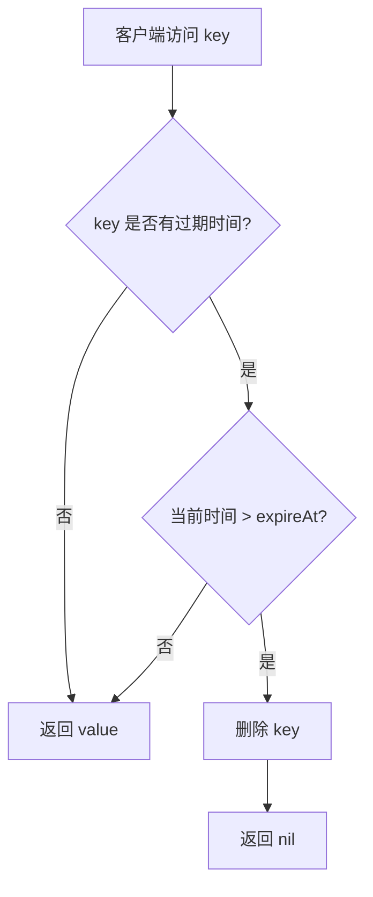

# 31 过期机制：Redis 的 key 过期是怎么工作的

## 1. 本章要解决的问题

Redis 的 TTL 看起来很简单：给 key 设置一个过期时间，到点删除。但深入生产环境会遇到很多问题：

- key 到期后是不是马上删除？
- 为什么已经过期的 key 还占内存？
- 大量 key 同时过期为什么会导致抖动？
- 过期删除和内存淘汰有什么区别？

本章从机制和实践两层拆解 Redis 的过期策略。

## 2. 核心观点

Redis 过期删除由两部分组成：

- 惰性删除：访问 key 时发现过期，再删除。
- 定期删除：后台周期性抽样检查过期 key。

因此，key 到期不代表立即消失。Redis 追求的是“删除成本”和“内存释放及时性”之间的平衡。

## 3. 原理拆解

### 3.1 过期时间存在哪里

Redis 会为设置了过期时间的 key 维护一个 expires 字典：

```text
db.dict     : key -> value
db.expires  : key -> expire timestamp
```

value 本身不保存 TTL，TTL 独立记录在过期字典里。

### 3.2 惰性删除

当客户端访问某个 key 时，Redis 会检查它是否过期：



惰性删除的优点是只处理被访问的 key，不浪费 CPU。缺点是冷 key 过期后如果没人访问，可能继续占内存。

### 3.3 定期删除

Redis 会周期性从 expires 字典里抽样一批 key，删除其中过期的 key。如果过期比例较高，会继续循环一小段时间。

```text
抽样一批带 TTL 的 key
检查是否过期
删除过期 key
如果过期比例高，继续抽样
控制每轮耗时，避免阻塞主线程太久
```

### 3.4 过期和淘汰的区别

| 机制 | 触发条件 | 删除对象 | 目标 |
| --- | --- | --- | --- |
| 过期删除 | TTL 到期 | 到期 key | 生命周期管理 |
| 内存淘汰 | 超过 maxmemory | 策略选中的 key | 控制内存上限 |

一个 key 可以因为 TTL 到期被删除，也可以在未到期时因为内存压力被淘汰。

## 4. 命令与代码示例

### 4.1 TTL 常用命令

```bash
SET session:token:abc user-1001 EX 1800
TTL session:token:abc
PTTL session:token:abc
EXPIRE session:token:abc 3600
PEXPIRE session:token:abc 3600000
PERSIST session:token:abc
```

返回值含义：

```text
TTL = -1  表示 key 存在但没有过期时间
TTL = -2  表示 key 不存在
TTL >= 0  表示剩余秒数
```

### 4.2 Java 设置随机过期

```java
public Duration ttlWithJitter(Duration base, int jitterSeconds) {
    int jitter = ThreadLocalRandom.current().nextInt(jitterSeconds);
    return base.plusSeconds(jitter);
}

redis.opsForValue().set(
    "cache:product:1001",
    json,
    ttlWithJitter(Duration.ofMinutes(10), 120)
);
```

### 4.3 Lua 保持写入和过期原子性

```lua
-- KEYS[1] key
-- ARGV[1] value
-- ARGV[2] ttl seconds
redis.call('SET', KEYS[1], ARGV[1])
redis.call('EXPIRE', KEYS[1], ARGV[2])
return 1
```

实际项目更推荐直接使用 `SET key value EX seconds`，避免 `SET` 成功但 `EXPIRE` 失败。

### 4.4 监听过期事件

```conf
notify-keyspace-events Ex
```

```bash
redis-cli PSUBSCRIBE "__keyevent@0__:expired"
```

注意：过期事件不适合作为强可靠消息队列。Redis 不保证订阅方离线期间的事件可恢复。

## 5. 生产实践

### 5.1 TTL 设计原则

- 缓存 key 必须有 TTL，除非明确需要常驻。
- 大批量 key 不要设置相同 TTL。
- 空值缓存 TTL 要短。
- 热点 key 可使用逻辑过期。
- 强一致配置类 key 可以使用短 TTL + 主动失效。

### 5.2 大量过期导致抖动

大量 key 同时过期时，Redis 删除成本、数据库回源和缓存重建会叠加，形成延迟尖刺。

治理：

```text
TTL 随机抖动
分批预热
逻辑过期
后台异步刷新
回源限流
```

### 5.3 删除大 key

如果过期 key 是大 key，删除可能阻塞主线程。可以启用 lazy free：

```conf
lazyfree-lazy-expire yes
lazyfree-lazy-eviction yes
lazyfree-lazy-server-del yes
```

手动删除大 key 时使用：

```bash
UNLINK big:key
```

`UNLINK` 会异步释放内存，比 `DEL` 更适合大对象。

## 6. 常见坑

- 使用 `SET key value` 覆盖数据后忘记 TTL 被清除。
- `SET` 和 `EXPIRE` 分两步执行，中间失败导致 key 永不过期。
- 使用过期事件做可靠任务调度。
- 所有缓存统一 TTL，导致雪崩。
- 以为 key 到期后内存会立即下降。
- 大 key 过期造成主线程释放内存耗时。

## 7. 面试追问

1. Redis key 过期后会立即删除吗？
2. 惰性删除和定期删除分别解决什么问题？
3. TTL 到期删除和 maxmemory 淘汰有什么区别？
4. 为什么不把所有过期 key 放进定时器精确删除？
5. 过期事件可以做可靠延迟队列吗？

## 8. 章节笔记

### 课程核心观点

Redis 过期策略是 CPU、内存和延迟之间的折中，不追求毫秒级精确删除。

### 我的理解

TTL 是业务生命周期声明，不是实时调度器。把它用于缓存失效很合适，把它用于强可靠任务触发就会踩坑。

### 关键概念

- expires 字典
- 惰性删除
- 定期删除
- TTL / PTTL
- `UNLINK`
- lazy free

### 排障命令

```bash
redis-cli TTL key
redis-cli INFO keyspace
redis-cli INFO stats | grep expired_keys
redis-cli MEMORY USAGE key
redis-cli LATENCY DOCTOR
```

## 9. 小结

Redis 的过期机制不是精确定时删除，而是惰性删除与定期删除的组合。理解这一点后，很多现象就能解释：过期 key 可能短暂占内存，大量同时过期会造成抖动，过期事件不能当可靠消息。生产上要用随机 TTL、逻辑过期、lazy free 和监控来把风险压住。
