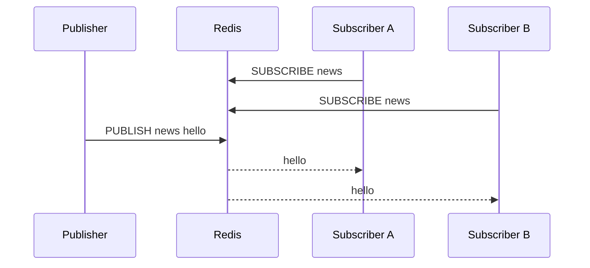

# 32 Pub/Sub 为什么不适合可靠消息

## 1. 本章要解决的问题

Redis Pub/Sub 很容易上手：发布者发消息，订阅者收到消息。但它经常被误用为可靠消息队列。本章要讲清楚：

- Pub/Sub 的消息会不会持久化？
- 消费者断线后还能不能补消息？
- Pub/Sub 适合哪些场景？
- 如果要可靠消息，应该选择什么方案？

## 2. 核心观点

Pub/Sub 是广播通知机制，不是可靠消息队列。

- 消息不持久化。
- 消费者离线期间消息会丢失。
- 没有 ACK、重试、消费进度和 Pending 管理。
- 适合在线通知、配置刷新、轻量事件广播。
- 可靠消息建议使用 Redis Stream、专业 MQ 或数据库 outbox。

## 3. 原理拆解

### 3.1 Pub/Sub 工作流程



Redis 只把消息推给当前在线订阅者。没有订阅者时，消息发布后直接结束。

### 3.2 Pub/Sub 缺少可靠消息的四个要素

| 可靠要素 | Pub/Sub 是否支持 | 影响 |
| --- | --- | --- |
| 持久化 | 不支持 | Redis 重启或消费者离线会丢 |
| 消费确认 | 不支持 | 无法知道是否处理成功 |
| 重试 | 不支持 | 处理失败无法自动补偿 |
| 消费进度 | 不支持 | 新消费者无法从历史位置恢复 |

### 3.3 Pub/Sub 和 Stream 的区别

Pub/Sub 像直播，错过就错过。Stream 像可回放日志，可以按 ID 消费、确认和追赶。

## 4. 命令与代码示例

### 4.1 Pub/Sub 命令

```bash
# 订阅频道
SUBSCRIBE config.changed

# 发布消息
PUBLISH config.changed '{"app":"order","version":12}'

# 按模式订阅
PSUBSCRIBE cache.invalidate.*
```

### 4.2 Spring Boot 订阅伪代码

```java
public class ConfigChangedListener implements MessageListener {
    @Override
    public void onMessage(Message message, byte[] pattern) {
        String body = new String(message.getBody(), StandardCharsets.UTF_8);
        configCache.refresh(body);
    }
}
```

### 4.3 不可靠场景示例

```text
T1 消费者断线
T2 发布者 PUBLISH order.created 1001
T3 Redis 返回发布成功
T4 消费者重新上线
结果：消费者收不到 1001
```

如果这个消息代表“必须创建物流单”，Pub/Sub 就不合适。

### 4.4 用 Stream 替代可靠消息

```bash
XADD order.events * type created orderId 1001
XGROUP CREATE order.events order-service 0 MKSTREAM
XREADGROUP GROUP order-service c1 COUNT 10 BLOCK 5000 STREAMS order.events >
XACK order.events order-service 1700000000000-0
```

## 5. 生产实践

### 5.1 Pub/Sub 适合场景

- 本地缓存失效通知。
- 配置刷新通知。
- 在线用户广播。
- 非关键实时事件。
- 节点间轻量控制信号。

这些场景的共同特点是：消息丢了可以接受，或者有其他兜底机制。

### 5.2 不适合场景

- 订单创建。
- 支付成功。
- 库存扣减。
- 发券。
- 审计日志。
- 需要消费重试的任务。

这些场景应该选择可靠消息队列。

### 5.3 缓存失效通知的兜底

即便使用 Pub/Sub 做缓存失效，也要设置 TTL：

```text
Pub/Sub 主动失效 + 缓存 TTL 自然过期
```

这样订阅者短暂断线时，旧缓存最终仍会过期。

## 6. 常见坑

- 用 Pub/Sub 做订单消息，消费者重启后丢消息。
- 以为 `PUBLISH` 返回订阅者数量就表示业务处理成功。
- 订阅端处理逻辑太慢，导致连接输出缓冲区膨胀。
- Pub/Sub 消息没有幂等处理，重复通知时状态混乱。
- 跨机房广播依赖单 Redis，网络抖动时不可控。

## 7. 面试追问

1. Redis Pub/Sub 为什么不可靠？
2. `PUBLISH` 返回值代表什么？
3. Pub/Sub 和 Stream 有什么区别？
4. Pub/Sub 适合做缓存失效通知吗？
5. 消费者离线期间的消息如何补？

## 8. 章节笔记

### 课程核心观点

Pub/Sub 是发布订阅，不是消息队列。它强调实时广播，不强调可靠投递。

### 我的理解

判断一个消息系统是否可靠，要看它能否回答“谁消费了、消费到哪、失败怎么办、重启后怎么恢复”。Pub/Sub 对这些问题都没有答案。

### 关键概念

- Channel
- Pattern Subscribe
- 在线广播
- 无持久化
- 无 ACK
- Stream 消费组

### 排障命令

```bash
PUBSUB CHANNELS
PUBSUB NUMSUB config.changed
CLIENT LIST
INFO clients
```

## 9. 小结

Pub/Sub 非常适合轻量通知，但不适合可靠消息。它的设计目标是低成本广播，而不是持久化、确认、重试和追赶。生产上要把它放在正确位置：能丢的通知用 Pub/Sub，不能丢的业务消息用 Stream 或专业 MQ。
