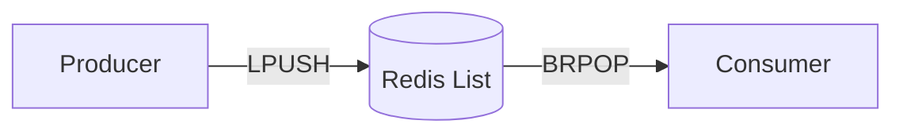
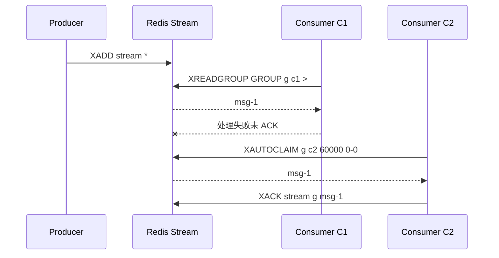
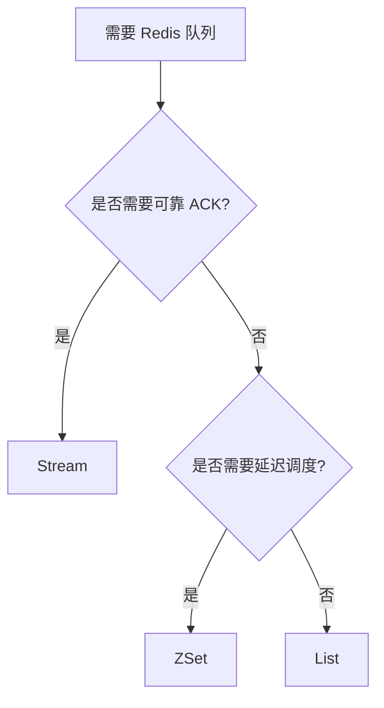

# 33 List、ZSet、Stream 三种队列方案怎么选

## 1. 本章要解决的问题

Redis 可以用多种结构实现队列：

- List：简单先进先出队列。
- ZSet：按时间或优先级调度的队列。
- Stream：带消息 ID、消费组和 ACK 的队列。

问题是：这些方案边界不同，选错会导致消息丢失、重复消费、堆积不可见或运维困难。

## 2. 核心观点

- 简单异步任务：List 可以胜任。
- 延迟任务：ZSet 更自然。
- 可靠消费、多消费者组、可追溯消息：Stream 更合适。
- Redis 队列适合中小规模和业务内聚场景，大规模复杂消息系统仍建议 Kafka、RocketMQ、RabbitMQ 等专业 MQ。

## 3. 原理拆解

### 3.1 三种队列能力对比

| 能力 | List | ZSet | Stream |
| --- | --- | --- | --- |
| FIFO | 支持 | 需要设计 | 支持 |
| 延迟消息 | 不直接支持 | 支持 | 可实现 |
| ACK | 需自建 | 需自建 | 原生支持 |
| 消费组 | 不支持 | 不支持 | 原生支持 |
| Pending | 不支持 | 需自建 | 原生支持 |
| 历史回放 | 不方便 | 不方便 | 支持 |
| 实现复杂度 | 低 | 中 | 中高 |

### 3.2 List 队列



List 适合简单队列，但如果消费者 `BRPOP` 后处理失败，消息已经从 List 移除，需要额外设计备份队列才能可靠。

### 3.3 ZSet 延迟队列

ZSet 使用 score 表示执行时间戳：

```text
member = message id / payload
score = execute_at_timestamp
```

消费者扫描 `score <= now` 的任务，抢占后执行。

### 3.4 Stream 消费组

Stream 的核心优势：

- 每条消息有递增 ID。
- 消费者组记录消费进度。
- `XACK` 确认成功。
- PEL（Pending Entries List）记录已投递但未确认的消息。
- `XAUTOCLAIM` 可以转移超时消息。



## 4. 命令与代码示例

### 4.1 List 队列

```bash
LPUSH queue:email '{"to":"a@example.com","template":"welcome"}'
BRPOP queue:email 5
```

Java 伪代码：

```java
while (running) {
    Message msg = redis.brpop("queue:email", Duration.ofSeconds(5));
    if (msg == null) continue;
    sendEmail(msg);
}
```

### 4.2 ZSet 延迟队列

```bash
ZADD delay:jobs 1716600000000 job-1001
ZRANGEBYSCORE delay:jobs -inf 1716600000000 LIMIT 0 10
ZREM delay:jobs job-1001
```

用 Lua 原子获取并删除到期任务：

```lua
local jobs = redis.call('ZRANGEBYSCORE', KEYS[1], '-inf', ARGV[1], 'LIMIT', 0, ARGV[2])
for i, job in ipairs(jobs) do
  redis.call('ZREM', KEYS[1], job)
end
return jobs
```

### 4.3 Stream 可靠队列

```bash
XADD order.stream * type created orderId 1001
XGROUP CREATE order.stream order-group 0 MKSTREAM
XREADGROUP GROUP order-group c1 COUNT 10 BLOCK 5000 STREAMS order.stream >
XACK order.stream order-group 1700000000000-0
XPENDING order.stream order-group
XAUTOCLAIM order.stream order-group c2 60000 0-0 COUNT 10
```

Spring Boot 伪代码：

```java
public void consume(List<StreamMessage> messages) {
    for (StreamMessage message : messages) {
        try {
            orderHandler.handle(message);
            redis.xack("order.stream", "order-group", message.id());
        } catch (Exception ex) {
            log.warn("handle stream message failed, id={}", message.id(), ex);
        }
    }
}
```

## 5. 生产实践

### 5.1 选择建议



### 5.2 Stream 运维关注

- 消息是否持续堆积。
- Pending 是否越来越多。
- 消费者是否长时间离线。
- Stream 是否需要裁剪。

```bash
XLEN order.stream
XPENDING order.stream order-group
XINFO GROUPS order.stream
XINFO CONSUMERS order.stream order-group
XTRIM order.stream MAXLEN ~ 1000000
```

### 5.3 幂等是必需的

Redis Stream 能做到至少一次投递，不能保证业务只执行一次。消费者必须幂等：

```text
message_id/order_id 去重表
业务状态机判断
唯一索引防重复
```

## 6. 常见坑

- 用 List 做可靠队列，消费者取出后宕机导致消息丢失。
- ZSet 延迟队列用 `ZRANGE` 后再 `ZREM`，不是原子操作，多个消费者重复拿任务。
- Stream 消费后忘记 `XACK`，Pending 越积越多。
- Stream 不裁剪，内存持续增长。
- 以为 Stream 可以替代 Kafka 做大规模日志系统。
- 消费者没有幂等，重试导致重复发券或重复扣款。

## 7. 面试追问

1. List 做队列有什么可靠性问题？
2. ZSet 如何实现延迟队列？
3. Stream 的 Pending List 是什么？
4. `XREADGROUP` 里 `>` 表示什么？
5. Redis Stream 能保证消息只消费一次吗？

## 8. 章节笔记

### 课程核心观点

Redis 提供了多种队列能力，但可靠性级别不同。

### 我的理解

队列不是只有“能放进去、能取出来”。真正重要的是失败后怎么办：消息是否还在，谁来重试，怎么防重复，怎么观察堆积。

### 关键概念

- `BRPOP`
- `ZADD`
- `ZRANGEBYSCORE`
- `XADD`
- `XREADGROUP`
- `XACK`
- `XPENDING`
- `XAUTOCLAIM`

### 生产 checklist

- 是否需要 ACK？
- 是否需要延迟？
- 是否需要多消费者组？
- 是否允许重复消费？
- 是否有幂等设计？
- 是否有堆积监控？

## 9. 小结

List、ZSet、Stream 不是谁取代谁，而是分别适合简单队列、延迟调度和可靠消费。选择队列方案时，优先考虑失败语义和运维可观测性。只要涉及关键业务消息，ACK、Pending、重试和幂等必须一起设计。
