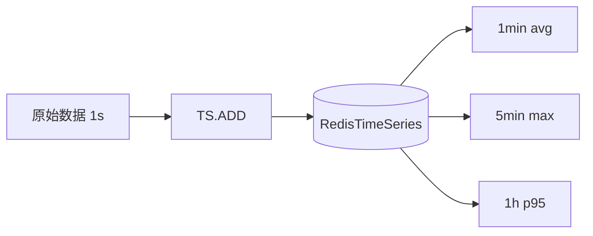

# 34 Redis 如何保存时间序列数据

## 1. 本章要解决的问题

时间序列数据在业务里很常见：

- 设备每秒上报温度。
- 接口 QPS 和延迟监控。
- 用户行为按分钟聚合。
- 股票、行情、传感器数据。

Redis 可以保存时间序列数据，但不同实现方式差异很大。本章讨论 Sorted Set、Hash 分桶和 RedisTimeSeries 模块的选择。

## 2. 核心观点

- 小规模、简单查询：ZSet 足够。
- 固定时间粒度聚合：Hash 分桶更省空间。
- 需要自动降采样、聚合和保留策略：RedisTimeSeries 更合适。
- 时间序列要提前设计保留周期，否则内存会无限增长。

## 3. 原理拆解

### 3.1 ZSet 保存时间序列

ZSet 的 score 用时间戳，member 保存值或事件 ID：

```text
key = ts:device:1001:temperature
score = timestamp
member = value 或 timestamp:value
```

优势是范围查询自然：

```bash
ZRANGEBYSCORE ts:device:1001:temperature 1716600000000 1716603600000
```

### 3.2 Hash 分桶

如果只需要按分钟统计 QPS，可以按时间分桶：

```text
metric:qps:api:/order/create:202605251730
  count -> 12000
  error -> 12
  totalLatency -> 360000
```

Hash 分桶适合聚合指标，不适合保存每个原始点。

### 3.3 RedisTimeSeries

RedisTimeSeries 是 Redis Stack 模块，提供时间序列专用命令：

- `TS.ADD`
- `TS.RANGE`
- `TS.CREATERULE`
- `TS.MRANGE`

它支持标签、压缩、保留策略、自动降采样。



## 4. 命令与代码示例

### 4.1 ZSet 示例

```bash
ZADD ts:device:1001:temp 1716600000000 "1716600000000:23.6"
ZADD ts:device:1001:temp 1716600001000 "1716600001000:23.7"
ZRANGEBYSCORE ts:device:1001:temp 1716600000000 1716600060000
ZREMRANGEBYSCORE ts:device:1001:temp -inf 1716513600000
```

### 4.2 Hash 聚合示例

```bash
HINCRBY metric:api:/order/create:202605251730 count 1
HINCRBY metric:api:/order/create:202605251730 totalLatency 35
EXPIRE metric:api:/order/create:202605251730 604800
```

### 4.3 Spring Boot 聚合伪代码

```java
public void recordApiMetric(String api, long latencyMs, boolean success) {
    String minute = DateTimeFormatter.ofPattern("yyyyMMddHHmm").format(LocalDateTime.now());
    String key = "metric:api:" + api + ":" + minute;

    redis.opsForHash().increment(key, "count", 1);
    redis.opsForHash().increment(key, "totalLatency", latencyMs);
    if (!success) {
        redis.opsForHash().increment(key, "error", 1);
    }
    redis.expire(key, Duration.ofDays(7));
}
```

### 4.4 RedisTimeSeries 命令

```bash
TS.CREATE ts:api:order:create:latency RETENTION 604800000 LABELS api order_create type latency
TS.ADD ts:api:order:create:latency * 35
TS.RANGE ts:api:order:create:latency - +

TS.CREATE ts:api:order:create:latency:avg1m RETENTION 2592000000
TS.CREATERULE ts:api:order:create:latency ts:api:order:create:latency:avg1m AGGREGATION avg 60000
```

## 5. 生产实践

### 5.1 方案选择

| 场景 | 推荐 |
| --- | --- |
| 最近一小时原始事件 | ZSet |
| 按分钟计数器 | String/Hash 分桶 |
| 监控指标长期保存 | RedisTimeSeries 或专业 TSDB |
| 多维标签查询 | RedisTimeSeries |
| 海量长期指标 | Prometheus/InfluxDB/ClickHouse |

### 5.2 内存控制

时间序列最容易忘记清理。必须设计：

- 原始数据保留多久。
- 聚合数据保留多久。
- 是否需要降采样。
- 是否允许近似统计。

ZSet 使用：

```bash
ZREMRANGEBYSCORE key -inf cutoff_timestamp
```

分桶 key 使用 TTL。

### 5.3 写入热点

所有指标写同一个 key 会形成热 key。可以按业务、实例、接口、时间分桶拆分。

```text
metric:{app}:{instance}:{api}:{yyyyMMddHHmm}
```

## 6. 常见坑

- ZSet member 只存 value，时间戳重复时覆盖。
- 不设置保留策略，内存持续增长。
- 高并发写单 key，形成热点。
- 在 Redis 中做复杂多维分析，超出 Redis 设计边界。
- 用 RedisTimeSeries 但没有规划标签基数，导致索引膨胀。
- 原始点和聚合点混在一个结构里，查询和清理都复杂。

## 7. 面试追问

1. 为什么 ZSet 适合保存时间序列？
2. ZSet 保存时间序列时 member 应该如何设计？
3. Hash 分桶适合什么场景？
4. RedisTimeSeries 相比 ZSet 有什么优势？
5. 时间序列数据如何控制内存增长？

## 8. 章节笔记

### 课程核心观点

Redis 可以承载实时性较强的时间序列数据，但要明确查询模式和保留周期。

### 我的理解

时间序列设计的关键不是“怎么写进去”，而是“怎么查、查多久、怎么降采样、什么时候删”。没有保留策略的时间序列就是定时内存事故。

### 关键概念

- ZSet score
- 时间分桶
- 降采样
- 保留策略
- RedisTimeSeries
- 标签基数

### 排障命令

```bash
redis-cli MEMORY USAGE ts:device:1001:temp
redis-cli ZCARD ts:device:1001:temp
redis-cli SCAN 0 MATCH 'metric:*' COUNT 1000
```

## 9. 小结

Redis 保存时间序列有多种方式：ZSet 灵活，Hash 分桶高效，RedisTimeSeries 能力完整。生产上最重要的是根据查询模式选结构，并提前设置保留周期、降采样和热点拆分策略。
