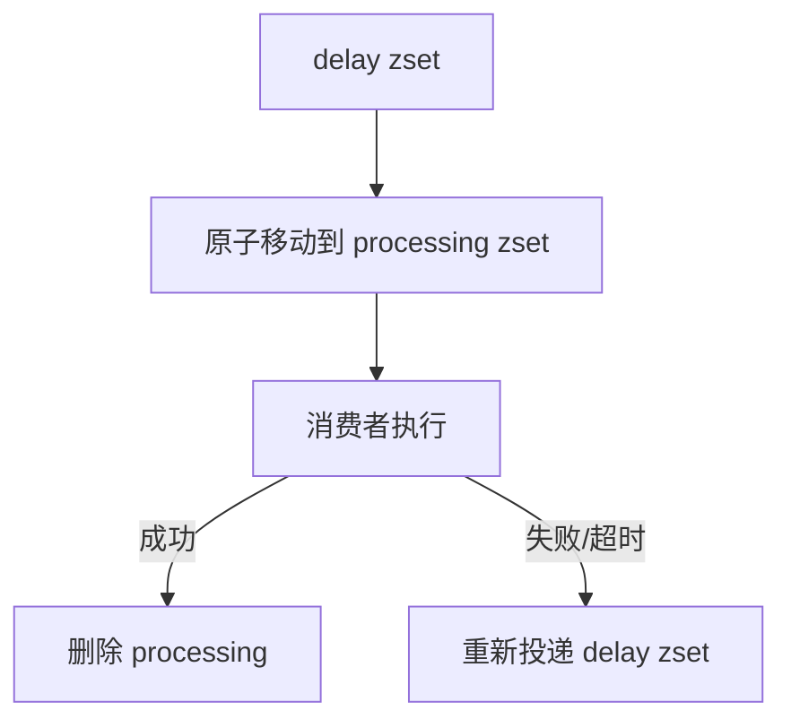

# 35 延迟队列与定时任务的两种实现

## 1. 本章要解决的问题

业务里经常需要“到点再执行”：

- 订单 30 分钟未支付自动取消。
- 优惠券到期提醒。
- 任务失败后延迟重试。
- 活动开始前预热缓存。

Redis 常见实现有两种：ZSet 延迟队列和 key 过期事件。本章重点说明两者边界。

## 2. 核心观点

- ZSet 延迟队列更可控，适合业务任务调度。
- key 过期事件不可靠，不适合关键任务。
- 延迟队列必须考虑重复执行、任务丢失、消费者宕机和补偿扫描。
- 如果任务规模大、可靠性要求高，应使用专业调度系统或 MQ 延迟消息。

## 3. 原理拆解

### 3.1 ZSet 延迟队列

ZSet 的 score 表示执行时间：

```text
ZADD delay:order:close executeAt orderId
```

消费者周期性拉取 `score <= now` 的任务。


### 3.2 key 过期事件

设置一个带 TTL 的 key：

```bash
SET delay:order:1001 1 EX 1800
```

订阅过期事件后收到通知。但过期事件存在问题：

- Redis 不保证精确到期触发。
- 订阅者离线会丢事件。
- Redis 重启、配置缺失、网络断开都会影响。
- 事件只告诉 key 过期，不适合携带复杂 payload。

因此它适合轻量提醒，不适合关键订单关闭。

## 4. 命令与代码示例

### 4.1 ZSet 添加任务

```bash
ZADD delay:order:close 1716600000000 order:1001
ZRANGEBYSCORE delay:order:close -inf 1716600000000 LIMIT 0 10
```

### 4.2 Lua 原子抢占任务

```lua
-- KEYS[1] delay zset
-- ARGV[1] now timestamp ms
-- ARGV[2] limit
local tasks = redis.call('ZRANGEBYSCORE', KEYS[1], '-inf', ARGV[1], 'LIMIT', 0, ARGV[2])
for i, task in ipairs(tasks) do
  redis.call('ZREM', KEYS[1], task)
end
return tasks
```

### 4.3 Java 调度器伪代码

```java
while (running) {
    List<String> tasks = redis.evalsha(popDueTaskSha,
        List.of("delay:order:close"),
        List.of(String.valueOf(System.currentTimeMillis()), "50"));

    for (String task : tasks) {
        executor.submit(() -> closeOrderIfUnpaid(task));
    }

    if (tasks.isEmpty()) {
        Thread.sleep(200);
    }
}
```

### 4.4 key 过期事件示例

```conf
notify-keyspace-events Ex
```

```bash
SET delay:order:1001 1 EX 1800
PSUBSCRIBE "__keyevent@0__:expired"
```

## 5. 生产实践

### 5.1 ZSet 延迟队列增强可靠性

只从 ZSet 删除任务后再执行，会遇到消费者宕机导致任务丢失。可以增加 processing 队列：



抢占时把任务从 `delay:zset` 移到 `processing:zset`，score 设置为处理超时时间。后台扫描超时 processing 任务并重新投递。

### 5.2 任务幂等

延迟队列通常是至少一次执行，所以业务必须幂等：

```java
public void closeOrderIfUnpaid(String orderId) {
    Order order = orderMapper.selectById(orderId);
    if (!order.isUnpaid()) {
        return;
    }
    orderMapper.closeIfStatus(orderId, "UNPAID");
}
```

### 5.3 时间精度和轮询间隔

Redis ZSet 延迟队列不是实时调度器。实际延迟由以下因素决定：

- 轮询间隔。
- 批量大小。
- 消费者处理能力。
- Redis 延迟。
- 系统时钟。

## 6. 常见坑

- `ZRANGEBYSCORE` 和 `ZREM` 分开执行，多个消费者重复拿任务。
- 任务取出后消费者宕机，没有 processing 补偿。
- 业务逻辑不幂等，重复执行导致事故。
- 使用 key 过期事件关闭订单，订阅者重启期间任务丢失。
- 延迟队列没有堆积监控。
- 单个 ZSet 过大，扫描和删除压力集中。

## 7. 面试追问

1. Redis 如何实现延迟队列？
2. 为什么 key 过期事件不适合可靠定时任务？
3. ZSet 延迟队列如何避免重复消费？
4. 消费者取出任务后宕机怎么办？
5. 延迟队列如何做幂等？

## 8. 章节笔记

### 课程核心观点

Redis ZSet 可以实现轻量延迟队列，但可靠性需要自己补齐。

### 我的理解

延迟任务的难点不是“到点取出”，而是“取出后失败怎么办”。只要业务不能接受任务丢失，就必须有 processing、超时重投和幂等。

### 关键概念

- ZSet score 时间戳
- 原子抢占
- processing 队列
- 超时重投
- keyspace notification
- 幂等执行

### 排障命令

```bash
ZCARD delay:order:close
ZRANGE delay:order:close 0 10 WITHSCORES
ZCOUNT delay:order:close -inf 1716600000000
ZCARD processing:order:close
```

## 9. 小结

Redis 实现延迟任务优先选择 ZSet，而不是过期事件。ZSet 方案简单可控，但要补齐原子抢占、processing 补偿、幂等和堆积监控。过期事件只能用于非关键提醒，不能承载可靠业务调度。
