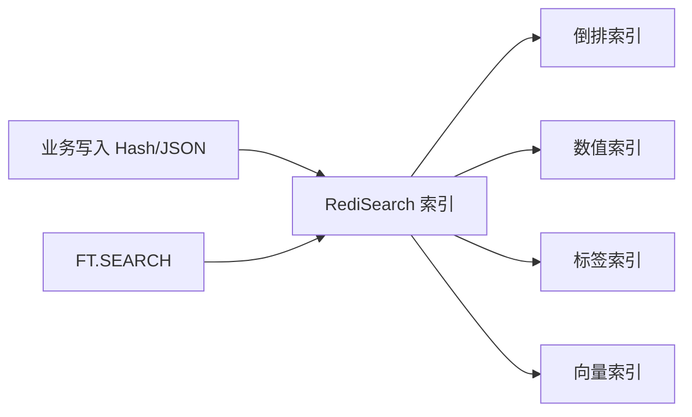

# 36 RediSearch：Redis 做全文搜索的边界

## 1. 本章要解决的问题

Redis Stack 提供 RediSearch，可以在 Redis 中做全文搜索、二级索引、标签过滤和向量检索。但问题是：

- Redis 适不适合替代 Elasticsearch？
- RediSearch 适合哪些搜索场景？
- 使用 RediSearch 会带来哪些内存和运维成本？
- 搜索索引和业务数据如何保持一致？

## 2. 核心观点

RediSearch 适合低延迟、数据规模可控、业务内聚的搜索能力，不适合无边界替代专业搜索引擎。

- 适合：商品小索引、自动补全、标签过滤、实时检索、向量召回实验。
- 不适合：海量日志检索、复杂分析查询、低成本长期存储。
- 索引会消耗额外内存，字段设计必须克制。
- 数据一致性需要写入链路或异步同步保证。

## 3. 原理拆解

### 3.1 RediSearch 能力

RediSearch 可以为 Hash 或 JSON 建索引：

- TEXT：全文分词搜索。
- TAG：精确标签过滤。
- NUMERIC：数值范围查询。
- GEO：地理位置过滤。
- VECTOR：向量相似度检索。



### 3.2 倒排索引

全文搜索的核心是倒排索引：

```text
phone -> doc:1, doc:8, doc:20
redis -> doc:3, doc:9
```

查询关键词时，不需要扫描所有文档，而是通过词项找到文档集合。

### 3.3 与 Elasticsearch 的边界

| 维度 | RediSearch | Elasticsearch |
| --- | --- | --- |
| 延迟 | 很低 | 较低 |
| 数据规模 | 中小规模更合适 | 大规模更合适 |
| 存储成本 | 内存成本高 | 磁盘为主 |
| 分析能力 | 相对轻量 | 强 |
| 运维复杂度 | Redis Stack 内聚 | 集群复杂 |
| 典型场景 | 实时检索、过滤、召回 | 搜索平台、日志分析 |

## 4. 命令与代码示例

### 4.1 创建索引

```bash
FT.CREATE idx:product ON HASH PREFIX 1 product: SCHEMA \
  name TEXT WEIGHT 5.0 \
  brand TAG \
  category TAG \
  price NUMERIC SORTABLE \
  stock NUMERIC
```

### 4.2 写入文档

```bash
HSET product:1001 name "Redis in Action" brand "techpress" category "book" price 59 stock 100
HSET product:1002 name "Redis Deep Dive" brand "techpress" category "book" price 89 stock 20
```

### 4.3 查询

```bash
FT.SEARCH idx:product "Redis @category:{book} @price:[50 100]" SORTBY price ASC LIMIT 0 10
FT.SEARCH idx:product "@brand:{techpress} @stock:[1 +inf]"
```

### 4.4 Spring Boot 伪代码

```java
public void saveProduct(Product product) {
    String key = "product:" + product.getId();
    Map<String, String> hash = Map.of(
        "name", product.getName(),
        "brand", product.getBrand(),
        "category", product.getCategory(),
        "price", product.getPrice().toPlainString(),
        "stock", String.valueOf(product.getStock())
    );
    redis.opsForHash().putAll(key, hash);
}

public List<Product> search(String keyword, String category) {
    String query = keyword + " @category:{" + category + "}";
    return redisSearch.ftSearch("idx:product", query, 0, 20);
}
```

## 5. 生产实践

### 5.1 适合 RediSearch 的场景

- 管理后台快速检索。
- 商品、门店、用户等中小规模对象搜索。
- 实时性要求高的过滤查询。
- 搜索结果需要和 Redis 缓存紧密结合。
- 召回阶段的小规模向量检索。

### 5.2 不适合的场景

- PB 级日志检索。
- 多租户复杂搜索平台。
- 大规模文本分析。
- 需要低成本长期保存的搜索数据。
- 复杂聚合报表。

### 5.3 索引一致性

常见写入方式：

```text
同步写数据库 -> 同步/异步写 Redis Hash -> RediSearch 自动索引
```

如果数据库是事实来源，建议：

- 使用 outbox 或 binlog 同步索引。
- 索引写入失败要重试。
- 定期全量校验。
- 索引可重建，不要把唯一数据只放 RediSearch。

## 6. 常见坑

- 给所有字段建索引，导致内存暴涨。
- 高基数 TAG 过多，索引开销大。
- 把 RediSearch 当 Elasticsearch 替代品，承载海量日志。
- 忽略中文分词能力和插件限制。
- 索引和数据库写入没有补偿，搜索结果长期不一致。
- 查询语句没有限制分页，深分页成本高。

## 7. 面试追问

1. RediSearch 的倒排索引是什么？
2. RediSearch 和 Elasticsearch 有什么区别？
3. RediSearch 适合什么场景？
4. 搜索索引如何和数据库保持一致？
5. 为什么索引字段不能无限加？

## 8. 章节笔记

### 课程核心观点

Redis 可以通过模块扩展搜索能力，但要理解内存数据库的成本边界。

### 我的理解

RediSearch 的价值是“把实时数据附近的搜索做得很快”，不是“把所有搜索问题都塞进 Redis”。搜索系统的核心仍然是索引设计、数据同步和成本控制。

### 关键概念

- RediSearch
- 倒排索引
- TEXT / TAG / NUMERIC
- Redis Stack
- 索引一致性
- 深分页

### 排障命令

```bash
FT.INFO idx:product
FT.SEARCH idx:product "Redis" LIMIT 0 10
MEMORY USAGE product:1001
INFO memory
```

## 9. 小结

RediSearch 是 Redis 能力边界的一次扩展，适合实时、低延迟、中小规模搜索。使用时要克制索引字段，明确数据库与索引的一致性方案，并避免把它当作通用搜索和日志分析平台。
