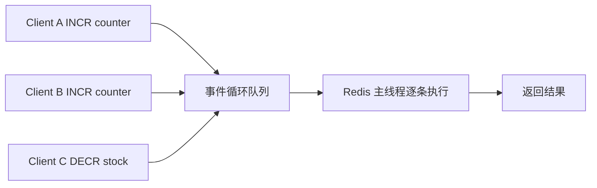

# 37 Redis 为什么能提供无锁原子操作

## 1. 本章要解决的问题

Redis 经常被用来做计数器、限流、库存扣减、状态标记。大家常说 Redis 命令是原子的，但这句话需要边界：

- Redis 为什么不加业务锁也能保证单条命令原子？
- 多条命令组合是不是原子？
- 单线程模型和多线程 IO 会不会冲突？
- 在并发控制中 Redis 适合做什么，不适合做什么？

## 2. 核心观点

Redis 的原子性来自命令执行阶段的串行化，而不是来自分布式事务。

- 单条 Redis 命令在服务端执行时不会被其他命令插入。
- 多条命令组合不天然原子，需要 Lua、事务或专用命令。
- Redis 6.0 多线程主要处理网络 IO，命令执行仍然保持串行模型。
- 原子操作只能保证 Redis 内部状态，不自动保证数据库一致性。

## 3. 原理拆解

### 3.1 命令串行执行模型



即使多个客户端同时发送请求，Redis 在命令执行阶段也会一条一条处理。比如 `INCR` 内部包含读取旧值、加一、写回新值，但整个命令执行期间不会被其他命令打断。

### 3.2 单条命令原子，不等于业务操作原子

下面是危险写法：

```java
Integer stock = Integer.valueOf(redis.get("stock:sku:1001"));
if (stock > 0) {
    redis.decr("stock:sku:1001");
}
```

`GET` 和 `DECR` 单独都是原子的，但组合不是原子的。多个线程可能同时读到库存大于 0，然后都扣减，导致超卖。

### 3.3 用专用命令替代读改写

例如计数器：

```bash
INCR page:view:1001
DECR stock:sku:1001
HINCRBY user:score 1001 10
```

Redis 提供的自增、自减、集合操作通常可以避免客户端读改写。

### 3.4 复合原子操作的三种方式

| 方式 | 特点 | 适用 |
| --- | --- | --- |
| 专用命令 | 简单高效 | 计数器、集合变更 |
| 事务 | 批量顺序执行，可配合 WATCH | 乐观锁更新 |
| Lua | 服务端执行复合逻辑 | 扣库存、限流、解锁 |

## 4. 命令与代码示例

### 4.1 原子计数器

```bash
INCR article:1001:views
INCRBY article:1001:views 10
EXPIRE article:1001:views 86400
```

如果要保证首次创建时同时设置 TTL，可以用 Lua：

```lua
local value = redis.call('INCR', KEYS[1])
if value == 1 then
  redis.call('EXPIRE', KEYS[1], ARGV[1])
end
return value
```

### 4.2 原子限流

```lua
-- KEYS[1] = rate limit key
-- ARGV[1] = limit
-- ARGV[2] = window seconds
local current = redis.call('INCR', KEYS[1])
if current == 1 then
  redis.call('EXPIRE', KEYS[1], ARGV[2])
end
if current > tonumber(ARGV[1]) then
  return 0
end
return 1
```

Java 伪代码：

```java
boolean allowed = redis.eval(rateLimitScript,
    List.of("rl:user:" + userId),
    List.of("100", "60")).equals(1L);
```

### 4.3 错误的库存扣减

```java
int stock = Integer.parseInt(redis.get("stock:sku:1001"));
if (stock > 0) {
    redis.decr("stock:sku:1001");
    return true;
}
return false;
```

这个写法存在并发窗口，不能用于秒杀库存。

## 5. 生产实践

### 5.1 Redis 原子性适合场景

- 计数器。
- 限流。
- 去重。
- 幂等标记。
- 简单库存预扣。
- 分布式锁 token 校验。

### 5.2 不适合单独依赖 Redis 的场景

- 资金余额最终扣款。
- 强一致订单状态流转。
- 跨 Redis 和数据库的原子事务。
- 长时间业务流程锁定。

这些场景通常需要数据库事务、状态机、消息补偿或 TCC/Saga 等机制。

### 5.3 原子性和持久化

Redis 命令原子不代表宕机不丢。比如 `INCR` 成功返回后，如果 AOF 配置为 `everysec`，极端情况下仍可能丢失最近一秒写入。

## 6. 常见坑

- 把多条命令的组合误认为原子。
- 用 Redis 扣库存成功后，数据库下单失败，没有补偿。
- Lua 脚本太复杂，阻塞 Redis 主线程。
- 计数器没有 TTL，长期占用内存。
- 限流 key 粒度过粗，误伤正常用户。
- Redis 原子操作和业务幂等混为一谈。

## 7. 面试追问

1. Redis 单条命令为什么是原子的？
2. Redis 6.0 多线程后命令还是原子的吗？
3. `GET` 后 `SET` 为什么不是原子操作？
4. Redis 原子操作能保证数据库一致性吗？
5. Lua 和事务在原子性上有什么区别？

## 8. 章节笔记

### 课程核心观点

Redis 原子性来自服务端命令串行执行模型。

### 我的理解

Redis 是一个很强的并发控制工具，但它只控制 Redis 内部的数据竞争。只要业务跨了数据库、MQ、外部接口，就必须重新设计一致性和补偿。

### 关键概念

- 单线程执行
- 命令原子性
- 复合操作
- Lua 脚本
- 乐观锁
- 幂等

### 排障命令

```bash
MONITOR
SLOWLOG GET 20
INFO commandstats
LATENCY DOCTOR
```

## 9. 小结

Redis 能提供无锁原子操作，是因为命令执行阶段天然串行。单条命令原子非常有用，但多条命令组合必须借助 Lua、事务或专用命令。设计并发控制时，要把 Redis 内部原子性和业务端到端一致性分开看。
