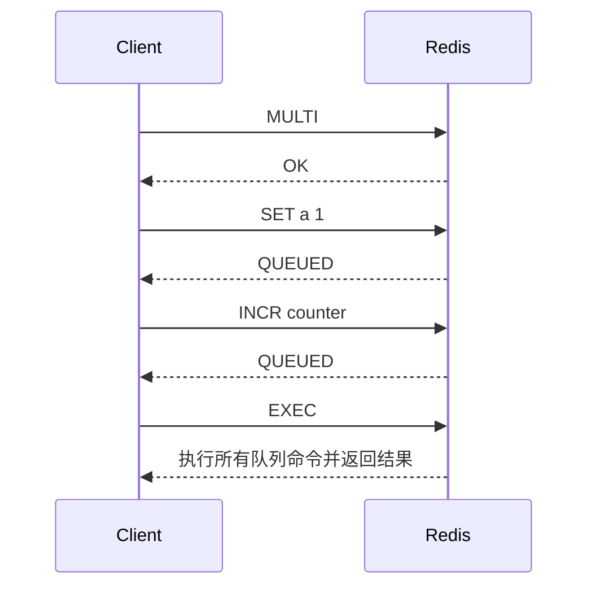
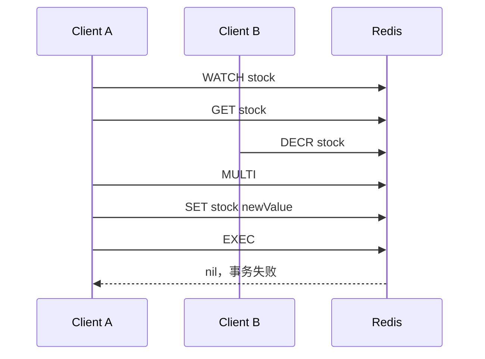

# 38 事务机制：Redis 能实现 ACID 吗

## 1. 本章要解决的问题

Redis 支持 `MULTI`、`EXEC`、`WATCH`，所以很多人会问：Redis 事务是不是和数据库事务一样？本章回答：

- Redis 事务到底保证什么？
- Redis 事务能不能回滚？
- `WATCH` 是怎么实现乐观锁的？
- Redis 事务是否满足 ACID？

## 2. 核心观点

Redis 事务保证的是一组命令按顺序、不中断地执行，但它不是关系型数据库事务。

- Atomicity：部分满足。命令入队错误可失败，运行时错误不会整体回滚。
- Consistency：由业务逻辑保证。
- Isolation：`EXEC` 执行期间不会插入其他命令。
- Durability：取决于 RDB/AOF 持久化配置。

Redis 事务更像“批量命令执行器 + 乐观锁”，不是完整 ACID 事务。

## 3. 原理拆解

### 3.1 MULTI/EXEC 流程



在 `MULTI` 后，命令不会立即执行，而是进入事务队列。直到 `EXEC` 才顺序执行。

### 3.2 Redis 事务不支持传统回滚

示例：

```bash
SET count hello
MULTI
SET a 1
INCR count
SET b 2
EXEC
```

`INCR count` 会失败，因为 `count` 不是整数。但 `SET a 1` 和 `SET b 2` 仍然会执行。

Redis 的设计选择是保持简单和高性能，不做复杂回滚日志。

### 3.3 WATCH 乐观锁

`WATCH` 可以监视 key。如果在 `EXEC` 前 key 被其他客户端修改，事务会失败。



## 4. 命令与代码示例

### 4.1 基础事务

```bash
MULTI
SET user:1001:name alice
INCR user:1001:version
EXEC
```

### 4.2 DISCARD

```bash
MULTI
SET a 1
SET b 2
DISCARD
```

### 4.3 WATCH 实现乐观扣减

```java
public boolean decreaseStock(String sku, int amount) {
    String key = "stock:" + sku;
    for (int i = 0; i < 3; i++) {
        redis.watch(key);
        int stock = Integer.parseInt(redis.get(key));
        if (stock < amount) {
            redis.unwatch();
            return false;
        }

        redis.multi();
        redis.set(key, String.valueOf(stock - amount));
        List<Object> result = redis.exec();
        if (result != null) {
            return true;
        }
    }
    return false;
}
```

高并发扣库存更推荐 Lua，因为 WATCH 冲突重试成本较高。

### 4.4 Lua 替代事务

```lua
local stock = tonumber(redis.call('GET', KEYS[1]) or '0')
local amount = tonumber(ARGV[1])
if stock < amount then
  return -1
end
redis.call('DECRBY', KEYS[1], amount)
return stock - amount
```

## 5. 生产实践

### 5.1 事务适合场景

- 批量写多个 key，要求执行期间不被插入。
- 配合 WATCH 做低冲突乐观更新。
- 初始化多个相关缓存字段。

### 5.2 不适合场景

- 高冲突库存扣减。
- 需要失败自动回滚。
- 跨 Redis 与数据库一致提交。
- 长逻辑计算。

### 5.3 Pipeline 与事务区别

Pipeline 是客户端批量发送命令，减少 RTT；事务是 Redis 服务端队列化命令并在 `EXEC` 时执行。

两者可以结合，但目的不同：

```text
Pipeline 解决网络往返成本
Transaction 解决命令执行期间不被插入
```

## 6. 常见坑

- 以为 Redis 事务失败会全部回滚。
- 在事务队列里读取前面命令的执行结果。
- 高并发下滥用 WATCH，导致大量事务失败重试。
- 把 Pipeline 当事务。
- 事务里执行慢命令，阻塞其他客户端。
- 认为 Redis 事务能解决数据库和缓存双写一致性。

## 7. 面试追问

1. Redis 事务和 MySQL 事务有什么区别？
2. Redis 事务支持回滚吗？
3. `WATCH` 的作用是什么？
4. Redis 事务满足 ACID 吗？
5. Pipeline 和事务有什么区别？

## 8. 章节笔记

### 课程核心观点

Redis 事务提供批量顺序执行和乐观锁能力，但不提供传统数据库事务语义。

### 我的理解

Redis 事务的核心价值是“把一组命令排队后一次性执行”，而不是“失败后恢复到执行前”。如果业务依赖回滚，就选错工具了。

### 关键概念

- `MULTI`
- `EXEC`
- `DISCARD`
- `WATCH`
- 乐观锁
- Pipeline

### 排障命令

```bash
MONITOR
SLOWLOG GET 20
INFO commandstats
```

## 9. 小结

Redis 事务不是完整 ACID 事务。它能保证 `EXEC` 阶段命令顺序执行且不被插入，但不支持运行时错误整体回滚。低冲突并发更新可以使用 WATCH，高并发复合原子逻辑更推荐 Lua 脚本。
