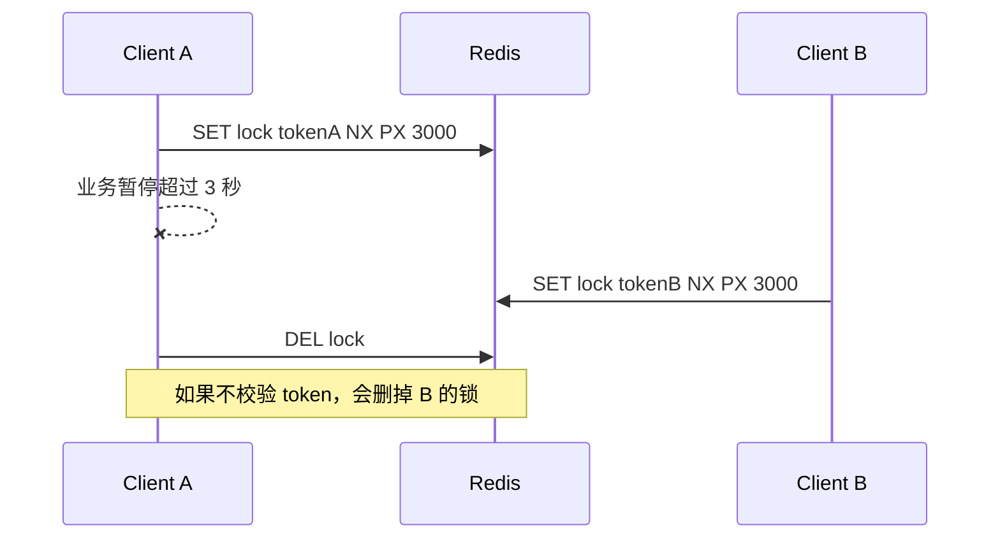

# 39 分布式锁：从 SET NX PX 到 RedLock 争议

## 1. 本章要解决的问题

Redis 分布式锁是高频面试题，也是高频事故点。本章解决：

- 如何用 Redis 正确加锁和释放锁？
- 为什么必须设置过期时间和唯一 token？
- 锁续期怎么做？
- RedLock 解决什么问题，又为什么有争议？
- 什么场景不该使用 Redis 锁？

## 2. 核心观点

一个基本可用的 Redis 分布式锁至少满足：

- 加锁原子：`SET key token NX PX ttl`
- 解锁安全：Lua 校验 token 后删除
- 业务耗时小于锁 TTL，或有续期机制
- 锁只能保护临界区入口，不能替代业务幂等和状态校验

RedLock 试图在多个独立 Redis 节点上提高锁可靠性，但它不能消除所有分布式系统问题，尤其是时钟漂移、进程暂停和网络分区下的安全边界争议。

## 3. 原理拆解

### 3.1 错误加锁方式

```bash
SETNX lock:order:1001 1
EXPIRE lock:order:1001 30
```

这是两条命令。如果 `SETNX` 成功后客户端宕机，`EXPIRE` 没执行，锁会永久存在。

正确方式：

```bash
SET lock:order:1001 token-uuid NX PX 30000
```

### 3.2 安全释放锁

不能直接 `DEL lock`。因为锁可能已经过期并被别人重新获取，直接删除会释放别人的锁。



必须使用 Lua：

```lua
if redis.call('GET', KEYS[1]) == ARGV[1] then
  return redis.call('DEL', KEYS[1])
end
return 0
```

### 3.3 锁续期

如果业务执行时间可能超过 TTL，需要续期。Redisson 的 WatchDog 思路是：持锁线程仍然存活时，后台定期延长锁时间。

但续期不是万能的：

- 进程 STW 暂停可能错过续期。
- 网络抖动可能续期失败。
- 业务线程卡死可能让锁长期存在。

## 4. 命令与代码示例

### 4.1 加锁

```bash
SET lock:coupon:1001 7f3c0c4a NX PX 10000
```

返回 `OK` 表示获取成功，返回 nil 表示锁已被占用。

### 4.2 解锁 Lua

```lua
-- KEYS[1] lock key
-- ARGV[1] token
if redis.call('GET', KEYS[1]) == ARGV[1] then
  return redis.call('DEL', KEYS[1])
end
return 0
```

### 4.3 Java 伪代码

```java
public <T> T withLock(String lockKey, Duration ttl, Supplier<T> action) {
    String token = UUID.randomUUID().toString();
    Boolean locked = redis.opsForValue().setIfAbsent(lockKey, token, ttl);
    if (!Boolean.TRUE.equals(locked)) {
        throw new BusyException("resource locked");
    }

    try {
        return action.get();
    } finally {
        redis.execute(unlockScript, List.of(lockKey), token);
    }
}
```

### 4.4 RedLock 简化流程

```text
1. 客户端依次向 N 个独立 Redis 节点加锁
2. 超过半数节点加锁成功
3. 总耗时小于锁有效期
4. 认为获取锁成功
5. 解锁时向所有节点释放
```

## 5. 生产实践

### 5.1 Redis 锁适合场景

- 防止重复提交。
- 定时任务单实例执行。
- 缓存重建互斥。
- 非核心资源的短临界区保护。

### 5.2 不适合场景

- 金融扣款的唯一一致性保障。
- 长时间任务独占。
- 强一致资源分配。
- 无法幂等的业务副作用。

这些场景要依赖数据库唯一约束、状态机、幂等表、消息事务或更强协调系统。

### 5.3 锁设计 checklist

```text
锁粒度是否足够小？
TTL 是否覆盖 P99 业务耗时？
是否有唯一 token？
解锁是否校验 token？
业务是否幂等？
锁失败是等待、快速失败还是降级？
是否监控锁竞争和超时？
```

### 5.4 RedLock 争议怎么看

RedLock 的价值是减少单 Redis 主从故障导致的锁安全问题。但争议在于：在异步网络、时钟漂移、进程暂停等情况下，仅靠多个 Redis 节点多数派并不能严格等价于共识系统。

工程判断：

- 如果只是缓存重建、任务去重，单 Redis 锁或 Redisson 足够。
- 如果是强一致资源协调，考虑 ZooKeeper、etcd、数据库事务或共识系统。

## 6. 常见坑

- `SETNX` 和 `EXPIRE` 分开执行。
- 解锁不校验 token。
- 锁 TTL 太短，业务没执行完锁已过期。
- 锁 TTL 太长，故障恢复慢。
- 获取锁失败后无限自旋，打爆 Redis。
- 以为 Redis 锁能代替幂等。
- 主从切换时没有考虑异步复制导致的锁丢失。

## 7. 面试追问

1. Redis 分布式锁怎么正确实现？
2. 为什么释放锁要用 Lua？
3. 锁过期但业务还没执行完怎么办？
4. RedLock 是什么？有什么争议？
5. Redis 锁和 ZooKeeper 锁有什么区别？

## 8. 章节笔记

### 课程核心观点

Redis 分布式锁的关键不是 `SETNX`，而是加锁、过期、解锁、续期和业务幂等的完整闭环。

### 我的理解

锁只是在并发入口处降低冲突，真正保证业务正确性的仍然是状态机、唯一约束和幂等。把锁当最后防线，系统就危险了。

### 关键概念

- `SET NX PX`
- 唯一 token
- Lua 解锁
- WatchDog
- RedLock
- fencing token

### 排障命令

```bash
GET lock:coupon:1001
PTTL lock:coupon:1001
SCAN 0 MATCH 'lock:*' COUNT 1000
SLOWLOG GET 20
```

## 9. 小结

Redis 分布式锁可以解决很多短临界区互斥问题，但必须正确实现：原子加锁、token 解锁、合理 TTL、必要续期和业务幂等。RedLock 提供了更复杂的多节点方案，但不是强一致银弹。越关键的业务，越不能只靠 Redis 锁兜底。
