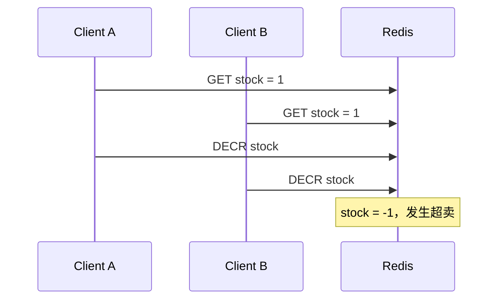
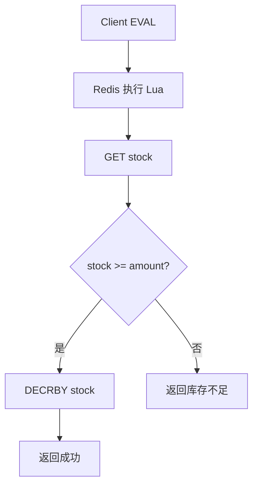

# 40 Lua 脚本如何保证复合操作原子性

## 1. 本章要解决的问题

Redis 单条命令是原子的，但业务常常需要复合操作：

- 判断库存是否充足，再扣减。
- 判断锁 token 是否匹配，再释放。
- 限流计数加一，同时设置 TTL。
- 判断用户是否已下单，再写入订单标记。

如果这些逻辑放在客户端多条命令里，就会有并发窗口。Lua 脚本可以把复合逻辑放到 Redis 服务端一次执行。

## 2. 核心观点

Lua 脚本的原子性来自 Redis 脚本执行期间不会穿插其他命令。

- 脚本内多条 Redis 命令作为一个整体执行。
- 脚本要短小，避免阻塞 Redis 主线程。
- 脚本结果要可重试、可幂等。
- Redis Cluster 下脚本访问的 key 必须在同一个 slot。

## 3. 原理拆解

### 3.1 客户端复合操作的并发窗口



### 3.2 Lua 服务端原子执行



脚本执行期间 Redis 不会处理其他客户端命令，所以判断和扣减之间没有并发插入。

### 3.3 EVAL 与 EVALSHA

第一次使用 `EVAL` 执行脚本，Redis 会计算 SHA1。之后可以用 `SCRIPT LOAD` + `EVALSHA` 减少脚本文本传输。

## 4. 命令与代码示例

### 4.1 解锁脚本

```lua
if redis.call('GET', KEYS[1]) == ARGV[1] then
  return redis.call('DEL', KEYS[1])
end
return 0
```

执行：

```bash
EVAL "if redis.call('GET', KEYS[1]) == ARGV[1] then return redis.call('DEL', KEYS[1]) end return 0" 1 lock:order:1001 token
```

### 4.2 秒杀扣库存脚本

```lua
-- KEYS[1] = stock key
-- KEYS[2] = user order set
-- ARGV[1] = user id
-- ARGV[2] = quantity
local ordered = redis.call('SISMEMBER', KEYS[2], ARGV[1])
if ordered == 1 then
  return -2
end

local stock = tonumber(redis.call('GET', KEYS[1]) or '0')
local quantity = tonumber(ARGV[2])
if stock < quantity then
  return -1
end

redis.call('DECRBY', KEYS[1], quantity)
redis.call('SADD', KEYS[2], ARGV[1])
return stock - quantity
```

返回值：

```text
-2 重复下单
-1 库存不足
>=0 扣减后剩余库存
```

### 4.3 Java 调用脚本

```java
Long result = redis.execute(seckillScript,
    List.of("seckill:{1001}:stock", "seckill:{1001}:users"),
    userId.toString(), "1");

if (result == -2) {
    throw new DuplicateOrderException();
}
if (result == -1) {
    throw new SoldOutException();
}
mq.send("order.create", new OrderCreateEvent(userId, skuId));
```

注意 key 使用 `{1001}` hash tag，保证 Redis Cluster 下两个 key 落在同一 slot。

### 4.4 滑动窗口限流脚本

```lua
-- KEYS[1] = zset key
-- ARGV[1] = now ms
-- ARGV[2] = window ms
-- ARGV[3] = limit
-- ARGV[4] = request id
local now = tonumber(ARGV[1])
local window = tonumber(ARGV[2])
local limit = tonumber(ARGV[3])

redis.call('ZREMRANGEBYSCORE', KEYS[1], '-inf', now - window)
local count = redis.call('ZCARD', KEYS[1])
if count >= limit then
  return 0
end
redis.call('ZADD', KEYS[1], now, ARGV[4])
redis.call('PEXPIRE', KEYS[1], window)
return 1
```

## 5. 生产实践

### 5.1 Lua 适合场景

- 判断后更新。
- 多 key 同 slot 原子变更。
- 解锁 token 校验。
- 限流。
- 秒杀预扣库存。
- 幂等标记。

### 5.2 Lua 不适合场景

- 长时间循环。
- 大范围扫描。
- 复杂业务计算。
- 访问外部系统。
- 跨 slot 多 key 操作。

Lua 脚本会阻塞 Redis 主线程，脚本越长风险越大。

### 5.3 脚本治理

建议：

- 脚本文件化，纳入代码版本管理。
- 启动时 `SCRIPT LOAD`，运行时 `EVALSHA`。
- 捕获 `NOSCRIPT` 后自动 reload。
- 对脚本耗时做监控。
- 参数只通过 `KEYS` 和 `ARGV` 传入。

## 6. 常见坑

- Lua 脚本里做大循环，阻塞 Redis。
- Redis Cluster 下脚本访问不同 slot 的 key。
- 把业务复杂逻辑塞进 Lua，难测试、难维护。
- 脚本执行成功后 MQ 发送失败，库存扣了但订单没创建。
- 秒杀扣库存没有用户幂等标记。
- 使用随机数、时间等非确定逻辑影响复制一致性。

## 7. 面试追问

1. Lua 脚本为什么能保证原子性？
2. Lua 脚本会阻塞 Redis 吗？
3. Redis Cluster 下 Lua 多 key 有什么限制？
4. 秒杀扣库存为什么适合 Lua？
5. Lua 成功后下游创建订单失败怎么办？

## 8. 章节笔记

### 课程核心观点

Lua 是 Redis 处理复合原子操作的核心工具，但它应该短小、明确、可控。

### 我的理解

Lua 适合放“数据结构附近的并发判断”，不适合放完整业务流程。秒杀里 Lua 负责预扣库存和幂等，订单创建、支付、超时补偿仍然应该交给业务系统和消息链路。

### 关键概念

- `EVAL`
- `EVALSHA`
- `SCRIPT LOAD`
- 原子复合操作
- hash tag
- 秒杀预扣
- 滑动窗口限流

### 排障命令

```bash
SCRIPT LOAD "return 1"
SCRIPT EXISTS <sha1>
SLOWLOG GET 20
LATENCY DOCTOR
CLUSTER KEYSLOT seckill:{1001}:stock
CLUSTER KEYSLOT seckill:{1001}:users
```

## 9. 小结

Lua 脚本把多条 Redis 命令封装到服务端一次执行，是解决复合原子操作的利器。它特别适合解锁、限流、扣库存和幂等标记。但 Lua 不是业务流程引擎，脚本必须短小、可测试、可监控，并注意 Redis Cluster 的同 slot 限制。
