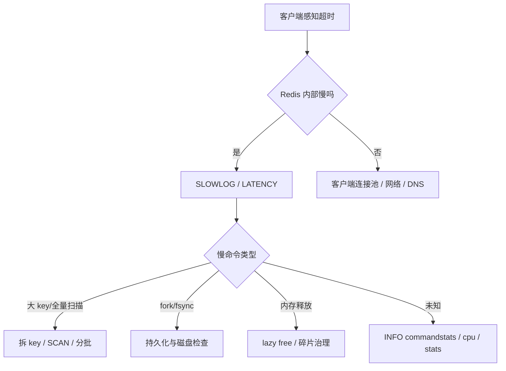

# 41 Redis变慢了应该先查什么

## 1. 本章要解决的问题

Redis 变慢时，最容易犯的错是直接猜测“是不是大 key”“是不是网络抖了”“是不是 Redis 单线程扛不住”。真正可靠的做法，是先把延迟分层：客户端、网络、Redis 主线程、后台任务、持久化、内存回收、操作系统。只有确认延迟发生在哪一层，后续优化才不会变成撞运气。

## 2. 核心观点

Redis 排障优先看四类证据：`SLOWLOG` 看慢命令，`LATENCY` 看事件尖刺，`INFO` 看实例状态，`MEMORY` 看内存和碎片。再结合客户端侧 RT、机器 CPU、磁盘、网络和 fork 指标，建立从现象到根因的链路。

## 3. 原理拆解

Redis 命令执行在主线程上串行完成。慢的来源不一定是命令本身，也可能是命令前后的等待：排队等待、协议读写、复制缓冲、AOF fsync、fork COW、内存释放、过期扫描、网络发送阻塞。



## 4. 命令与代码示例

排障第一屏：

```bash
redis-cli --latency -h 127.0.0.1 -p 6379
redis-cli --latency-history -i 1
redis-cli slowlog get 20
redis-cli latency latest
redis-cli latency doctor
redis-cli info stats
redis-cli info commandstats
redis-cli info persistence
redis-cli info memory
redis-cli memory stats
```

大 key 低风险扫描脚本：

```bash
redis-cli --bigkeys -i 0.05
redis-cli --memkeys -i 0.05
redis-cli --keystats -i 0.05
```

应用侧埋点伪代码：

```java
long start = System.nanoTime();
try {
    return redis.get(key);
} finally {
    long costMs = TimeUnit.NANOSECONDS.toMillis(System.nanoTime() - start);
    metrics.timer("redis.client.rt", "cmd", "GET").record(costMs, TimeUnit.MILLISECONDS);
}
```

## 5. 生产实践

排查顺序建议固定化：先确认是不是全局慢，再确认是不是某类命令慢，再确认是不是特定实例慢，最后看资源和业务变更。全局慢通常指所有命令 RT 升高，局部慢则可能是某些 key、某类命令、某个客户端或某个 slot。

生产 Runbook：

```text
1. 看客户端错误：timeout、connection refused、pool exhausted。
2. 看 Redis 当前延迟：--latency、LATENCY LATEST。
3. 看慢查询：SLOWLOG GET，确认是否有 KEYS、LRANGE 大范围、HGETALL 大 hash。
4. 看实例状态：INFO clients/memory/persistence/replication/stats。
5. 看机器资源：CPU steal、磁盘 await、网卡丢包、内存 swap。
6. 看最近变更：上线、流量、key 规模、持久化参数、主从切换。
```

## 6. 常见坑

- 只看 `SLOWLOG`：网络阻塞、连接池耗尽、fork 卡顿不一定会进入慢查询。
- 在线执行 `KEYS *`、`HGETALL` 大 key、`SMEMBERS` 大集合，会把排障变成事故。
- 把 `used_memory` 升高等同于泄漏，忽略 allocator 和碎片。
- 忽略客户端连接池，Redis 很快但应用线程都在等连接，同样表现为慢。

## 7. 面试追问

1. Redis 慢查询阈值应该如何设置？
2. `LATENCY DOCTOR` 和 `SLOWLOG` 的差异是什么？
3. Redis 没有慢查询但应用超时，可能是什么原因？
4. 大 key 为什么会同时影响主线程、网络和复制？

## 8. 章节笔记

- 核心命令：`SLOWLOG GET`、`LATENCY LATEST`、`INFO`、`MEMORY STATS`。
- 核心指标：p99 延迟、慢命令数、fork 耗时、AOF fsync、复制积压、输出缓冲。
- 排障原则：先分层，后定位；先证据，后优化；先止血，后复盘。

## 9. 小结

Redis 变慢不是一个点状问题，而是一条链路问题。稳定团队会把排障步骤沉淀成固定 Runbook，让每次事故都能迅速从“感觉慢”落到“哪一层、哪条命令、哪个指标异常”。
