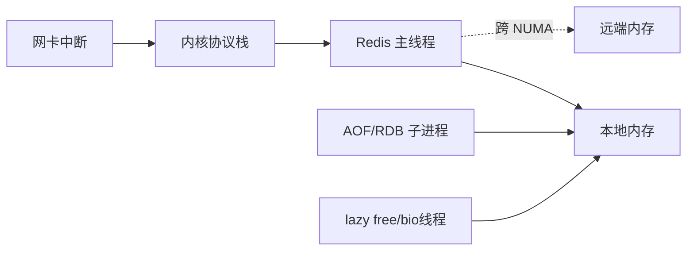

# 42 CPU结构为什么会影响Redis性能

## 1. 本章要解决的问题

Redis 大部分命令在主线程执行，看起来只要给它一个高主频 CPU 就够了。但在多核、多 NUMA 节点、云主机虚拟化、网卡多队列环境下，CPU 拓扑会直接影响内存访问、网络中断、线程调度和尾延迟。

## 2. 核心观点

Redis 性能更依赖单核质量、CPU cache 命中、内存本地性和稳定调度。多核不是没用，后台线程、IO 线程、内核网络栈、fork 子进程都需要 CPU，但 Redis 主线程最怕被迁移、被中断打断、跨 NUMA 访问内存。

## 3. 原理拆解

NUMA 机器上，每个 CPU socket 有自己的本地内存。Redis 进程如果在 CPU0 上跑，却频繁访问另一个 NUMA 节点上的内存，会增加访问延迟。网络中断如果和 Redis 主线程抢同一个核心，也会造成 p99 抖动。



## 4. 命令与代码示例

查看 CPU 和 NUMA：

```bash
lscpu
numactl --hardware
numastat -p $(pidof redis-server)
taskset -cp $(pidof redis-server)
cat /proc/interrupts | egrep 'eth|ens|mlx'
mpstat -P ALL 1
pidstat -t -p $(pidof redis-server) 1
```

绑核示例：

```bash
# 将 Redis 主进程限制到 2 号 CPU，实际生产需结合中断和 NUMA 拓扑评估
taskset -cp 2 $(pidof redis-server)

# 启动时绑定内存和 CPU 到同一 NUMA 节点
numactl --cpunodebind=0 --membind=0 redis-server /etc/redis/redis.conf
```

Redis 6 IO 线程配置示例：

```conf
io-threads 4
io-threads-do-reads yes
```

## 5. 生产实践

部署建议：

- 独占 Redis 核心，避免和高 CPU 任务混部。
- 将 Redis 主线程、网卡中断、后台任务错开核心。
- NUMA 机器上尽量保证 CPU 和内存本地化。
- 关闭透明大页：`echo never > /sys/kernel/mm/transparent_hugepage/enabled`。
- 关注 CPU steal，云主机 steal 高会导致 Redis 无端抖动。

性能压测不要只看 QPS，要看 p95/p99/p999。CPU 拓扑问题往往不是平均值变差，而是尾延迟突然拉长。

## 6. 常见坑

- 在大规格机器上部署很多 Redis 实例，却让所有实例共享同一组 CPU。
- 开启多 IO 线程后期待命令执行并行化，实际 Redis 命令执行仍主要串行。
- Redis 和网关、日志采集、压缩任务混部，导致周期性 CPU 抢占。
- 忽略 THP，fork 和内存页管理出现不可预测延迟。

## 7. 面试追问

1. Redis 单线程为什么仍然受多核 CPU 拓扑影响？
2. NUMA 对 Redis 的影响体现在哪里？
3. Redis 6 多线程 IO 适合什么场景？
4. 为什么 CPU 使用率不高也可能出现高延迟？

## 8. 章节笔记

- Redis 主线程适合高主频、低抖动、低中断干扰的核心。
- NUMA 本质是“访问哪块内存更近”的问题。
- 多线程 IO 优化的是网络读写和协议处理的一部分，不是所有命令并发执行。
- p99 比平均值更能暴露 CPU 调度和硬件拓扑问题。

## 9. 小结

Redis 快，不代表它对机器环境不敏感。越是低延迟系统，越需要理解 CPU、NUMA、内核中断和调度。工程上最稳的做法是把 Redis 当作延迟敏感服务部署，而不是普通后台进程。
