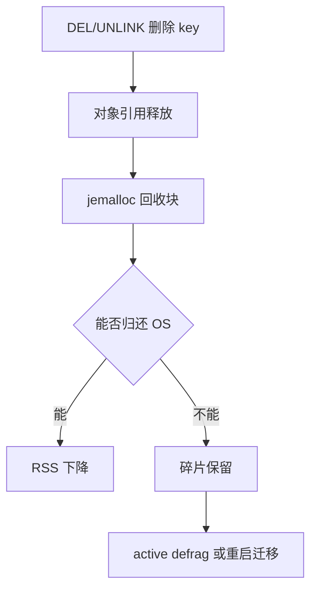

# 43 删除数据后为什么内存还是很高

## 1. 本章要解决的问题

很多人看到 `DEL` 后 `DBSIZE` 降了，但 `top` 或 `INFO memory` 里的内存仍然很高，就会怀疑 Redis 泄漏。实际上，这常常是 allocator、内存碎片、RSS 回收、后台释放和操作系统页管理共同作用的结果。

## 2. 核心观点

判断内存问题不能只看一个指标。`used_memory` 表示 Redis 认为自己使用的内存，`used_memory_rss` 表示进程常驻内存，`mem_fragmentation_ratio` 反映碎片倾向。删除数据后内存不降，可能正常，也可能需要主动碎片整理或重启迁移。

## 3. 原理拆解

Redis 通过 jemalloc 分配内存。对象删除后，内存先还给 allocator，allocator 不一定立刻还给操作系统。大量大小不一的 key 反复创建删除，会造成内存空洞，表现为 RSS 高于 Redis 实际数据大小。



## 4. 命令与代码示例

内存诊断：

```bash
redis-cli info memory
redis-cli memory stats
redis-cli memory malloc-stats
redis-cli memory doctor
redis-cli --bigkeys -i 0.05
redis-cli --memkeys -i 0.05
```

关键配置：

```conf
maxmemory 12gb
maxmemory-policy allkeys-lfu

lazyfree-lazy-user-del yes
lazyfree-lazy-expire yes
lazyfree-lazy-server-del yes
replica-lazy-flush yes

activedefrag yes
active-defrag-ignore-bytes 100mb
active-defrag-threshold-lower 10
active-defrag-threshold-upper 100
```

用 `UNLINK` 替代大 key 删除：

```bash
redis-cli unlink user:big:profile
redis-cli scan 0 match 'tmp:*' count 1000
```

## 5. 生产实践

内存治理要分三步：先确认数据量是否真的下降，再看碎片是否异常，最后决定使用主动碎片整理、迁移重启还是数据模型改造。

建议阈值：

- `mem_fragmentation_ratio` 长期大于 1.5，需要关注。
- RSS 接近机器内存上限，先止血，避免触发 OOM。
- 大量删除前先评估 key 大小，优先使用 `UNLINK` 或分批删除。

在集群中，最平滑的内存回收方式通常是迁移 slot、重启空实例、再迁回，而不是直接在高峰期执行大范围删除和碎片整理。

## 6. 常见坑

- 把 `DBSIZE` 当作内存大小，忽略 value 大小和内部编码。
- 用 `DEL` 删除巨大集合，导致主线程长时间阻塞。
- 在线开启 aggressive defrag，结果碎片下降了但 CPU 抖动上去了。
- 容器环境里只看宿主机内存，没有看 cgroup 限制。

## 7. 面试追问

1. `used_memory` 和 `used_memory_rss` 有什么区别？
2. `DEL` 和 `UNLINK` 的差异是什么？
3. jemalloc 为什么会导致删除后 RSS 不降？
4. active defrag 会带来哪些副作用？

## 8. 章节笔记

- 删除后内存不降不等于泄漏。
- 大 key 删除要异步化，小批量、可观测、可回滚。
- 碎片治理有成本，不能只追求数字漂亮。
- 数据模型稳定比事后 defrag 更重要。

## 9. 小结

Redis 内存治理的关键，是区分“真实数据占用”“allocator 保留”“碎片浪费”和“操作系统未回收”。当你能讲清这些指标之间的关系，内存问题就不再是一团雾。
