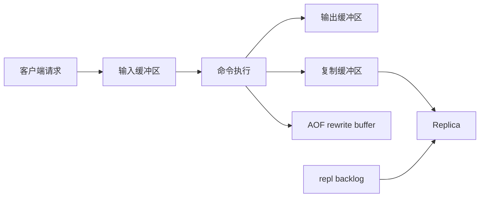

# 44 缓冲区：一个可能引发事故的地方

## 1. 本章要解决的问题

Redis 的缓冲区平时很安静，一旦出事往往很凶：客户端输出缓冲区爆掉、复制积压缓冲区不足、Pub/Sub 客户端消费慢、主从断线全量同步。缓冲区不是附属细节，而是 Redis 高可用和稳定性的关键边界。

## 2. 核心观点

缓冲区问题本质是“生产速度大于消费速度”。Redis 主线程生成响应、主库生成复制流、Pub/Sub 推送消息，如果对端读得慢，数据就会堆在缓冲区里，最终触发断连、内存飙升或全量同步。

## 3. 原理拆解

Redis 常见缓冲区包括客户端输入缓冲区、客户端输出缓冲区、复制 backlog、主从复制缓冲区、AOF rewrite 缓冲区。不同缓冲区负责不同阶段，但风险都指向内存和阻塞。



## 4. 命令与代码示例

查看客户端缓冲：

```bash
redis-cli client list
redis-cli info clients
redis-cli info replication
redis-cli info memory
```

重点字段：

```text
obl: output buffer length
omem: output buffer memory usage
qbuf: query buffer length
cmd: current command
age/idle: connection age and idle time
```

缓冲区配置：

```conf
client-output-buffer-limit normal 0 0 0
client-output-buffer-limit replica 256mb 64mb 60
client-output-buffer-limit pubsub 32mb 8mb 60

repl-backlog-size 256mb
repl-backlog-ttl 3600
proto-max-bulk-len 512mb
client-query-buffer-limit 1gb
```

慢消费者清理：

```bash
redis-cli client list | grep 'omem='
redis-cli client kill id 12345
```

## 5. 生产实践

缓冲区治理要区分普通客户端、复制客户端和 Pub/Sub 客户端。普通客户端输出缓冲默认无限制，业务客户端如果长时间不读响应，可能吃掉大量内存。Pub/Sub 客户端尤其危险，因为消息会主动推送；消费者慢时，即使没有请求也会持续堆积。

复制 backlog 不是越小越省。它太小会导致短暂网络抖动后无法增量同步，只能全量复制，反过来制造更大的网络和磁盘压力。

## 6. 常见坑

- 大查询返回给慢客户端，输出缓冲区持续增长。
- 从库网络抖动，主库复制缓冲区变大，最终断开并触发全量同步。
- Pub/Sub 被当作可靠队列使用，消费者掉线或变慢后没有补偿机制。
- 盲目调大缓冲区上限，掩盖消费能力不足。

## 7. 面试追问

1. Redis 有哪些重要缓冲区？
2. `client-output-buffer-limit` 三个数字分别是什么意思？
3. 复制 backlog 和复制缓冲区有什么区别？
4. Pub/Sub 为什么不适合可靠消息？

## 8. 章节笔记

- 缓冲区是流量削峰，不是无限仓库。
- 慢消费者要被识别和隔离。
- backlog 影响主从断线后的增量同步能力。
- 缓冲区事故通常表现为内存升高、客户端断连、复制反复全量同步。

## 9. 小结

Redis 的缓冲区设计体现了高性能系统的常见矛盾：不能让慢消费者拖垮系统，也不能因为短暂抖动就过早失败。生产上的关键，是给不同连接类型设置合理边界，并持续观察它们。
