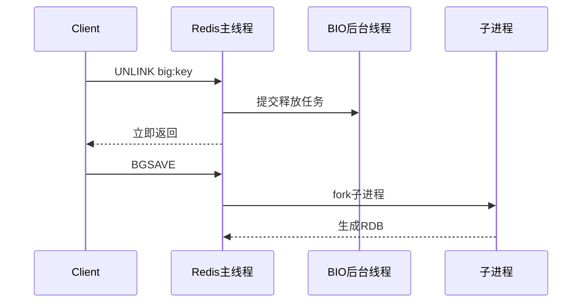

# 45 异步机制如何避免单线程阻塞

## 1. 本章要解决的问题

Redis 主线程负责命令执行，任何耗时操作都可能拖慢所有请求。但 Redis 并不是“只有一个线程”。它通过后台线程、子进程、lazy free、多 IO 线程等机制，把某些重活从主路径中移开。

## 2. 核心观点

Redis 异步机制的目标不是把所有操作并行化，而是保护主线程的短路径。网络读写、对象释放、AOF fsync、RDB/AOF rewrite、关闭大连接等，都可以在不同程度上异步处理。

## 3. 原理拆解

Redis 的异步任务主要由 bio 后台线程和子进程承接。`UNLINK`、异步过期、异步 flush 会把释放对象的工作排队给后台线程；RDB 和 AOF rewrite 则通过 fork 子进程生成文件。



## 4. 命令与代码示例

配置 lazy free：

```conf
lazyfree-lazy-user-del yes
lazyfree-lazy-expire yes
lazyfree-lazy-eviction yes
lazyfree-lazy-server-del yes
replica-lazy-flush yes
```

命令使用：

```bash
redis-cli unlink large:list
redis-cli flushdb async
redis-cli flushall async
redis-cli info stats | grep lazyfree
redis-cli info persistence | egrep 'rdb|aof|fork'
```

释放任务伪代码：

```c
void unlinkCommand(client *c) {
    robj *key = lookupKeyWrite(c->db, c->argv[1]);
    dbAsyncDelete(c->db, key->ptr);
    addReplyLongLong(c, 1);
}

void bioProcessBackgroundJobs() {
    while (job = pop_job()) {
        lazyfreeFreeObjectFromBioThread(job->arg);
    }
}
```

## 5. 生产实践

异步释放适合大对象删除、批量 flush、从库全量同步前清空数据等场景。它能降低主线程阻塞，但不会让释放成本消失，只是把成本转移到后台线程和 CPU 上。因此在高峰期大量 `UNLINK` 仍可能造成 CPU 压力和内存回收滞后。

对于持久化，`BGSAVE` 和 `BGREWRITEAOF` 使用子进程异步生成文件，但 fork 本身发生在主线程，且 COW 会放大内存压力。异步不等于零成本。

## 6. 常见坑

- 以为 `UNLINK` 后内存会立刻下降，实际释放还在后台排队。
- 在 CPU 紧张时大量异步释放，后台线程抢占资源。
- 忽略 fork 瞬间阻塞和 COW 内存，导致持久化期间延迟尖刺。
- 把 Redis 多线程 IO 理解成命令并行执行。

## 7. 面试追问

1. Redis 有哪些后台线程任务？
2. `DEL` 和 `UNLINK` 在实现路径上有什么不同？
3. RDB/AOF rewrite 为什么仍可能阻塞？
4. lazy free 会不会影响内存淘汰？

## 8. 章节笔记

- Redis 异步机制服务于主线程延迟稳定性。
- 后台释放减少阻塞，但不减少总 CPU 成本。
- fork 是异步持久化前的同步风险点。
- 使用异步机制也要配合监控和限速。

## 9. 小结

Redis 的异步设计很克制：把最容易拖慢主线程的工作移走，同时保持命令执行模型简单。理解这一点，就能在使用 `UNLINK`、`BGSAVE`、多 IO 线程时把握收益和边界。
