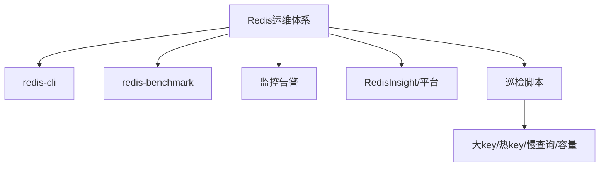

# 46 Redis运维工具与使用规范

## 1. 本章要解决的问题

Redis 运维不是“会用 redis-cli”就够了。生产环境需要工具链、规范和权限边界：怎么压测，怎么巡检，怎么找大 key，怎么限制危险命令，怎么做变更，怎么给业务制定 key 和 TTL 规范。

## 2. 核心观点

优秀的 Redis 运维体系由三部分组成：可观察的工具、可执行的规范、可复盘的流程。工具解决“看见”，规范解决“少犯错”，流程解决“出了事能恢复”。

## 3. 原理拆解

Redis 运维工具围绕连接、性能、内存、数据、集群和可视化展开。命令行适合自动化和应急，可视化工具适合巡检和低风险操作，监控系统负责趋势和告警。



## 4. 命令与代码示例

常用工具命令：

```bash
redis-cli -h host -p 6379 --stat
redis-cli -h host -p 6379 --latency
redis-cli -h host -p 6379 --bigkeys -i 0.05
redis-cli -h host -p 6379 --scan --pattern 'order:*'
redis-benchmark -h host -p 6379 -c 100 -n 100000 -t get,set -d 128
```

危险命令治理：

```conf
rename-command FLUSHALL ""
rename-command FLUSHDB ""
rename-command KEYS ""
rename-command CONFIG "CONFIG_9d34c1"
protected-mode yes
requirepass your-strong-password
aclfile /etc/redis/users.acl
```

ACL 示例：

```bash
ACL SETUSER app_user on >strong-pass ~app:* +get +set +del +expire +eval
ACL SETUSER readonly on >read-pass ~* +get +mget +ttl +scan -@dangerous
```

## 5. 生产实践

使用规范建议：

- key 命名：`业务:实体:ID:字段`，避免无边界通配。
- TTL 规范：缓存必须有过期时间，核心状态类 key 需要明确生命周期。
- 大 key 红线：String 超过 1MB、集合元素超过 1 万就要评估拆分。
- 禁止线上直接执行 `KEYS`、大范围 `HGETALL`、无 COUNT 的扫描。
- 变更前准备回滚：备份、慢日志阈值、监控看板、限速脚本。

巡检清单：

```text
每日：内存水位、连接数、慢查询、主从延迟、AOF/RDB 状态。
每周：大 key、热 key、过期 key 比例、碎片率、命令分布。
每月：容量预测、版本升级、参数审计、故障演练。
```

## 6. 常见坑

- 压测只跑本机回环，结果上线后网络和客户端连接池成为瓶颈。
- 运维平台权限过大，误删比性能问题更可怕。
- 大 key 扫描不加限速，在业务高峰制造抖动。
- 监控只看 Redis 指标，不看宿主机、客户端、网络和磁盘。

## 7. 面试追问

1. Redis 生产环境应该禁用哪些危险命令？
2. 如何设计 Redis key 命名规范？
3. `redis-benchmark` 的结果为什么不能直接代表业务性能？
4. 大 key 巡检如何避免影响线上？

## 8. 章节笔记

- 工具链：`redis-cli`、`redis-benchmark`、RedisInsight、监控系统、巡检脚本。
- 规范：key、TTL、大 key、权限、变更、压测。
- 运维目标：可观察、可控制、可恢复。

## 9. 小结

Redis 的稳定性很大程度上来自日常规范，而不是事故时的聪明。把工具和流程沉淀下来，团队才能从“靠经验救火”升级到“靠系统治理”。
