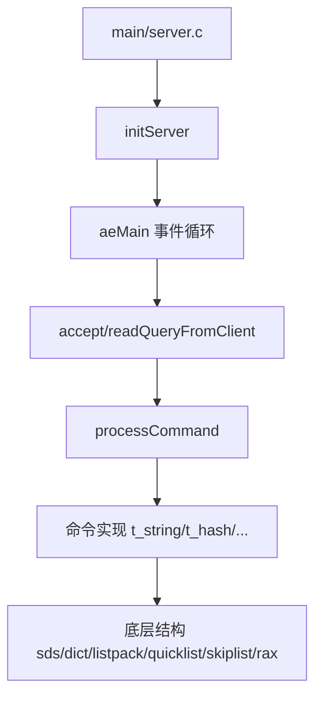

# 47 如何阅读Redis源码

## 1. 本章要解决的问题

Redis 源码规模不算巨大，但第一次读仍容易迷路：从哪里开始，哪些文件最重要，如何把命令执行、数据结构、事件循环、持久化和高可用串起来。本章给出一套可复用的源码阅读路线。

## 2. 核心观点

读 Redis 源码不要从“逐行看”开始，而要从主流程和问题开始：一条命令怎么执行，一个对象怎么存，一个事件怎么触发，一次持久化怎么完成，一次主从同步怎么推进。源码阅读的目标是建立机制模型。

## 3. 原理拆解

Redis 源码可以按能力域拆分：启动初始化、网络事件、命令表、对象系统、数据结构、持久化、复制、集群、模块和测试。



## 4. 命令与代码示例

建议入口：

```bash
git clone https://github.com/redis/redis.git
cd redis
make BUILD_TLS=no
src/redis-server redis.conf
src/redis-cli set hello world
```

调试入口：

```bash
gdb --args src/redis-server redis.conf
(gdb) b processCommand
(gdb) b setCommand
(gdb) run
```

源码笔记模板：

```text
问题：这段源码解决什么问题？
入口函数：从哪个函数进入？
核心结构体：有哪些字段决定行为？
主流程：正常路径是什么？
异常路径：失败、超时、内存不足如何处理？
设计取舍：为什么不选更简单的实现？
```

## 5. 生产实践

源码阅读最有价值的方式，是带着生产问题看源码。例如：

- 慢查询：从 `processCommand`、`call`、`slowlogPushEntryIfNeeded` 看命令计时。
- 过期删除：从 `expireIfNeeded`、`activeExpireCycle` 看惰性和定期删除。
- 集群重定向：从 `getNodeByQuery` 看 `MOVED`、`ASK`。
- AOF 重写：从 `rewriteAppendOnlyFileBackground` 看 fork 和缓冲。

## 6. 常见坑

- 一开始就看所有文件，缺少问题牵引。
- 只看数据结构，不看它被命令如何调用。
- 看源码时忽略配置项，实际行为往往由配置驱动。
- 用最新版源码解释旧版本线上行为，版本差异可能很关键。

## 7. 面试追问

1. 你会从哪个函数开始跟踪一条 Redis 命令？
2. Redis 源码中哪些文件最值得先读？
3. 读源码时如何避免陷入细节？
4. 如何用源码解释一个生产延迟问题？

## 8. 章节笔记

- 入口：`server.c`、`networking.c`、`ae.c`、`db.c`。
- 数据结构：`sds.c`、`dict.c`、`listpack.c`、`quicklist.c`、`t_zset.c`、`rax.c`。
- 主线：命令执行、事件循环、对象存储、持久化、复制集群。
- 方法：问题驱动、断点调试、画调用图、记录版本。

## 9. 小结

读 Redis 源码的收益不只是知道 Redis 怎么写，更重要的是学习一个成熟系统如何在性能、复杂度、可维护性之间取舍。源码不是终点，它是训练工程判断力的材料。
