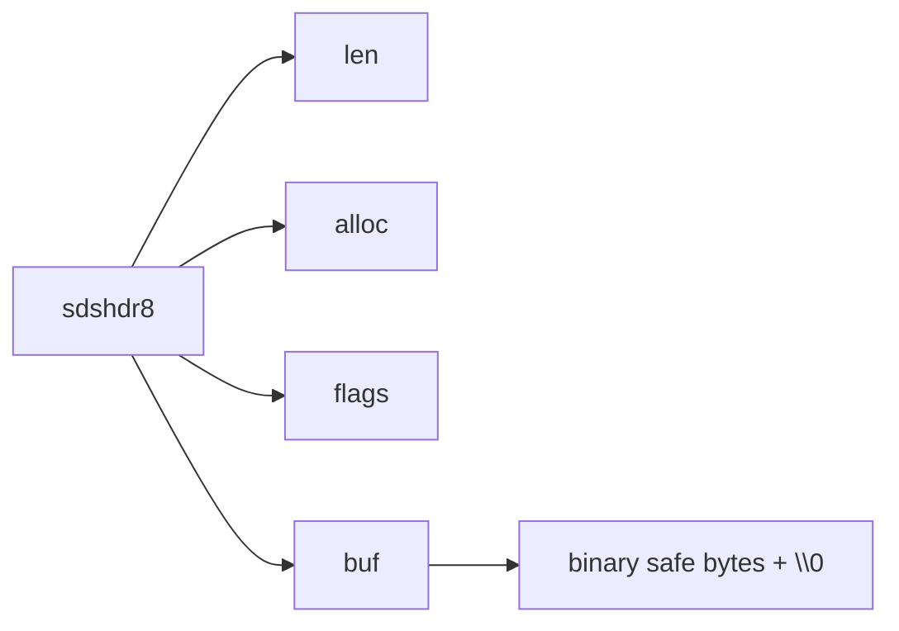

# 48 SDS：字符串为什么不用C原生char指针

## 1. 本章要解决的问题

Redis 用 C 写成，却没有直接用 C 原生字符串表示所有字符串，而是设计了 SDS。原因很简单：Redis 需要高频拼接、二进制安全、快速取长度和减少内存浪费，C 字符串无法优雅满足这些要求。

## 2. 核心观点

SDS 是 Redis 字符串的基础设施。它在字符数组前面保存长度、容量和类型信息，让字符串操作从“每次扫描”变成“直接读元数据”，同时支持包含 `\0` 的二进制内容。

## 3. 原理拆解

SDS 的核心是 header + buf。不同长度使用不同 header 类型，以降低小字符串的元数据开销。



## 4. 命令与代码示例

简化结构体：

```c
struct sdshdr8 {
    uint8_t len;
    uint8_t alloc;
    unsigned char flags;
    char buf[];
};
```

典型操作伪代码：

```c
size_t sdslen(const sds s) {
    unsigned char flags = s[-1];
    switch(flags & SDS_TYPE_MASK) {
        case SDS_TYPE_8: return SDS_HDR(8, s)->len;
        case SDS_TYPE_16: return SDS_HDR(16, s)->len;
    }
}
```

命令观察：

```bash
redis-cli set bin "$(printf 'a\\0b')"
redis-cli strlen bin
redis-cli object encoding bin
redis-cli memory usage bin
```

## 5. 生产实践

SDS 解释了 String 的很多使用边界。String 可以存 JSON、图片片段、序列化对象，但大 value 会带来网络传输、复制、持久化和删除成本。生产上建议把大对象拆分，或者把大二进制放对象存储，Redis 只存索引和元数据。

## 6. 常见坑

- 以为 Redis String 等同于 Java String，忽略二进制安全和内存编码。
- 单个 value 过大，导致慢查询、复制延迟和 AOF 膨胀。
- 小字符串 key 过多，元数据和 dict 开销超过 value 本身。
- 只关注 `strlen`，不看 `memory usage`。

## 7. 面试追问

1. SDS 相比 C 字符串有哪些优势？
2. SDS 为什么要分 sdshdr5/8/16/32/64？
3. Redis String 的 embstr 和 raw 有什么区别？
4. 二进制安全对 Redis 有什么意义？

## 8. 章节笔记

- SDS 保存 `len` 和 `alloc`，取长度 O(1)。
- SDS 兼容 C 字符串结尾 `\0`，但不依赖它判断长度。
- 分级 header 是典型的空间优化。
- String 好用，但大 value 和小 key 海量化都要治理。

## 9. 小结

SDS 是一个很小但很漂亮的工程设计：它没有追求复杂抽象，而是在 C 字符串前补上 Redis 真正需要的元数据。高性能系统里的很多设计，都像 SDS 这样朴素但精准。
