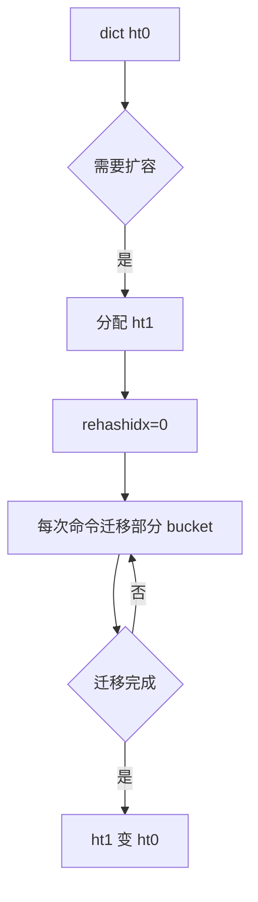

# 49 dict与渐进式rehash

## 1. 本章要解决的问题

Redis 的 key 空间、Hash 对象、Set 对象都大量依赖哈希表。哈希表扩容如果一次性搬迁所有元素，会阻塞主线程。Redis 通过双哈希表和渐进式 rehash，把大搬迁拆成很多小步。

## 2. 核心观点

dict 的设计重点不是“哈希表怎么查”，而是“如何在单线程服务中平滑扩容”。渐进式 rehash 让 Redis 在读写命令顺手迁移 bucket，避免一次性阻塞。

## 3. 原理拆解

dict 包含两个哈希表 `ht[0]` 和 `ht[1]`。正常使用 `ht[0]`；扩容时分配 `ht[1]`，通过 `rehashidx` 记录迁移位置。查找时两个表都查，写入通常进入新表。



## 4. 命令与代码示例

简化结构：

```c
typedef struct dict {
    dictType *type;
    dictEntry **ht_table[2];
    unsigned long ht_used[2];
    long rehashidx;
} dict;
```

渐进式迁移伪代码：

```c
int dictRehash(dict *d, int n) {
    while (n-- && d->ht_used[0] != 0) {
        while (d->ht_table[0][d->rehashidx] == NULL) d->rehashidx++;
        moveBucket(d, d->rehashidx);
        d->rehashidx++;
    }
    if (d->ht_used[0] == 0) finishRehash(d);
}
```

观察哈希编码：

```bash
redis-cli hset user:1 name tom age 18
redis-cli object encoding user:1
redis-cli memory usage user:1
redis-cli config get hash-max-listpack-entries
```

## 5. 生产实践

大 Hash 并不总是坏，但需要关注字段数量、单字段大小和访问模式。如果业务经常一次性 `HGETALL`，大 Hash 会变成慢操作。如果只按字段点查，大 Hash 可以减少 key 数量和过期字典开销。

设计建议：

- 用户画像类 Hash 控制字段数量，超大字段拆出去。
- 高频更新对象避免一次性大范围遍历。
- 扩容期延迟可能轻微增加，压测要覆盖写入增长阶段。

## 6. 常见坑

- 把 Redis Hash 当作无限 Map 使用。
- 大量字段一次性写入，触发扩容和内存压力。
- 在线 `HGETALL` 大 Hash，阻塞主线程和网络发送。
- 忽略 listpack 到 hashtable 编码转换带来的内存变化。

## 7. 面试追问

1. Redis dict 为什么要用两个哈希表？
2. 渐进式 rehash 期间查询如何保证正确？
3. rehash 期间新写入的数据进入哪个表？
4. Redis Hash 什么时候用 listpack，什么时候用 hashtable？

## 8. 章节笔记

- dict 是 Redis key 空间和多种类型的基础。
- 渐进式 rehash 是单线程服务平滑扩容的关键。
- 读写操作会帮助推进 rehash。
- Hash 设计要结合访问模式，不只看字段数量。

## 9. 小结

dict 展示了 Redis 的工程风格：算法并不神秘，但它必须适配单线程低延迟服务。渐进式 rehash 的价值，就是把不可接受的一次阻塞，拆成可接受的小成本。
