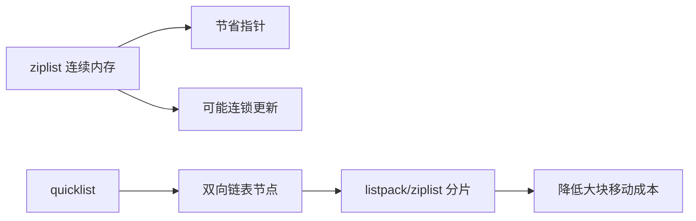

# 50 ziplist quicklist listpack的内存设计

## 1. 本章要解决的问题

Redis 很多对象在“小数据量”时不用普通链表或哈希表，而使用紧凑编码。ziplist、quicklist、listpack 的演进，体现了 Redis 在内存占用、访问效率和更新成本之间的不断平衡。

## 2. 核心观点

紧凑结构减少指针和 allocator 元数据开销，适合小对象密集存储。但紧凑结构通常需要连续内存，插入、删除、扩容可能移动数据。Redis 后续用 quicklist 和 listpack 缓解 ziplist 的连锁更新问题。

## 3. 原理拆解

ziplist 是连续内存结构，每个 entry 保存前一个 entry 的长度，便于反向遍历，但当前一个 entry 长度编码变化时，可能引发后续 entry 连锁更新。quicklist 把多个紧凑列表挂在双向链表节点上，兼顾内存和更新。



## 4. 命令与代码示例

配置示例：

```conf
list-max-listpack-size -2
list-compress-depth 0
hash-max-listpack-entries 512
hash-max-listpack-value 64
zset-max-listpack-entries 128
zset-max-listpack-value 64
```

观察编码变化：

```bash
redis-cli del mylist
redis-cli rpush mylist a b c
redis-cli object encoding mylist
redis-cli memory usage mylist
```

结构伪代码：

```c
typedef struct quicklist {
    quicklistNode *head;
    quicklistNode *tail;
    unsigned long count;
    unsigned long len;
} quicklist;

typedef struct quicklistNode {
    quicklistNode *prev, *next;
    unsigned char *entry; // listpack
    size_t sz;
    unsigned int count;
} quicklistNode;
```

## 5. 生产实践

紧凑编码对内存非常友好，适合大量小 Hash、小 ZSet、小 List。但不要为了节省内存把阈值调得过大。阈值太大，单个 listpack 过长，插入删除和查找成本会升高，尾延迟可能变差。

建议做法：

- 小对象默认使用紧凑编码，先观察 `MEMORY USAGE`。
- 大列表使用分片 key 或 Stream，避免单 list 过长。
- 业务需要频繁中间插入删除时，不要只看 List 的内存优势。

## 6. 常见坑

- 把紧凑编码理解成“永远更快”，实际它主要是省内存。
- 调大 listpack 阈值后，内存降了但延迟升了。
- 大 List 做队列没有消费上限，最终删除和复制都变慢。
- 版本升级后内部编码变化，容量评估仍沿用旧经验。

## 7. 面试追问

1. ziplist 为什么会有连锁更新问题？
2. quicklist 如何兼顾链表和紧凑内存？
3. listpack 相比 ziplist 改进在哪里？
4. 为什么 Redis 要为小对象设计特殊编码？

## 8. 章节笔记

- 紧凑编码核心目标是节省内存。
- ziplist 的弱点是连续内存和连锁更新。
- quicklist 通过分片降低大块移动成本。
- 参数调优要同时看内存和延迟。

## 9. 小结

ziplist、quicklist、listpack 的演进不是简单替换，而是 Redis 对真实 workload 的回应。一个成熟系统的底层结构，往往来自多年性能与稳定性的折中。
