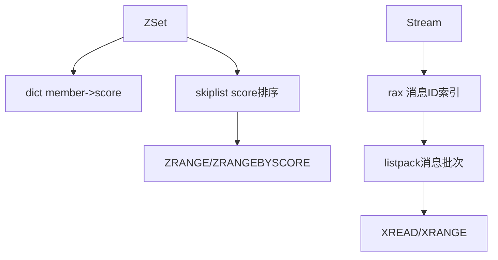

# 51 skiplist rax与范围查询结构

## 1. 本章要解决的问题

Redis 中 ZSet 和 Stream 都需要高效范围查询，但它们选择了不同结构：ZSet 使用 skiplist，Stream 使用 rax。为什么不是统一用一种树？答案在访问模式和编码目标里。

## 2. 核心观点

skiplist 擅长按分值排序和范围扫描，结构简单，插入删除容易实现；rax 擅长前缀压缩和有序 key 空间，适合 Stream ID 这类递增、有共同前缀的键。

## 3. 原理拆解

ZSet 同时使用 dict 和 skiplist：dict 支持 member 到 score 的点查，skiplist 支持 score 范围查询。Stream 使用 rax 管理消息 ID 到 listpack 的映射，减少索引内存。



## 4. 命令与代码示例

ZSet 观察：

```bash
redis-cli zadd rank 100 alice 95 bob 88 carol
redis-cli zrange rank 0 -1 withscores
redis-cli zrangebyscore rank 90 100 withscores
redis-cli object encoding rank
```

Stream 观察：

```bash
redis-cli xadd orders * user u1 amount 99
redis-cli xrange orders - +
redis-cli xinfo stream orders
```

skiplist 节点简化：

```c
typedef struct zskiplistNode {
    sds ele;
    double score;
    struct zskiplistNode *backward;
    struct zskiplistLevel {
        struct zskiplistNode *forward;
        unsigned long span;
    } level[];
} zskiplistNode;
```

## 5. 生产实践

排行榜适合 ZSet，但要控制 member 数量和更新频率。高并发排行榜可以按业务维度分片，例如按赛季、地区、榜单类型拆 key。Stream 适合有消费组和消息追踪的场景，但需要治理 Pending、消息堆积和裁剪策略。

Stream 裁剪示例：

```bash
redis-cli xtrim orders maxlen '~' 100000
redis-cli xpending orders group-a
```

## 6. 常见坑

- ZSet member 太大，dict 和 skiplist 双份索引导致内存放大。
- 排行榜无限增长，历史数据不归档。
- Stream 不裁剪，rax 和 listpack 持续增长。
- 消费组 Pending 不处理，消息看似发了但业务没真正消费。

## 7. 面试追问

1. ZSet 为什么同时需要 dict 和 skiplist？
2. skiplist 和平衡树相比有什么工程优势？
3. rax 为什么适合 Stream？
4. Stream 的消息为什么要批量放入 listpack？

## 8. 章节笔记

- skiplist 用简单结构换稳定范围查询能力。
- rax 利用前缀压缩降低有序索引内存。
- ZSet 和 Stream 的结构选择由访问模式决定。
- 范围查询结构必须配套容量治理。

## 9. 小结

Redis 没有迷信某一种“高级数据结构”。skiplist 和 rax 的选择说明：合适的数据结构不是理论上最优，而是在目标 workload 下足够快、足够省、足够可维护。
