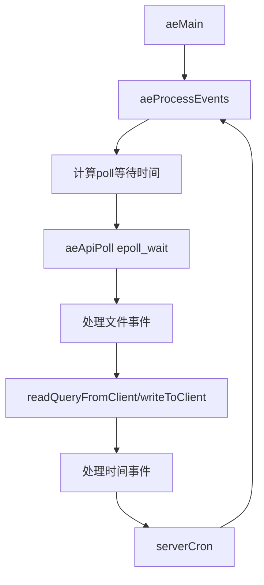

# 52 Redis事件驱动框架源码拆解

## 1. 本章要解决的问题

Redis 单线程高性能的核心是事件驱动框架。理解 `ae` 模块，才能理解网络 IO、定时任务、serverCron、客户端读写为什么能在一个主循环中协作。

## 2. 核心观点

Redis 的事件循环把文件事件和时间事件统一调度。文件事件处理 socket 可读可写，时间事件处理周期任务。底层根据系统选择 epoll、kqueue、evport 或 select。

## 3. 原理拆解

事件循环的基本流程：计算最近时间事件的等待时间，调用 IO 多路复用等待文件事件，处理已触发文件事件，再处理到期时间事件。



## 4. 命令与代码示例

事件循环伪代码：

```c
void aeMain(aeEventLoop *eventLoop) {
    eventLoop->stop = 0;
    while (!eventLoop->stop) {
        aeProcessEvents(eventLoop, AE_ALL_EVENTS);
    }
}
```

文件事件注册伪代码：

```c
aeCreateFileEvent(server.el, fd, AE_READABLE, readQueryFromClient, c);
aeCreateFileEvent(server.el, fd, AE_WRITABLE, sendReplyToClient, c);
```

观察网络连接：

```bash
redis-cli client list
ss -tanp | grep redis
redis-cli info clients
redis-cli info stats | egrep 'instantaneous|total_connections'
```

## 5. 生产实践

事件循环最怕单次回调执行过久。任何大 key 操作、大量响应输出、慢 Lua、磁盘阻塞，都可能让后续事件排队。排障时要把 Redis 想象成一个非常快的“单窗口服务台”：每个客户都很快时吞吐惊人，一旦一个客户拿着复杂业务卡住，后面全排队。

## 6. 常见坑

- 以为 epoll 解决一切，忽略命令执行本身仍在主线程。
- 慢 Lua 脚本让事件循环无法处理其他客户端。
- 大响应写入慢客户端，导致输出缓冲和写事件压力。
- 时间事件过重，影响普通请求延迟。

## 7. 面试追问

1. Redis 文件事件和时间事件分别处理什么？
2. Redis 为什么选择 Reactor 模型？
3. epoll 提升的是哪部分性能？
4. 一个慢命令如何影响事件循环？

## 8. 章节笔记

- `aeMain` 是主循环入口。
- `aeApiPoll` 屏蔽不同平台 IO 多路复用差异。
- 文件事件处理网络，时间事件处理周期任务。
- 事件循环简单，是 Redis 可维护性的重要来源。

## 9. 小结

Redis 的事件驱动框架并不庞大，却支撑了它的高吞吐和低延迟。读懂 `ae`，就能理解 Redis 为什么快，也能理解它为什么怕阻塞。
