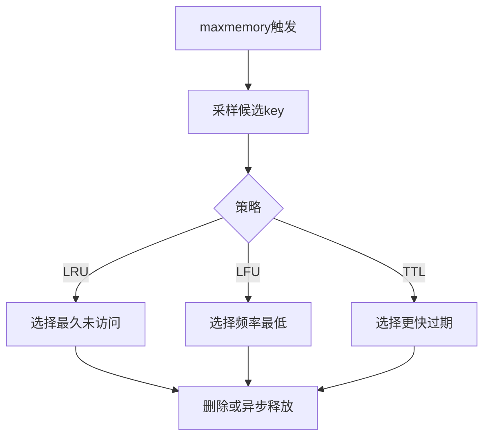

# 53 LRU LFU和LazyFree的源码实现

## 1. 本章要解决的问题

Redis 的淘汰和删除机制看似简单：内存满了淘汰，删除 key 就释放。但源码里为了性能做了大量近似和异步化设计。本章解释 LRU、LFU、Lazy Free 的实现思路。

## 2. 核心观点

Redis 使用近似 LRU，而不是维护全局精确链表；LFU 使用紧凑计数和时间衰减，而不是无限增长计数；Lazy Free 把大对象释放交给后台线程，保护主线程延迟。

## 3. 原理拆解

精确 LRU 需要每次访问都移动链表节点，成本高且需要额外内存。Redis 从随机采样的 key 中选择最适合淘汰的 key。LFU 在对象 lru 字段中编码访问频率和衰减时间。



## 4. 命令与代码示例

配置：

```conf
maxmemory 8gb
maxmemory-policy allkeys-lfu
maxmemory-samples 5
lfu-log-factor 10
lfu-decay-time 1
lazyfree-lazy-eviction yes
```

观察对象：

```bash
redis-cli object idletime key1
redis-cli object freq key1
redis-cli info memory
redis-cli info stats | grep evicted_keys
```

淘汰伪代码：

```c
while (mem_used > maxmemory) {
    candidate = evictionPoolPopulate(sample_keys);
    key = selectBestKey(candidate, policy);
    if (lazyfree) dbAsyncDelete(db, key);
    else dbSyncDelete(db, key);
}
```

## 5. 生产实践

策略选择：

- 纯缓存：优先 `allkeys-lfu` 或 `allkeys-lru`。
- 部分 key 有 TTL：可考虑 `volatile-lru`，但要确保缓存 key 都设置过期。
- 不允许淘汰：`noeviction`，但业务要处理写入失败。

LFU 适合热点相对稳定的业务，LRU 适合最近访问更能代表未来访问的业务。无论哪种策略，都要配合容量规划，不能把淘汰当扩容替代品。

## 6. 常见坑

- 使用 `volatile-*` 策略但很多 key 没有 TTL，导致内存满后无法淘汰。
- 采样数调太高，淘汰更准但 CPU 更高。
- 大 key 被淘汰时同步释放，引发延迟尖刺。
- 把 LFU 频率当作精确访问次数。

## 7. 面试追问

1. Redis 为什么使用近似 LRU？
2. LFU 如何避免访问计数无限增长？
3. `maxmemory-samples` 有什么影响？
4. lazy eviction 解决什么问题？

## 8. 章节笔记

- Redis 淘汰追求低成本近似正确。
- LFU 是概率递增 + 时间衰减。
- Lazy Free 保护主线程，但会带来后台释放滞后。
- 淘汰策略必须和业务语义匹配。

## 9. 小结

LRU、LFU 和 Lazy Free 都体现了 Redis 的实用主义：不追求教科书式完美，而是在性能成本可控的前提下达到足够好的效果。
