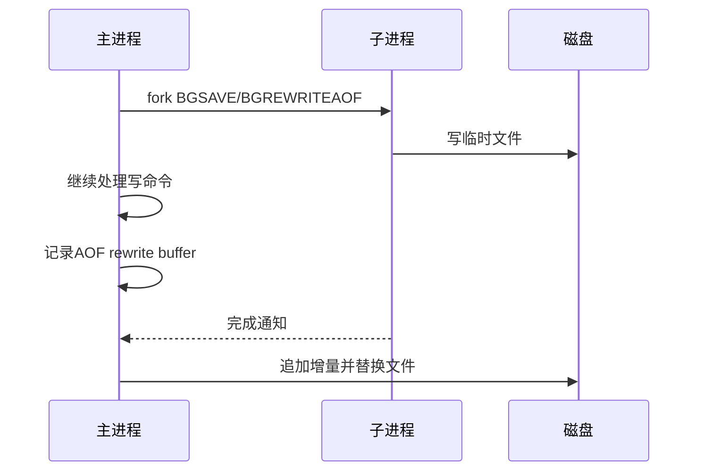

# 54 RDB AOF源码主流程

## 1. 本章要解决的问题

Redis 持久化不仅是配置项问题，也是源码主流程问题。RDB 如何 fork，AOF 如何追加，rewrite 如何避免阻塞，混合持久化如何恢复，都决定了 Redis 的可靠性和延迟边界。

## 2. 核心观点

RDB 用子进程生成快照，AOF 用追加日志记录写命令。AOF rewrite 通过子进程重写紧凑日志，主进程同时维护 rewrite 缓冲，保证重写期间的新写入不丢。

## 3. 原理拆解

RDB 主流程：触发 `BGSAVE`，主进程 fork 子进程，子进程遍历数据库写 RDB 文件，完成后替换旧文件。AOF 主流程：写命令执行后追加到 AOF buffer，再按 fsync 策略刷盘。



## 4. 命令与代码示例

配置：

```conf
save 900 1
save 300 10
appendonly yes
appendfsync everysec
aof-use-rdb-preamble yes
no-appendfsync-on-rewrite yes
auto-aof-rewrite-percentage 100
auto-aof-rewrite-min-size 64mb
```

观测：

```bash
redis-cli info persistence
redis-cli bgsave
redis-cli bgrewriteaof
redis-cli config get appendfsync
```

主流程伪代码：

```c
void feedAppendOnlyFile(struct redisCommand *cmd, robj **argv, int argc) {
    sds buf = catAppendOnlyGenericCommand(cmd, argv, argc);
    server.aof_buf = sdscatlen(server.aof_buf, buf, sdslen(buf));
}

int rdbSaveBackground(char *filename) {
    pid_t childpid = fork();
    if (childpid == 0) rdbSave(filename);
}
```

## 5. 生产实践

配置取舍：

- 对可靠性要求高：开启 AOF，`appendfsync everysec` 是常见平衡点。
- 启动恢复要求高：开启混合持久化，加快加载。
- 写入高峰：关注 AOF rewrite 和 fsync 延迟。
- 大实例：评估 fork 耗时和 COW 内存，必要时拆分实例。

故障演练：

```bash
redis-check-rdb dump.rdb
redis-check-aof --fix appendonly.aof
```

## 6. 常见坑

- 以为 AOF everysec 绝对不丢数据，实际最多可能丢约 1 秒窗口。
- fork 子进程期间内存不足，触发失败甚至 OOM。
- AOF 文件持续膨胀，不配置自动 rewrite。
- rewrite 期间磁盘 IO 打满，导致请求延迟升高。

## 7. 面试追问

1. RDB 和 AOF 的恢复速度有什么差异？
2. AOF rewrite 为什么不直接复用旧 AOF？
3. fork 和 COW 对 Redis 有什么影响？
4. 混合持久化解决了什么问题？

## 8. 章节笔记

- RDB 是快照，AOF 是命令日志。
- rewrite 期间要处理增量写入。
- fork 是持久化路径上的关键风险点。
- 持久化策略必须结合 RPO、RTO 和成本。

## 9. 小结

Redis 持久化不是“开或不开”的二元选择，而是恢复速度、数据丢失窗口、运行时延迟和磁盘成本的平衡。读懂源码主流程，才能真正理解这些配置的含义。
