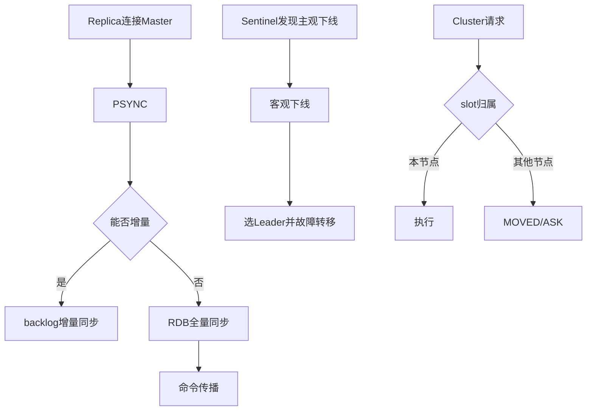

# 55 Redis复制哨兵和Cluster源码主线

## 1. 本章要解决的问题

Redis 从单机到高可用集群，涉及复制状态机、哨兵选主、故障转移、Gossip、槽迁移和客户端重定向。源码很多，但主线可以用几个状态机串起来。

## 2. 核心观点

复制解决数据副本，哨兵解决自动故障转移，Cluster 解决分片扩展。三者都围绕状态传播和一致性边界展开：谁是主，数据到哪里，客户端该访问谁。

## 3. 原理拆解

复制流程包括握手、全量同步、增量同步和命令传播。哨兵通过定时 PING、主观下线、客观下线、Leader 选举和故障转移完成主从切换。Cluster 通过 Gossip 传播节点状态，通过 slot 映射完成路由。



## 4. 命令与代码示例

复制和集群观测：

```bash
redis-cli info replication
redis-cli role
redis-cli sentinel masters
redis-cli sentinel slaves mymaster
redis-cli cluster nodes
redis-cli cluster slots
```

关键配置：

```conf
replicaof 10.0.0.1 6379
repl-backlog-size 256mb
min-replicas-to-write 1
min-replicas-max-lag 10

cluster-enabled yes
cluster-node-timeout 15000
```

源码主线伪代码：

```c
replicationCron();
sentinelTimer();
clusterCron();

if (request_slot_not_here) {
    addReplyMovedOrAsk(client, slot, target_node);
}
```

## 5. 生产实践

主从复制要关注 `master_repl_offset` 和 `slave_repl_offset` 差距；哨兵要部署奇数个，跨故障域；Cluster 要治理 slot 倾斜、热 key 和客户端重定向风暴。

高可用配置建议：

- 主库设置 `min-replicas-to-write` 降低脑裂写入风险。
- backlog 按写入峰值和网络抖动窗口估算。
- Cluster 迁移 slot 避开高峰，客户端必须支持重定向。

## 6. 常见坑

- backlog 太小，短暂断连就全量同步。
- 哨兵和 Redis 部署在同一故障域，机器故障时一起消失。
- Cluster 热 key 集中在单节点，分片也无济于事。
- 客户端不正确处理 `ASK`，迁移期间请求失败。

## 7. 面试追问

1. PSYNC 如何判断能否增量同步？
2. 哨兵主观下线和客观下线有什么区别？
3. Cluster 的 MOVED 和 ASK 有什么区别？
4. 如何降低 Redis 脑裂带来的数据丢失？

## 8. 章节笔记

- 复制是数据流，哨兵是控制面，Cluster 是路由和分片。
- 高可用问题的核心是状态判断和状态传播。
- backlog、仲裁、slot 映射都是生产稳定性的关键参数。
- 客户端能力是 Redis 高可用的一部分。

## 9. 小结

复制、哨兵和 Cluster 看似三套机制，底层都是分布式系统的基本问题：节点状态如何判断，数据如何追平，路由如何更新，异常窗口如何收敛。
