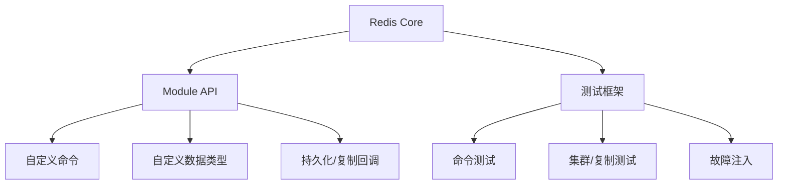

# 56 RedisModule和单元测试给工程系统的启发

## 1. 本章要解决的问题

Redis 不只是一个数据库，也是一套可扩展系统。RedisModule 让外部开发者扩展命令和数据类型，单元测试体系保证长期演进不失控。它们对我们设计工程系统很有启发。

## 2. 核心观点

成熟系统要同时考虑扩展性和可验证性。RedisModule 提供稳定边界，让能力扩展不必修改核心；测试体系覆盖命令、协议、持久化、复制和边界行为，让重构有安全网。

## 3. 原理拆解

Module 通过 API 注册命令、数据类型和回调。Redis 核心负责生命周期、内存、持久化接口和命令分发。测试体系则用 Tcl、单元测试和集成测试覆盖关键路径。



## 4. 命令与代码示例

加载模块：

```conf
loadmodule /path/to/module.so
```

最小模块伪代码：

```c
int HelloCommand(RedisModuleCtx *ctx, RedisModuleString **argv, int argc) {
    return RedisModule_ReplyWithSimpleString(ctx, "hello");
}

int RedisModule_OnLoad(RedisModuleCtx *ctx, RedisModuleString **argv, int argc) {
    RedisModule_Init(ctx, "hello", 1, REDISMODULE_APIVER_1);
    RedisModule_CreateCommand(ctx, "hello.world", HelloCommand, "readonly", 0, 0, 0);
    return REDISMODULE_OK;
}
```

运行测试：

```bash
make test
./runtest --single unit/type/list
./runtest-cluster
```

## 5. 生产实践

Module 适合扩展 Redis 原生不具备的能力，例如 Bloom、Search、JSON、TimeSeries。但模块会进入 Redis 进程内部，质量、内存安全和阻塞风险必须严格评估。生产使用模块前，应压测、故障演练、确认升级兼容性。

测试启发：

- 对外 API 必须有回归测试。
- 故障路径比正常路径更需要测试。
- 数据格式升级要测试向前和向后兼容。
- 性能敏感代码要有基准和边界测试。

## 6. 常见坑

- 自研模块执行耗时逻辑，阻塞 Redis 主线程。
- 模块内存管理不当，导致进程崩溃。
- 只测单机，不测复制、AOF/RDB 和集群。
- 升级 Redis 版本时不验证模块 ABI/API 兼容。

## 7. 面试追问

1. RedisModule 解决了什么扩展性问题？
2. Redis 模块为什么风险比普通客户端更高？
3. 一个数据库系统应该如何设计测试体系？
4. 从 Redis 测试中可以学到哪些工程实践？

## 8. 章节笔记

- 扩展能力要有稳定 API 边界。
- 模块进入进程内，收益和风险都更高。
- 测试是系统可演进的前提。
- 学 Redis 源码，也要学它如何保证长期维护。

## 9. 小结

RedisModule 和测试体系告诉我们：优秀系统不是把所有功能都写进核心，而是留出扩展边界，并用测试守住演进质量。这比单个数据结构技巧更值得学习。
