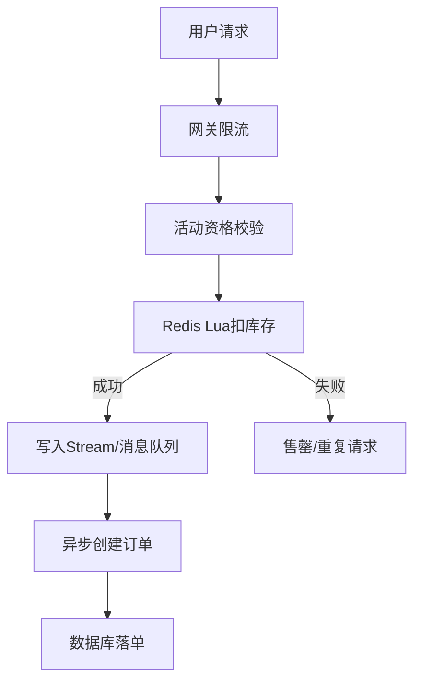

# 57 Redis支撑秒杀场景的关键技术

## 1. 本章要解决的问题

秒杀系统的难点不是“扣库存”一个动作，而是瞬时流量、库存一致性、超卖防护、排队削峰、重复请求、热点 key 和数据库保护共同出现。Redis 常被放在秒杀核心链路中，但必须设计好边界。

## 2. 核心观点

Redis 适合承接秒杀的高并发读写、原子扣减、限流和排队，但最终订单状态仍需要数据库或可靠消息系统兜底。一个稳健秒杀系统通常是：预热库存、入口限流、Lua 原子扣减、Stream/消息队列异步下单、幂等校验、失败补偿。

## 3. 原理拆解



秒杀链路要把数据库从同步高峰中移开。Redis 负责快速判断“是否还有资格继续”，消息队列负责削峰，数据库负责最终一致的订单记录。

## 4. 命令与代码示例

Lua 扣库存并防重复：

```lua
local stockKey = KEYS[1]
local userKey = KEYS[2]
local streamKey = KEYS[3]
local userId = ARGV[1]
local orderId = ARGV[2]

if redis.call('SISMEMBER', userKey, userId) == 1 then
  return -2
end

local stock = tonumber(redis.call('GET', stockKey) or '0')
if stock <= 0 then
  return -1
end

redis.call('DECR', stockKey)
redis.call('SADD', userKey, userId)
redis.call('XADD', streamKey, '*', 'userId', userId, 'orderId', orderId)
return 1
```

初始化与消费：

```bash
redis-cli set seckill:1001:stock 1000
redis-cli xgroup create seckill:1001:orders g1 0 mkstream
redis-cli xreadgroup group g1 c1 count 10 block 1000 streams seckill:1001:orders >
```

## 5. 生产实践

秒杀 checklist：

- 活动开始前预热库存、商品信息、活动配置。
- 网关层按活动、用户、IP、设备做限流。
- Redis Lua 保证扣库存和去重原子性。
- 下单异步化，订单消费者必须幂等。
- 库存回补要有补偿任务，避免消息失败导致库存丢失。
- 热 key 拆分：超大活动可以把库存拆成多个桶。

## 6. 常见坑

- 只用 `DECR` 扣库存，没有处理重复请求。
- Redis 扣减成功但消息发送失败，库存和订单不一致。
- 所有流量打到一个库存 key，单实例热点过高。
- 秒杀结束后不清理临时 key，造成内存污染。

## 7. 面试追问

1. 秒杀为什么适合用 Lua？
2. Redis 扣库存成功但订单创建失败怎么办？
3. 如何处理重复下单？
4. 热点库存 key 如何拆分？

## 8. 章节笔记

- Redis 秒杀链路核心是限流、原子、削峰、幂等。
- Lua 解决单实例内复合操作原子性。
- Stream/消息队列让数据库从峰值流量中解耦。
- 最终一致需要补偿和对账。

## 9. 小结

Redis 可以让秒杀系统扛住第一波流量，但它不是完整交易系统。真正可靠的设计，是把 Redis 放在它擅长的位置，并为失败路径准备补偿。
