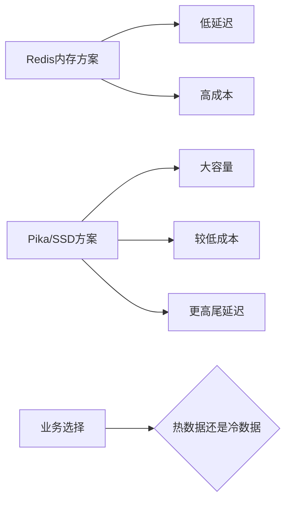

# 58 Pika与大容量Redis：SSD方案怎么理解

## 1. 本章要解决的问题

Redis 使用内存存储，速度快但成本高。当数据规模远超内存预算时，一些团队会考虑 Pika 这类兼容 Redis 协议、基于 SSD 的大容量方案。本章解释它适合什么，不适合什么。

## 2. 核心观点

Pika 类方案用更低成本承载更大数据量，但代价是延迟、吞吐和运维复杂度变化。它不是“更便宜的 Redis”，而是面向大容量、冷热分明、延迟要求没那么极致场景的替代或补充。

## 3. 原理拆解



内存数据库把随机访问交给 DRAM，SSD 方案把大量数据落到磁盘，通过 LSM、RocksDB 等存储引擎组织数据。它可以存更多，但读写路径更长，后台 compaction 也会影响延迟。

## 4. 命令与代码示例

容量评估模板：

```text
日活用户数：5000万
每用户缓存对象：2 KB
副本数：2
预留碎片和增长：1.5
容量 = 5000万 * 2KB * 2 * 1.5 ≈ 300GB
```

Redis 热冷分层示例：

```bash
# 热点元数据留在 Redis
SET user:hot:1001 "{small-json}" EX 3600

# 大对象落 SSD/数据库，Redis 存索引
SET user:profile:1001:ref "pika://profile/1001" EX 86400
```

访问伪代码：

```java
String v = redis.get(key);
if (v == null) {
    v = pikaOrDb.get(key);
    redis.setex(key, 3600, compact(v));
}
```

## 5. 生产实践

选型建议：

- 高频热 key、低延迟交易链路：优先 Redis 内存。
- 大容量画像、历史状态、成本敏感缓存：可评估 Pika/SSD。
- 需要强 Redis 模块能力或复杂命令：验证兼容性。
- 延迟敏感但容量大：考虑多级缓存，Redis 放热数据，SSD 放温冷数据。

压测必须覆盖 compaction、高写入、范围扫描、故障恢复和主从同步，而不是只测简单 GET/SET。

## 6. 常见坑

- 只看容量成本，不看 p99 延迟。
- 认为 Redis 协议兼容等于所有命令语义和性能都一致。
- 没有评估 SSD 寿命、写放大和 compaction 抖动。
- 把热点数据也放入 SSD 方案，导致尾延迟不可控。

## 7. 面试追问

1. Pika 和 Redis 的核心差异是什么？
2. SSD 大容量方案适合哪些场景？
3. 为什么兼容 Redis 协议不等于完全替代 Redis？
4. 如何设计 Redis + SSD 的热冷分层？

## 8. 章节笔记

- Redis 买的是低延迟内存能力，Pika 买的是大容量成本优势。
- SSD 方案要重点关注尾延迟和后台 compaction。
- 热冷分层比单纯替换更稳。
- 选型要从业务 SLO 出发。

## 9. 小结

Pika 类方案提醒我们：技术选型不是寻找银弹，而是在成本、容量、延迟和兼容性之间做选择。Redis 适合热路径，SSD 方案适合容量路径，两者可以组合。
