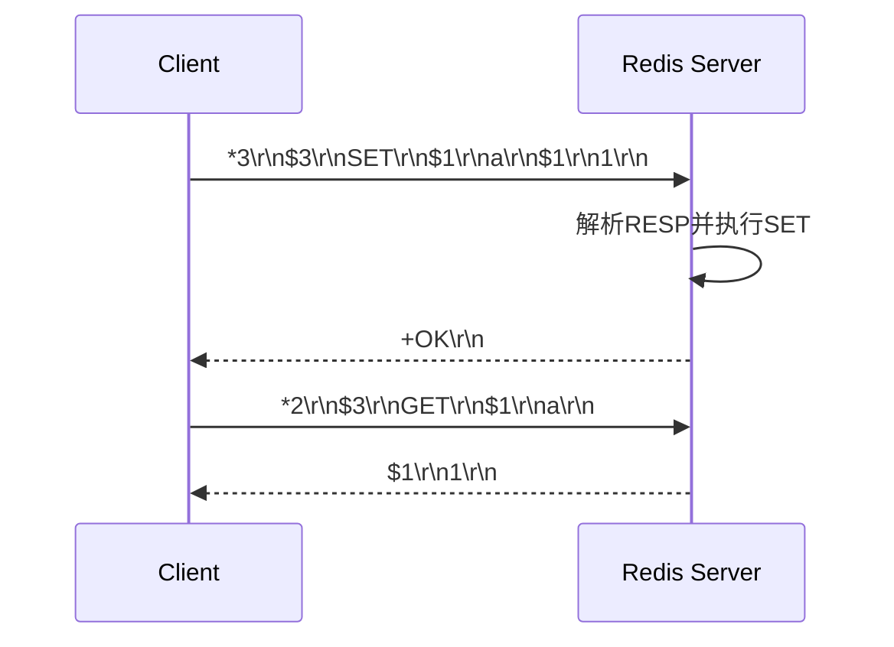

# 59 Redis客户端如何与服务端交换命令和数据

## 1. 本章要解决的问题

Redis 客户端看似只是调用 `get`、`set`，底层其实要编码 RESP 协议、维护连接、处理 pipeline、解析响应、重连、认证、集群重定向。本章从协议层理解客户端和服务端如何交流。

## 2. 核心观点

RESP 是 Redis 简洁高效的重要原因之一。客户端把命令编码为数组和批量字符串，服务端解析后执行命令，再返回简单字符串、错误、整数、批量字符串或数组。理解协议有助于排查连接、pipeline 和代理问题。

## 3. 原理拆解



## 4. 命令与代码示例

RESP 示例：

```text
SET name redis

*3
$3
SET
$4
name
$5
redis
```

用 netcat 手写协议：

```bash
printf '*2\r\n$4\r\nPING\r\n$5\r\nhello\r\n' | nc 127.0.0.1 6379
```

简单 RESP 编码伪代码：

```python
def encode_command(*parts):
    out = f"*{len(parts)}\r\n"
    for part in parts:
        b = str(part).encode()
        out += f"${len(b)}\r\n"
        out += b.decode() + "\r\n"
    return out.encode()
```

Pipeline：

```bash
redis-cli --pipe < commands.resp
```

## 5. 生产实践

客户端治理重点：

- 连接池大小要和业务线程数、Redis 承载能力匹配。
- Pipeline 能降低 RTT，但要限制批次大小。
- 设置合理超时，区分连接超时、读超时和命令超时。
- Cluster 客户端必须正确处理 `MOVED`、`ASK`、slot 缓存刷新。
- 重试必须考虑命令幂等性，避免重复写。

## 6. 常见坑

- pipeline 批次太大，客户端和 Redis 输出缓冲区暴涨。
- 连接池耗尽被误判为 Redis 慢。
- 重连风暴压垮 Redis。
- 集群 slot 迁移时客户端不刷新路由，持续访问错误节点。

## 7. 面试追问

1. RESP 协议如何表示数组和字符串？
2. Pipeline 为什么能提升吞吐？
3. Redis 客户端重试有什么风险？
4. Cluster 客户端如何处理 MOVED？

## 8. 章节笔记

- RESP 简洁、文本友好、解析成本低。
- 客户端是 Redis 稳定性的重要组成部分。
- Pipeline 优化 RTT，但会放大缓冲风险。
- 连接池、超时、重试、路由刷新都要有规范。

## 9. 小结

理解 Redis 协议后，客户端不再是黑盒。很多线上问题，比如连接池耗尽、pipeline 堆积、集群重定向失败，都能从协议和连接模型中找到解释。
