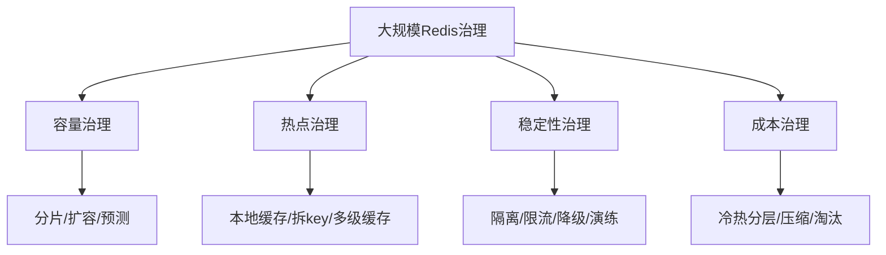

# 60 从微博Redis实践学习容量和稳定性治理

## 1. 本章要解决的问题

大规模互联网场景下，Redis 面临的不只是单实例性能，而是热点、容量、成本、故障隔离、业务治理和平台化运维。本章从典型社交平台实践中提炼可复用方法。

## 2. 核心观点

大规模 Redis 治理的关键词是分层、隔离、自动化和规范。热点数据要分层缓存，核心业务要隔离资源，容量要持续预测，运维动作要平台化，事故要通过规则减少复发。

## 3. 原理拆解



社交场景常见热点包括明星主页、热搜、热门微博、关系链、计数器。它们的共同特点是读多写少、突发性强、热点变化快。

## 4. 命令与代码示例

热点 key 监控：

```bash
redis-cli --hotkeys
redis-cli info commandstats
redis-cli monitor
```

注意：`MONITOR` 对生产影响很大，只能短时间、低峰、受控使用。

多级缓存伪代码：

```java
Value v = localCache.get(key);
if (v != null) return v;

v = redis.get(key);
if (v != null) {
    localCache.put(key, v, randomTtl(3, 10));
    return v;
}

v = db.get(key);
redis.setex(key, randomTtl(300, 600), v);
localCache.put(key, v, randomTtl(3, 10));
return v;
```

容量预测：

```text
未来容量 = 当前 used_memory * 增长率 * 副本系数 * 碎片系数 * 安全水位
安全水位建议：峰值不超过 maxmemory 的 70%-80%
```

## 5. 生产实践

治理策略：

- 热点 key：本地缓存、读副本、key 拆分、请求合并。
- 大 key：结构拆分、分页读取、异步删除。
- 多租户：按业务隔离实例或集群，避免互相拖垮。
- 容量：按业务线做预算和告警，提前扩容。
- 降级：Redis 不可用时核心链路有兜底策略。

平台能力：

```text
申请 -> 容量评估 -> 资源分配 -> 权限发放 -> 监控接入 -> 巡检 -> 变更审计 -> 复盘
```

## 6. 常见坑

- 所有业务共享一个 Redis 集群，故障影响面巨大。
- 热点治理只靠扩容，结果热 key 仍落在单分片。
- 没有 key 负责人，问题 key 无法追责和改造。
- 只关注 Redis 服务端，不治理客户端用法。

## 7. 面试追问

1. 大规模 Redis 如何做业务隔离？
2. 热点 key 为什么不是简单扩容就能解决？
3. 如何做 Redis 容量预测？
4. 多级缓存如何避免一致性问题扩大？

## 8. 章节笔记

- 大规模治理靠体系，不靠单点技巧。
- 热点、容量、隔离、自动化是核心主题。
- 客户端规范和平台能力同样重要。
- 成本优化不能牺牲核心链路 SLO。

## 9. 小结

从大型实践中能学到的不是某个神奇参数，而是一种治理思路：让 Redis 从“业务随便用的缓存”变成“有边界、有预算、有监控、有负责人”的基础设施。
