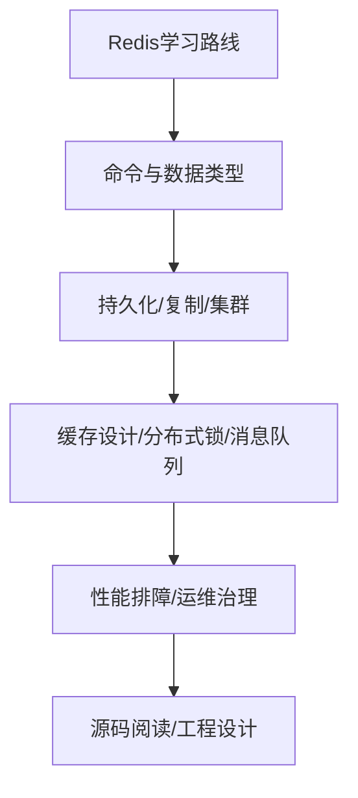

# 61 经典Redis学习资料和个人学习路线

## 1. 本章要解决的问题

Redis 资料很多，容易碎片化学习：今天看命令，明天看源码，后天看缓存一致性，但无法形成体系。本章给出一条从使用到原理、从排障到源码的学习路线。

## 2. 核心观点

Redis 学习应分四层：命令与数据建模、系统原理、生产治理、源码设计。先能正确使用，再理解为什么快，接着能排查生产问题，最后从源码学习工程取舍。

## 3. 原理拆解



## 4. 命令与代码示例

个人实验清单：

```bash
# 基础
redis-cli set k v
redis-cli object encoding k
redis-cli memory usage k

# 性能
redis-benchmark -c 100 -n 100000 -t get,set
redis-cli --latency-history

# 持久化
redis-cli bgsave
redis-cli bgrewriteaof

# 高可用
redis-cli info replication
redis-cli cluster nodes
```

源码阅读实验：

```bash
git clone https://github.com/redis/redis.git
cd redis && make
gdb --args src/redis-server
```

## 5. 生产实践

推荐学习顺序：

1. 熟练掌握 String、Hash、List、Set、ZSet、Stream 的场景和边界。
2. 学会 RDB、AOF、复制、哨兵、Cluster 的可靠性模型。
3. 系统学习缓存雪崩、击穿、穿透、一致性、热点和大 key。
4. 掌握 `INFO`、`SLOWLOG`、`LATENCY`、`MEMORY` 排障。
5. 读 SDS、dict、quicklist/listpack、skiplist、ae、AOF/RDB、复制集群源码。

学习产出建议：

- 每个数据类型写一个业务建模案例。
- 每个可靠性机制做一次故障演练。
- 每个性能问题沉淀一个 runbook。
- 每个源码模块画一张调用图。

## 6. 常见坑

- 只背命令，不知道内部编码和复杂度。
- 只看源码，不知道生产问题怎么发生。
- 只学缓存，不学持久化和高可用。
- 没有做实验，知识停留在概念层。

## 7. 面试追问

1. 你会如何系统学习 Redis？
2. Redis 哪些源码模块最值得读？
3. 如何把 Redis 学习和项目经验结合？
4. 你如何证明自己能排查 Redis 生产问题？

## 8. 章节笔记

- 学习路线：会用 -> 懂原理 -> 能排障 -> 读源码 -> 学设计。
- 输出比输入重要，笔记、实验和复盘会加深理解。
- Redis 是学习高性能系统的好入口。
- 不要把 Redis 只当缓存工具。

## 9. 小结

Redis 的学习不该停留在“命令大全”。当你能从业务模型讲到数据结构，从慢查询讲到事件循环，从故障切换讲到复制状态机，Redis 才真正变成你的工程能力。
