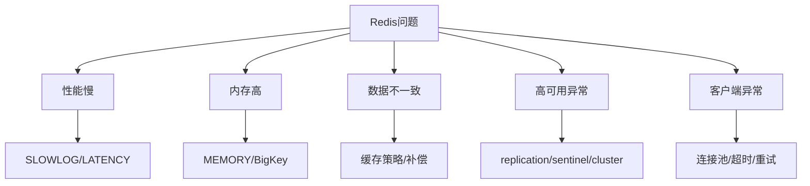

# 62 Redis问题汇总和解决方案

## 1. 本章要解决的问题

Redis 常见问题很多：慢查询、大 key、热 key、内存不降、缓存穿透、主从延迟、脑裂、连接池耗尽、AOF 膨胀。本章把问题按症状归类，给出快速定位和处理路径。

## 2. 核心观点

问题汇总的价值不是罗列答案，而是建立“症状 -> 证据 -> 根因 -> 处理 -> 预防”的闭环。Redis 事故处理要先止血，再定位，再修复，再复盘。

## 3. 原理拆解



## 4. 命令与代码示例

问题速查命令：

```bash
# 慢
redis-cli slowlog get 20
redis-cli latency doctor
redis-cli info commandstats

# 内存
redis-cli info memory
redis-cli memory stats
redis-cli --bigkeys -i 0.05

# 复制
redis-cli info replication
redis-cli role

# 集群
redis-cli cluster info
redis-cli cluster nodes

# 客户端
redis-cli client list
redis-cli info clients
```

事故记录模板：

```text
时间：
影响范围：
现象：
第一证据：
根因：
止血动作：
永久修复：
预防规则：
负责人：
```

## 5. 生产实践

常见问题处理：

| 问题 | 证据 | 处理 |
| --- | --- | --- |
| 慢查询 | `SLOWLOG GET` | 改命令、拆 key、分页、异步 |
| 大 key | `--bigkeys`、`MEMORY USAGE` | 拆分、压缩、异步删除 |
| 热 key | QPS 倾斜、`--hotkeys` | 本地缓存、拆 key、读副本 |
| 内存碎片 | `mem_fragmentation_ratio` | active defrag、迁移重启 |
| 主从延迟 | offset 差距 | 降写入、扩容、优化网络 |
| 脑裂 | 旧主继续写 | `min-replicas-to-write`、演练 |
| 连接池耗尽 | 应用线程等待 | 调池、限流、排查慢命令 |

## 6. 常见坑

- 故障时直接调参数，没有保留现场证据。
- 把所有问题都归因 Redis，忽略客户端和网络。
- 只做临时扩容，没有改造问题 key 和访问模式。
- 复盘没有形成规则，事故重复发生。

## 7. 面试追问

1. Redis 线上变慢你会怎么排查？
2. 如何治理大 key 和热 key？
3. 主从延迟如何定位？
4. 缓存和数据库不一致如何处理？

## 8. 章节笔记

- 问题处理要闭环：症状、证据、根因、处理、预防。
- Redis 排障离不开四件套：`INFO`、`SLOWLOG`、`LATENCY`、`MEMORY`。
- 常见事故背后通常是规范缺失。
- 复盘要输出可执行规则。

## 9. 小结

Redis 问题多，但并不乱。只要按症状分类、按证据定位、按机制解释，就能把碎片化经验沉淀成可复用的问题手册。
