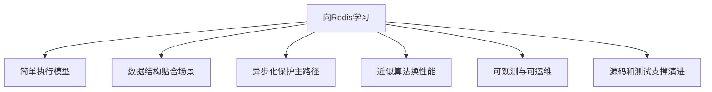

# 63 从学习Redis到向Redis学习

## 1. 本章要解决的问题

学完 Redis 后，真正值得带走的并不只是命令、配置和源码细节，更是它背后的工程思想：简单模型、清晰边界、性能意识、渐进优化、可观测和可维护。本章做系列收束。

## 2. 核心观点

学习 Redis 有两个层次。第一层是会使用 Redis 解决缓存、队列、锁、计数、排行榜等问题；第二层是向 Redis 学习如何设计一个高性能、可演进、可运维的工程系统。

## 3. 原理拆解



Redis 的很多设计都不炫技：单线程命令执行降低并发复杂度，SDS 补齐 C 字符串短板，渐进式 rehash 避免长阻塞，近似 LRU 降低维护成本，lazy free 保护主路径。这些都体现了工程取舍。

## 4. 命令与代码示例

把 Redis 思想迁移到业务系统的伪代码：

```java
// 保护主路径：先快速完成用户请求，把重任务放后台
public Result handle(Request req) {
    validate(req);
    State state = updateSmallState(req);
    backgroundQueue.offer(new HeavyJob(req.id()));
    return Result.accepted(state.version());
}
```

可观测清单：

```text
延迟：平均值、p95、p99、最大值
吞吐：QPS、命令分布、批量大小
资源：CPU、内存、磁盘、网络
队列：连接池等待、缓冲区、后台任务积压
错误：超时、重试、拒绝、降级
```

## 5. 生产实践

向 Redis 学到的实践：

- 保持核心路径短小清晰。
- 对慢操作做异步化、分批化、限速化。
- 用合适的数据结构表达业务，而不是用一个万能表。
- 接受近似正确，在成本和收益之间做工程平衡。
- 把监控、诊断和配置边界作为系统的一部分。
- 用测试和工具保护长期演进。

个人复盘问题：

```text
这个系统的主路径是什么？
哪些操作可能阻塞主路径？
有哪些状态需要可观察？
哪些数据结构和访问模式不匹配？
失败后如何恢复？
```

## 6. 常见坑

- 学 Redis 只停留在八股题，没有转化为系统设计能力。
- 追求复杂架构，忽略简单模型的力量。
- 只关注性能峰值，不关注尾延迟和故障恢复。
- 读源码只记函数名，没有提炼设计思想。

## 7. 面试追问

1. Redis 哪个设计最能体现工程取舍？
2. 单线程模型给业务系统设计什么启发？
3. 如何理解“近似算法换性能”？
4. 你从 Redis 源码中学到了什么可迁移经验？

## 8. 章节笔记

- Redis 是缓存，也是高性能系统教材。
- 简单不是简陋，简单是可预测和可维护。
- 低延迟来自主路径克制。
- 从 Redis 学到的思想可以迁移到业务架构。

## 9. 小结

学 Redis 的终点不是背熟命令，而是获得一种工程直觉：知道系统哪里会慢，哪里会膨胀，哪里会失控，哪里需要边界。能做到这一点，Redis 就不只是工具，而是你的工程老师。
