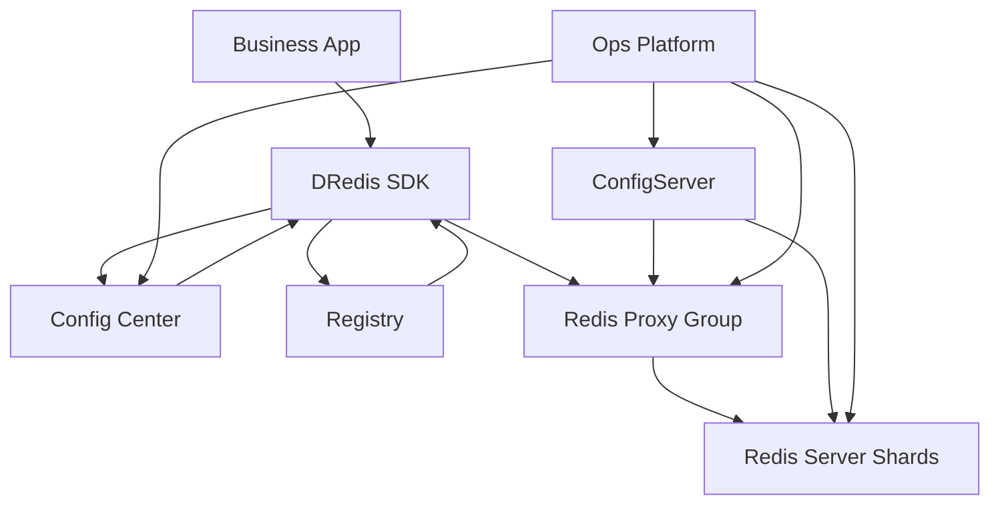
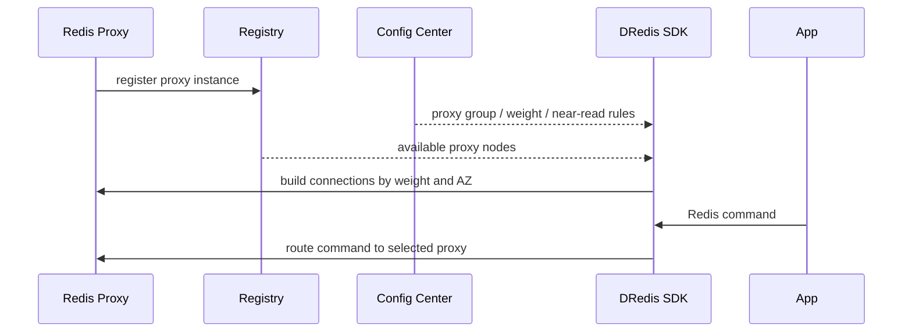
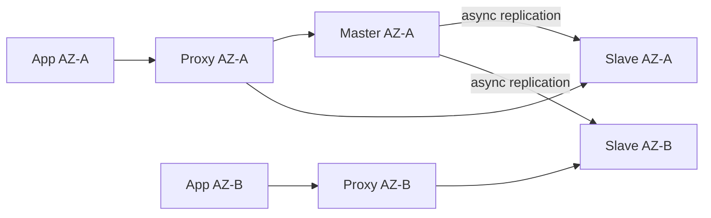
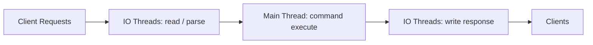
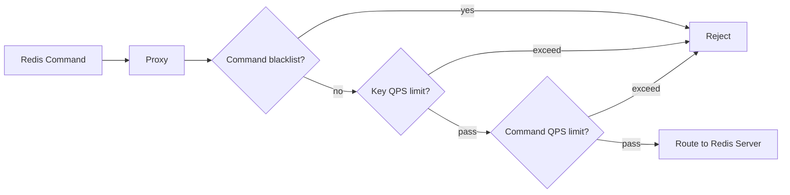
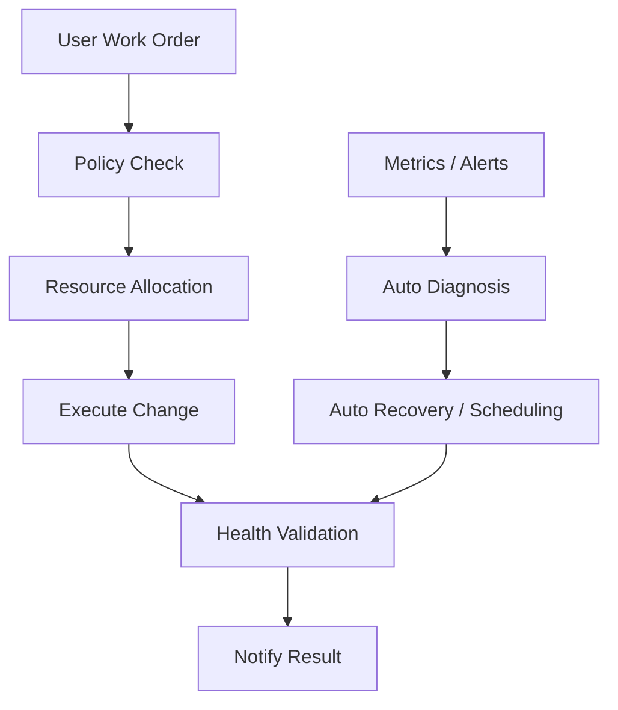

# 得物自建 Redis 最新技术演进：平台架构、同城双活与自动化运维

> 来源整理：根据微信公众号文章《一文解析得物自建 Redis 最新技术演进》提取、总结并重写为技术博客版本。本文不复刻原文，而是围绕“平台化 Redis 怎么演进”这条主线，梳理接入架构、同城双活、版本能力、实例规格、proxy 限流和自动化运维，并在文末补充面向 5 年经验开发/架构候选人的高质量追问。

## 1. 文章摘要

原文介绍了得物自建 Redis 经过 3 年多演进后的平台化能力。其背景是 Redis 集群规模持续增长：管理 1000+ 集群、总内存规格约 160T、10W+ 数据节点、数千台机器，单集群最大访问 QPS 接近千万。

这类规模下，Redis 不再只是“缓存组件”，而是一个需要平台化治理的基础设施系统。文章核心演进点包括：

- 架构上由 `Redis-server + Redis-proxy + ConfigServer + 自动化运维平台` 组成。
- 接入方式从 `域名 + LB` 演进为 `DRedis SDK 直连 proxy`。
- 同城双活采用“中心写 + 就近读”，并支持更细粒度的 key/请求级就近读。
- Redis-server 支持 Redis 4.0/6.2，并增强多线程 IO、热 key 统计、异步迁移能力。
- 实例形态支持集群架构、单点主备、一主多从规格。
- Redis-proxy 支持 key 维度限流、命令维度限流和命令黑名单。
- 自动化运维平台覆盖创建、扩缩容、下线、资源调度、巡检、故障恢复等生命周期。

一句话概括：自建 Redis 的核心价值不是“自己部署 Redis”，而是把 Redis 做成一套可接入、可治理、可扩展、可观测、可自动化运维的平台。

## 2. 自建 Redis 平台架构

自建 Redis 集群由几个核心组件组成：

| 组件 | 职责 | 关键能力 |
|---|---|---|
| Redis-server | 数据存储 | 一主多从、多可用区部署、高性能读写 |
| Redis-proxy | 代理接入 | 屏蔽集群细节、路由、就近读、限流、命令黑名单 |
| ConfigServer | 高可用与拓扑管理 | 集群配置、故障切换、拓扑变更 |
| DRedis SDK | 客户端接入 | 直连 proxy、同区优先、权重路由、自定义协议 |
| 自动化运维平台 | 平台治理 | 创建、扩缩容、下线、资源调度、巡检、诊断 |

整体架构可以抽象为：

这种架构的目标是：业务侧像使用单点 Redis 一样使用集群，平台侧负责路由、扩缩容、故障切换、限流和资源调度。

## 3. 接入方式演进：从 LB 到 DRedis SDK

### 3.1 LB 接入的问题

早期通过 `域名 + LB` 接入 proxy，有两个好处：业务接入简单、与云 Redis 使用方式相近。但随着规模和流量增长，LB 成为稳定性和成本瓶颈。

主要问题：

- 单个 LB 流量上限有限，例如原文提到单 LB 5Gb 上限，大流量集群需要多个 LB。
- 多 LB 会引入流量倾斜、运维复杂度和配置复杂度。
- LB 作为统一入口，可能成为网络异常流量冲击点。
- Redis 是长连接 TCP 访问，LB 摘流时容易出现秒级报错。
- LB 很难理解业务所在可用区，也就难以天然支持同区优先。

### 3.2 DRedis SDK 接入方式

DRedis SDK 的思路是：客户端直接理解 proxy 拓扑，通过配置中心和注册中心获取 proxy 分组、权重、可用区、就近读规则，然后与 proxy 建立连接。

相较 LB 接入，SDK 直连 proxy 带来的收益：

- 避免 LB 流量瓶颈和摘流风险。
- 客户端可以感知可用区，实现同区优先。
- 通过权重、分组、连接池实现更细粒度流量治理。
- 可以扩展 RESP 协议，支持就近读等平台能力。
- 多语言统一接入规范，原文提到 Java、Golang、C++ SDK。

### 3.3 工程取舍

SDK 化不是免费午餐。它把一部分基础设施能力下沉到客户端，会带来：

- 多语言 SDK 版本治理成本。
- 客户端升级推广成本。
- 配置中心、注册中心可用性要求更高。
- SDK bug 的影响面可能大于 proxy bug。
- 需要兼容原生 Redis 客户端行为，降低业务迁移成本。

因此 SDK 直连适合中大型公司内部基础设施，尤其适合对性能、可用区路由和成本有强诉求的场景。

## 4. 同城双活就近读：性能与一致性的取舍

同城双活的目标是降低多可用区部署下访问 Redis 的 RT。文章中的方案可以概括为：

- 中心写：写请求走主节点，保证写入口收敛。
- 就近读：读请求可以优先访问同可用区 proxy 和同可用区 server 从节点。

### 4.1 Service 接入的问题

在 DRedis SDK 之前，要支持就近读，需要在容器环境部署 proxy，并通过 service 的同区路由能力实现。这会带来几个问题：

- 运维体系割裂：ECS 和容器两套部署方式。
- 成本增加：容器 proxy 不能与 server 混部，资源利用率下降。
- RT 上升：实际观察中容器 proxy CPU 和响应 RT 更高。
- 访问不均衡：service 接入可能出现连接和访问倾斜。
- 粒度不够：无法只对少量 key、key 前缀或某次请求开启就近读。

### 4.2 DRedis 的精细化就近读

DRedis SDK 支持更细的就近读控制：

- 默认访问主节点，保证强一致优先。
- 指定 key 精确匹配开启就近读。
- 指定 key 前缀开启就近读。
- Java 通过注解如 `@NearRead` 指定某次请求就近读。
- Golang 通过特定 Nearby 读命令启用就近读。
- 当同可用区 proxy 可用数量不足时，SDK 主动跨区访问可用 proxy，避免局部故障。

核心取舍是：Redis 主从复制是异步的，就近读可能读到旧值。因此就近读应只用于“读延迟敏感、可接受短暂不一致”的业务。

适合就近读：

- 商品详情中的弱一致字段。
- 推荐、画像、配置类缓存。
- 计数、展示类、可补偿数据。

不适合就近读：

- 支付状态。
- 库存扣减结果。
- 风控强一致判断。
- 刚写后立刻读且要求读己之写的链路。

## 5. Redis-server 版本与能力演进

文章提到自建 Redis 初期主版本为 Redis 4.0，后来新增 Redis 6.2 并作为新集群默认版本。同时在 Redis 4.0 和 6.2 上均支持了平台增强能力。

### 5.1 多线程 IO

Redis 6.0 以后支持 IO 多线程。其本质不是让命令执行多线程化，而是对网络读写、协议解析等 IO 阶段进行并行处理，命令执行主流程仍需要保持 Redis 的单线程语义。

多线程 IO 适合网络读写开销明显的高 QPS 场景，但不能解决慢命令、大 key、复杂 Lua 等阻塞主线程的问题。

### 5.2 实时热 key 统计

热 key 会导致单分片、单节点 CPU 或网络打满。平台在 Redis-server 侧支持实时热 key 统计，并通过管控台展示，有利于快速定位：

- 某个 key 访问量异常升高。
- 热点读导致单节点高 CPU。
- 大 key 被高频访问导致网络出入口压力。

热 key 治理手段通常包括：

- 本地缓存。
- 多副本读。
- key 拆分。
- 随机后缀打散。
- 业务降级或限流。

### 5.3 水平扩容异步迁移

文章提到自建 Redis 支持水平扩容异步迁移 slot，解决大 key 迁移失败或迁移影响业务 RT 的问题。默认配置下，几亿 key 数据扩容耗时从平均 4 小时缩短到 10 分钟，迁移对业务 RT 影响下降 90% 以上。

这一点非常关键：大规模 Redis 平台的扩容能力，不只是“能不能迁”，而是“迁移过程是否可控、是否影响线上流量、失败后能否恢复”。

## 6. 实例架构与规格

### 6.1 集群架构与单点主备

自建 Redis 默认采用集群架构，并由 proxy 屏蔽底层分片细节，让业务像访问单点 Redis 一样访问集群。

但集群架构有天然限制：多 key 命令要求 key 位于同一个 slot，例如 `eval`、`evalsha`、`BLPOP` 等场景会与单点 Redis 有差异。

因此平台也支持单点主备模式，用于少量业务依赖三方组件、数据量很小但命令模型不适合集群的场景。

### 6.2 一主多从规格

平台支持多种副本规格：

- 一主一从：默认规格，主备可用区各一个副本。
- 一主两从：主可用区一主一从，备可用区一从。
- 一主三从：主可用区一主一从，备可用区两从。

一主多从可以提升：

- 跨可用区容灾能力。
- HA 切换效率。
- 读写分离场景下的读吞吐。

但副本越多，写入复制压力和资源成本也越高。

## 7. Proxy 限流与命令治理

Redis 的危险往往不是平均流量，而是突发热点、大 key 和高危命令。

文章提到 Redis-proxy 支持：

- key 维度限流：指定 key 访问 QPS 阈值。
- 命令维度限流：指定命令访问 QPS 阈值。
- 命令黑名单：对特定集群禁用高风险命令。

高风险命令包括：

- `keys`
- `hgetall`
- `smembers`
- `lrange huge_list 0 -1`
- 大 key 上的全量读取命令
- 未审计 Lua 脚本

Proxy 层限流的优势是对业务透明、响应快、可平台化治理；缺点是需要准确识别 key、命令和业务影响，避免误伤核心链路。

## 8. 自动化运维：Redis 平台化的分水岭

当 Redis 集群达到上千规模时，人工运维会成为最大风险。文章中的自动化运维能力包括：

- 集群创建、扩缩容、下线全生命周期管理。
- 工单自动审批后执行。
- ECS/LB 资源打标、资源池隔离和智能分配。
- 按内存使用率、内存分配率、CPU 使用率做自动均衡调度。
- 隐患机器凌晨迁移调度。
- 集群大 key、热 key 诊断。
- 自动垂直扩容：如内存使用率达到 80% 后触发扩容。
- 机器宕机后自动拉起节点。
- 下线保护：释放 proxy，server 节点保留 7 天以便快速恢复。

自动化运维的本质不是“少写几条命令”，而是把运维动作产品化、标准化、可审计化、可回滚化。

## 9. 架构启示

这篇文章最有价值的地方，不是某个 Redis 参数，而是它展示了缓存平台从“可用”走向“可治理”的演进路径。

几个关键启示：

- 大规模 Redis 的瓶颈不只在 Redis-server，也在接入层、运维层和治理层。
- LB 简化了初期接入，但在大流量、长连接、多可用区场景下会成为瓶颈。
- SDK 化接入可以解决就近路由和精细治理，但要承担多语言 SDK 治理成本。
- 同城双活必须明确一致性边界，不能为了低 RT 牺牲核心业务正确性。
- 热 key、大 key、慢命令治理必须平台化，不能只靠业务自觉。
- 自动化运维能力决定 Redis 平台能否稳定支撑千级集群。

## 10. 落地检查清单

### 10.1 接入层

- 是否存在 LB 流量上限或连接摘流问题？
- 客户端是否支持连接池、权重、可用区优先？
- SDK 配置是否支持动态刷新和灰度？
- 多语言 SDK 是否有统一行为规范？

### 10.2 一致性

- 哪些读请求可以就近读？
- 哪些请求必须读主？
- 是否需要读己之写保障？
- 主从延迟是否有监控和业务降级策略？

### 10.3 性能治理

- 是否具备热 key 实时发现能力？
- 大 key 是否能自动扫描和告警？
- 是否禁用了高风险命令？
- 是否支持 key/命令维度限流？

### 10.4 运维平台

- 集群创建、扩缩容、下线是否自动化？
- 资源调度是否考虑 CPU、内存、可用区、业务隔离？
- 扩容迁移是否对业务 RT 可控？
- 故障恢复是否有演练和审计？

## 11. 总结

得物自建 Redis 的演进可以抽象成四个阶段：

1. 可用：通过 proxy 屏蔽集群细节，让业务像用单点 Redis 一样使用集群。
2. 稳定：从 LB 接入升级为 SDK 直连 proxy，解决流量瓶颈和摘流风险。
3. 高性能：多线程 IO、就近读、热 key 统计、异步迁移提升吞吐和 RT。
4. 平台化：自动扩缩容、资源调度、限流治理、故障恢复降低运维成本。

对架构师来说，这类系统的难点并不是“Redis 怎么部署”，而是如何把接入、路由、一致性、容量、故障、成本和业务体验统一在一个可治理的平台里。

## 12. 面试追问：五年资深开发与架构设计视角

下面这些问题适合在面试中追问候选人，不只考 Redis 八股，而是看候选人是否真正理解业务场景、系统取舍和平台化治理。

### 12.1 接入架构与 SDK 治理

1. 如果让你把 Redis 接入方式从 `域名 + LB` 改造成 SDK 直连 proxy，你会如何设计灰度迁移方案？如何保证回滚？
2. SDK 直连 proxy 后，客户端需要感知哪些信息？这些信息来自配置中心还是注册中心？为什么？
3. SDK 里做负载均衡、可用区优先、连接池和故障摘除，会不会让客户端过重？你如何控制 SDK 复杂度？
4. 多语言 SDK 的行为一致性怎么保证？比如 Java、Go、C++ 在超时、重试、连接池、异常类型上的差异如何治理？
5. 如果配置中心故障，SDK 已有连接是否还能继续工作？新启动应用怎么办？

### 12.2 同城双活与一致性

6. “中心写 + 就近读”会带来哪些一致性问题？哪些业务可以接受，哪些业务不能接受？
7. 如果业务要求“写后立刻读到最新值”，你会如何设计？读主、版本号、会话粘滞、延迟检测分别有什么代价？
8. 如果某个可用区的从节点复制延迟突然升高，SDK/proxy 应该如何决策？继续就近读还是切回主节点？
9. 你会把就近读开关设计在 proxy、SDK 还是业务注解层？每种方案的优缺点是什么？
10. 如果只允许部分 key 前缀走就近读，如何避免业务误配导致核心链路读到旧数据？

### 12.3 Redis 性能与容量治理

11. 热 key 实时统计放在 Redis-server 内核、proxy 层、SDK 层分别有什么优缺点？
12. 发现一个 key QPS 异常高，你会如何判断它应该限流、拆分、本地缓存还是多副本读？
13. 大 key 为什么会导致主从切换或 RT 抖动？你会如何在线治理一个业务无法立刻删除的大 key？
14. Redis IO 多线程能解决哪些问题？为什么它解决不了慢 Lua、大 key 全量读取和复杂命令阻塞？
15. 水平扩容迁移 slot 时，如何降低对业务 RT 的影响？如何处理迁移中的大 key？

### 12.4 Proxy 限流与业务保护

16. key 维度限流和命令维度限流分别适合什么场景？如何避免误伤正常业务？
17. 对 `hgetall`、`smembers` 这类命令做黑名单会不会影响业务兼容性？上线前你会如何评估？
18. 如果限流发生在 proxy 层，业务侧看到的是错误还是降级数据？你会如何设计错误码和可观测性？
19. proxy 自身成为瓶颈时如何扩容？如何避免新增 proxy 后连接和流量仍然不均衡？
20. 如果某个业务突然流量暴涨，把 proxy 打满，你会如何快速止血？

### 12.5 高可用与自动化运维

21. 一主一从、一主两从、一主三从分别适合什么业务？你会如何让业务方理解成本和可靠性的差异？
22. 自动垂直扩容以 80% 内存使用率触发是否合理？还需要结合哪些指标？
23. 集群下线为什么要保留 server 资源 7 天？这背后防的是哪类事故？
24. 自动迁移调度如何避免“越调越抖”？你会设置哪些保护条件？
25. 机器宕机自动拉起节点是否一定正确？什么情况下自动恢复可能扩大故障？

### 12.6 业务与架构综合题

26. 如果一个订单核心链路依赖 Redis，你会如何划分哪些数据能缓存、哪些数据不能缓存？
27. Redis 平台如何给业务提供 SLA？你会定义哪些核心指标？
28. 自建 Redis 相比云 Redis 的收益和成本如何评估？什么时候不该自建？
29. 如果你负责这个平台，下一阶段你会优先做成本优化、稳定性、可观测性还是业务体验？为什么？
30. 请设计一个“热 key 导致单分片 CPU 打满”的完整排障流程，从告警、定位、止血、根因、复盘到长期治理。

这些追问的重点不是标准答案，而是观察候选人是否能从“组件使用者”上升到“平台设计者”：能否识别取舍、定义边界、设计灰度、保护业务、度量效果并持续治理。

## 参考来源

- 微信公众号文章：[一文解析得物自建 Redis 最新技术演进](https://mp.weixin.qq.com/s/wCbg-CTcg_Xt5KB3dLYNpA)
