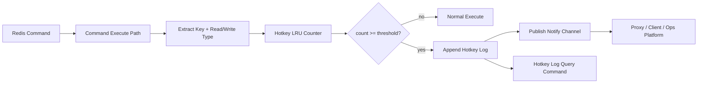
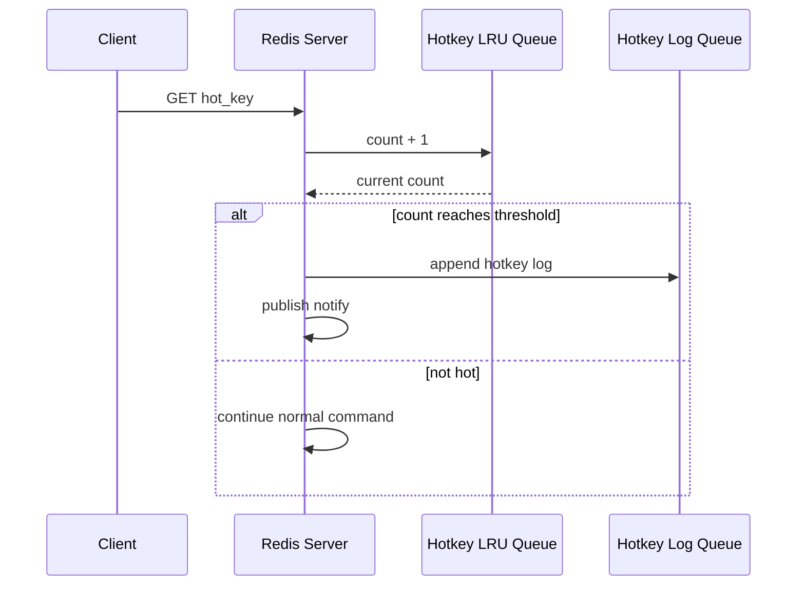
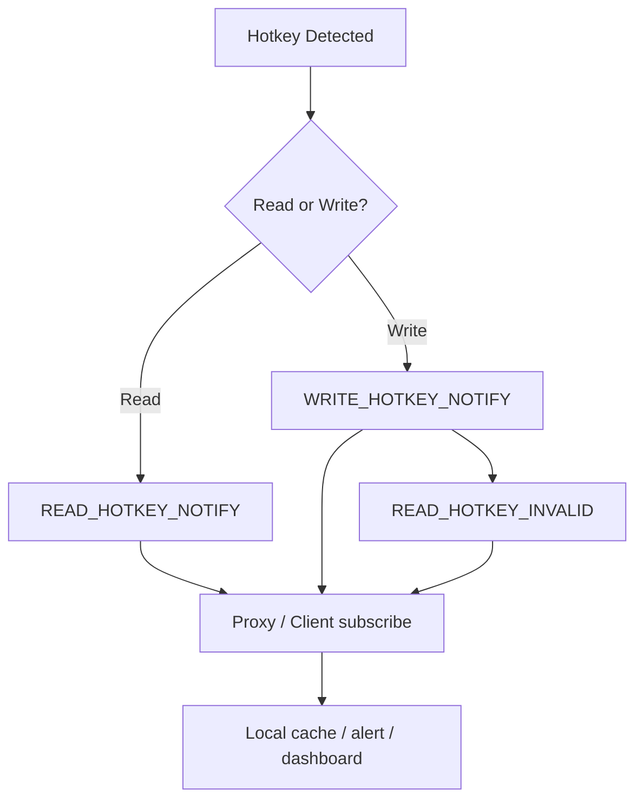

# 基于 Redis 内核的热 Key 统计实现方案

> 来源整理：根据微信公众号文章《基于Redis内核的热key统计实现方案｜得物技术》提取、总结并重写为技术博客版本。本文围绕热 key 的问题本质、常见探测方案、内核统计设计、通知机制、查询命令和工程取舍展开，并在文末补充面向 5 年经验开发/架构候选人的高质量面试追问。

## 1. 文章摘要

Redis 热 key 是指在单位时间内某个 key 被高频访问，导致单个 Redis 节点 CPU、网络带宽或主线程被集中消耗，从而影响其他请求。热 key 如果叠加大 key 或高复杂度命令，影响会更明显，甚至可能引发 RT 飙升、主从切换、带宽打满和业务雪崩。

原文先对比了常见热 key 探测方案：

- `redis-cli --hotkeys`
- `MONITOR` 命令统计
- Redis 节点抓包分析
- Client/Proxy 端采集并聚合

这些方案要么实时性差，要么侵入性强，要么实现复杂，要么无法长期开启。因此，得物自建 Redis 选择在 Redis-server 内核侧实现热 key 统计：在命令访问路径中以低成本记录 key 的访问频次，当单周期访问次数超过阈值时判定为热 key，并支持热 key 查询、日志记录和订阅通知。

## 2. 热 Key 为什么危险

Redis 单线程执行命令的模型决定了：如果某个 key 在短时间内承载了大量请求，即使每个请求本身很快，也会让该节点的大量 CPU 时间被集中消耗。

风险可以分三层：

| 风险 | 表现 | 典型场景 |
|---|---|---|
| CPU 热点 | 单 key 请求过多，主线程被占满 | 爆款商品、热点新闻、活动配置 |
| 网络热点 | 热 key 同时是大 key，响应体过大 | 大 hash、大 set 全量读取 |
| 命令热点 | 热 key 上执行高复杂度命令 | `hgetall`、`smembers`、复杂 Lua |

热 key 问题的难点在于它常常是突发的：一次运营活动、一条爆款内容、一个异常客户端循环请求，都可能在分钟级甚至秒级触发热点。

## 3. 常见热 Key 探测方案对比

### 3.1 redis-cli --hotkeys

Redis 4.0 起提供 `redis-cli --hotkeys`，其基本思路是通过 `SCAN + OBJECT FREQ` 遍历实例 keyspace，基于 LFU 频率信息找出热 key。

限制：

- 需要淘汰策略配置为 LFU，如 `volatile-lfu` 或 `allkeys-lfu`。
- 需要遍历全量 key，实时性差。
- 扫描耗时和 key 数量正相关。
- `OBJECT FREQ` 是近似访问频率，不等于真实 QPS。
- 信息不够丰富，例如缺少访问时间、key 类型、读写维度等。

### 3.2 MONITOR 命令

`MONITOR` 能实时打印 Redis 接收到的命令，再结合工具统计热 key。

限制：

- 高并发下可能造成内存暴涨。
- 会明显影响 Redis 性能。
- 只能短时间应急使用，不适合长期在线。
- 只能统计开启期间的热点，错过的突发热点无法追溯。

### 3.3 节点抓包分析

抓包方案通过 `libpcap` 监听 Redis 端口，解析 RESP 协议并统计 key。

限制：

- 实现复杂，需要解析 Redis 协议。
- 对机器负载有额外影响。
- 多 Redis-server 混部时全量抓包成本较高。
- 仍然只能统计抓包期间的数据。

### 3.4 Client/Proxy 端采集

Client 或 Proxy 端记录访问 key，再上报聚合中心统一计算。业界一些热点探测框架采用类似方案。

限制：

- Client 方案对业务 SDK 有侵入，多语言维护成本高。
- 单个 Client/Proxy 看不到全局访问，需要聚合中心。
- 架构链路变长，需要采集、上报、聚合、推送。
- 统计延迟和准确性依赖上报策略。

### 3.5 方案对比

| 方案 | 实时性 | 准确性 | 侵入性 | 可长期运行 | 主要问题 |
|---|---|---|---|---|---|
| `redis-cli --hotkeys` | 低 | 近似 | 低 | 不适合频繁运行 | 依赖 LFU，全量扫描 |
| `MONITOR` | 高 | 高 | 低 | 否 | 性能风险大 |
| 抓包分析 | 中 | 中高 | 低 | 不建议全量长期 | 实现复杂，有系统开销 |
| Client/Proxy 采集 | 中高 | 取决于聚合 | 中高 | 可以 | 架构复杂，多语言成本 |
| Redis 内核统计 | 高 | 高 | 低 | 可以 | 需要维护 Redis 内核改造 |

## 4. 基于 Redis 内核统计的整体设计

内核统计方案把热 key 识别放到 Redis-server 内部执行，直接在命令处理路径中记录 key 访问频次。

整体由三部分组成：

- 热 key 统计模块：记录 key 在时间窗口内的访问次数。
- 热 key 通知模块：当 key 达到阈值时，向订阅通道广播热 key 消息。
- 热 key 日志查询模块：提供查询和重置命令，供管控平台展示和排障。



这个方案最大的好处是：统计点离数据最近，不需要额外抓包，不依赖客户端上报，也不需要扫描全量 keyspace。

## 5. 热 Key 统计模块

### 5.1 固定大小 LRU 队列

为了控制内存使用，方案使用固定大小的 LRU 队列记录 key 访问统计。队列大小可配置，因此统计模块的内存开销不会随着 Redis 实例中的 key 数量无限增长。

关键设计：

- 每个 key 的统计操作为 `O(1)`。
- 每秒作为一个统计周期。
- 同一个 key 在同一秒内最多通知一次。
- 超过阈值后记录热 key 日志。
- 区分读热 key 和写热 key。

### 5.2 紧凑数据结构

原文中 hotkeyRecord 使用 bit field 压缩字段：

```c
#define HOTKEY_NOTIFIED_BIT 1
#define ACCESS_COUNT_BITS 16
#define ACCESS_TIME_BITS 46

typedef struct hotkeyRecord {
    uint64_t notified:HOTKEY_NOTIFIED_BIT;
    uint64_t same_period:HOTKEY_NOTIFIED_BIT;
    uint64_t count:ACCESS_COUNT_BITS;
    uint64_t access_time:ACCESS_TIME_BITS;
} hotkeyRecord;
```

字段含义：

| 字段 | 作用 |
|---|---|
| `notified` | 是否已经通知或记录日志 |
| `same_period` | 是否处于同一个统计周期 |
| `count` | 当前周期内访问次数 |
| `access_time` | 统计周期起始时间，毫秒级 |

这种设计的重点是节省内存，并保证在 Redis 主线程路径中统计不会引入过高成本。

### 5.3 统计周期与阈值

默认以 1 秒为统计周期，当某个 key 在 1 秒内访问次数达到阈值，就被判定为热 key。



同一个 key 如果连续多个周期都超过阈值，会在不同周期多次记录，这有助于区分“一瞬间热点”和“持续热点”。

## 6. 热 Key 日志

被判定为热 key 后，会写入热 key 日志队列，供平台查询和展示。

原文中的日志结构：

```c
#define HOTKEY_NOTIFIED_BIT 1
#define ACCESS_COUNT_BITS 16
#define LOG_TIME_BITS 46

typedef struct hotkeyLogEntry {
    uint64_t notified:HOTKEY_NOTIFIED_BIT;
    uint64_t access_count:ACCESS_COUNT_BITS;
    uint64_t access_time:LOG_TIME_BITS;
    unsigned type;
    void *key;
} hotkeyLogEntry;
```

日志信息通常包括：

- 热 key 出现时间。
- 访问次数。
- key 类型。
- 读操作还是写操作。
- key 名称。

平台可以基于这些信息展示实时热 key 列表，并联动治理能力，例如限流、本地缓存、通知业务负责人等。

## 7. 热 Key 通知机制

内核方案还支持订阅与主动通知，Redis-server 提供三个通道：

- 读热 key 通知。
- 写热 key 通知。
- 热 key 失效通知。

当 key 被判定为读/写热 key 时，Redis-server 向对应通道广播消息；当一个热 key 发生写操作时，向失效通道广播 key 失效消息。



通知机制的价值在于：热 key 不只是被发现，还可以驱动后续动作。

例如：

- Proxy 收到读热 key 通知后开启本地缓存。
- Client 收到热 key 通知后短时间本地缓存。
- 平台收到热 key 日志后告警。
- 写热 key 或热 key 失效通知触发本地缓存删除。

## 8. 查询与重置命令

除了订阅通知，Redis-server 还提供日志查询和重置命令。

读热 key：

```redis
readHotkeyLog len
readHotkeyLog reset
readHotkeyLog get
readHotkeyLog get [len]
readHotkeyLog get [index] [len]
```

写热 key：

```redis
writeHotkeyLog len
writeHotkeyLog reset
writeHotkeyLog get
writeHotkeyLog get [len]
writeHotkeyLog get [index] [len]
```

这些命令适合管控台周期性拉取热 key 记录，也适合排障时手动查询。

## 9. 工程取舍与风险

### 9.1 优势

- 实时性好：在 Redis-server 内部直接统计。
- 低侵入：业务无需改造 SDK。
- 成本可控：固定大小 LRU 队列限制内存。
- 信息丰富：可以记录时间、次数、类型、读写维度。
- 可联动治理：支持订阅通知和日志查询。

### 9.2 风险

- 需要维护 Redis 内核分支，升级成本高于纯外部方案。
- 统计逻辑在 Redis 主线程路径上，必须极致轻量。
- 阈值配置不合理会导致误报或漏报。
- 固定大小 LRU 队列可能在超高基数访问下淘汰掉部分 key 记录。
- 热 key 通知如果被滥用，可能反向增加系统负担。

### 9.3 适用场景

适合：

- 自建 Redis 平台。
- 多语言业务接入，难以统一 SDK 改造。
- 对实时热 key 发现要求高。
- 希望与 proxy、本地缓存、管控平台联动。

不适合：

- 完全使用云 Redis 且无法改内核。
- 小规模 Redis，无需建设平台化治理。
- 对 Redis 内核维护能力不足的团队。

## 10. 热 Key 治理建议

发现热 key 只是第一步，更重要的是治理。

常见治理手段：

| 治理方式 | 适用场景 | 注意点 |
|---|---|---|
| 本地缓存 | 读多写少、短时热点 | 需要失效通知或短 TTL |
| Proxy 缓存 | 多语言统一治理 | 注意 proxy 内存和一致性 |
| 多副本读 | 读压力大，可接受读从 | 注意主从延迟 |
| key 拆分 | 单 key 访问过高 | 业务需要支持聚合 |
| 限流降级 | 异常热点或攻击流量 | 要有明确错误码和兜底 |
| 大 key 拆分 | 热 key 同时是大 key | 需要数据模型改造 |

治理流程建议：


## 11. 总结

热 key 是 Redis 生产环境中非常典型的问题。传统探测方案各有局限：`hotkeys` 实时性差，`MONITOR` 风险大，抓包复杂，Client/Proxy 聚合需要额外平台。

基于 Redis 内核的热 key 统计方案，把统计点下沉到 Redis-server 内部，通过固定大小 LRU 队列、紧凑 bit field 数据结构、周期阈值判断、日志队列和订阅通知，实现了低侵入、实时、可查询、可联动治理的热 key 发现能力。

真正的工程价值在于：热 key 发现不是孤立能力，它应该和告警、本地缓存、proxy 限流、读写分离、业务降级和数据模型治理组成闭环。

## 12. 面试追问：五年资深开发与架构设计视角

下面这些问题适合用于考察候选人是否真正理解 Redis 热 key 的生产治理，而不是只会背概念。

### 12.1 热 Key 问题本质

1. 你如何定义热 key？用 QPS、CPU 占用、网络流量还是业务影响来定义？为什么？
2. 热 key 和 big key 有什么区别？当一个 key 既热又大时，系统风险会如何放大？
3. Redis 是单线程执行命令，为什么一个热 key 会影响其他 key 的请求？
4. 如果某个 key QPS 不高，但每次访问都是 `hgetall` 大 hash，它算热 key 吗？你会怎么治理？
5. 热 key 问题更容易发生在读请求还是写请求？写热 key 有哪些额外风险？

### 12.2 探测方案取舍

6. `redis-cli --hotkeys` 为什么要求 LFU？为什么它不适合实时热点发现？
7. `MONITOR` 能看到所有命令，为什么不能长期在线使用？
8. 抓包分析相比 `MONITOR` 有什么优势和不足？在多 Redis 实例混部机器上会遇到什么问题？
9. Client/Proxy 端采集为什么需要聚合中心？如果没有聚合中心会漏掉什么？
10. 如果你不能改 Redis 内核，只能在 SDK 或 Proxy 做热 key 探测，你会如何设计？

### 12.3 内核实现与性能

11. 在 Redis-server 内核里统计热 key，为什么统计操作必须是 `O(1)`？
12. 固定大小 LRU 队列有什么好处？在高基数 key 访问场景下可能有什么误差？
13. 为什么使用 bit field 压缩 hotkeyRecord？如果直接存对象和时间戳会有什么问题？
14. 每秒一个统计周期是否合理？如果业务流量极高或极低，周期和阈值如何调整？
15. 热 key 通知逻辑在 Redis 主线程执行时，如何避免通知本身拖慢 Redis？

### 12.4 通知、本地缓存与一致性

16. Redis-server 主动通知热 key 后，Client/Proxy 做本地缓存会带来什么一致性问题？
17. 为什么文章中要区分读热 key、写热 key 和热 key 失效通知？
18. 如果一个读热 key 被本地缓存了，随后发生写操作，如何保证本地缓存失效？
19. 如果失效通知丢失，业务会读到旧数据，你会如何兜底？短 TTL、版本号、主动拉取分别有什么代价？
20. 本地缓存适合所有热 key 吗？哪些场景不能使用本地缓存？

### 12.5 平台化治理

21. 管控平台展示热 key 时，除了 key 名称和访问次数，还应该展示哪些信息？
22. 热 key 告警应该按节点、实例、业务、命令还是 key 维度聚合？为什么？
23. 热 key 自动限流可能误伤业务，你会如何设计灰度和白名单？
24. 如果热 key 是爆款商品详情页，短期止血和长期治理分别怎么做？
25. 如果热 key 来源是异常客户端死循环请求，你如何定位具体调用方？

### 12.6 架构与业务思考

26. 热 key 治理应该由 Redis 平台负责，还是业务方负责？边界如何划分？
27. 什么时候应该通过扩容解决热 key？什么时候扩容没有意义？
28. 如果一个活动会制造热点，你会如何在活动前做容量评估和缓存预热？
29. 热 key 统计阈值应该全局统一，还是按实例/业务配置？如何防止配置复杂度失控？
30. 请设计一个完整的热 key 生产事故处理流程：从告警、定位、止血、恢复、复盘到长期治理。

这些追问重点考察候选人是否具备三个能力：能看懂 Redis 内核与性能边界，能做平台化治理设计，也能把技术方案落回业务正确性和成本收益。

## 参考来源

- 微信公众号文章：[基于Redis内核的热key统计实现方案｜得物技术](https://mp.weixin.qq.com/s/RWQzLZq6X7B5ThaKX6U4SQ)
