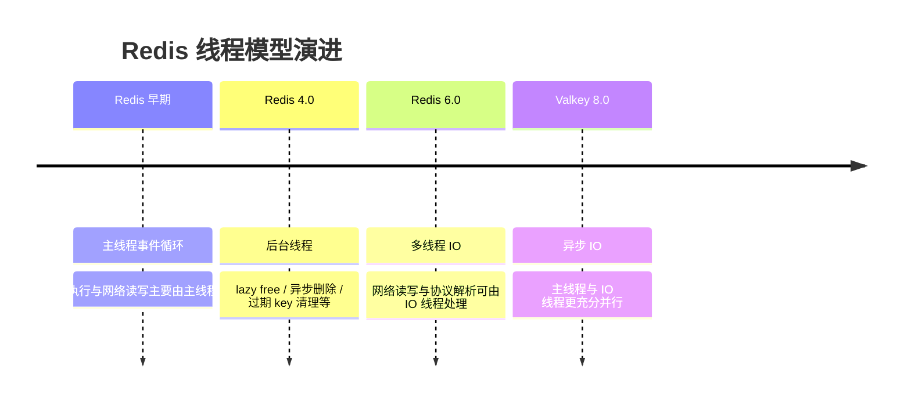
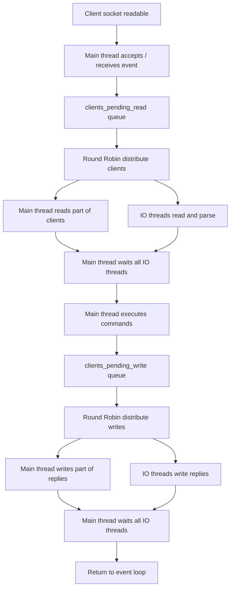
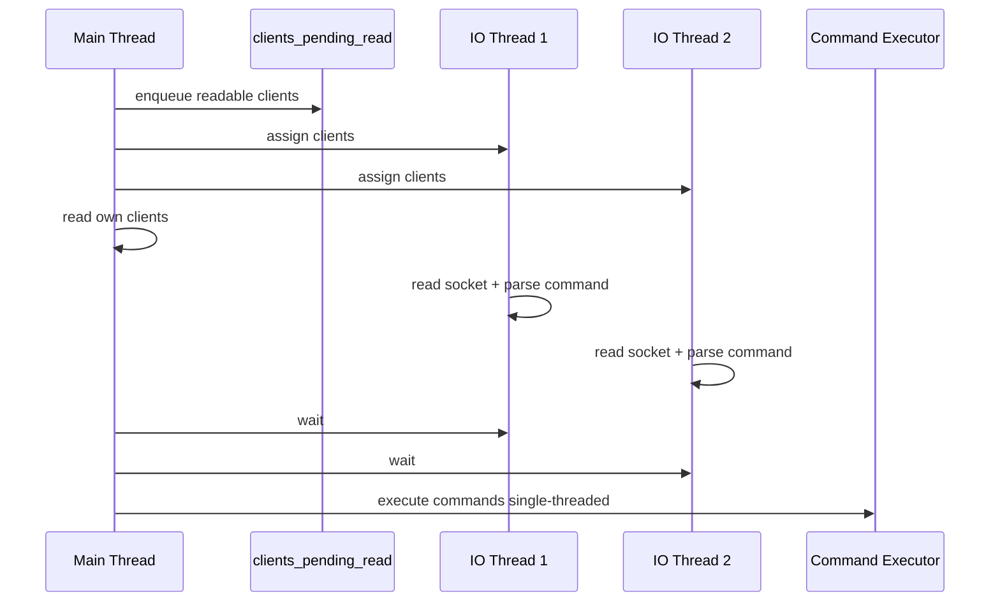
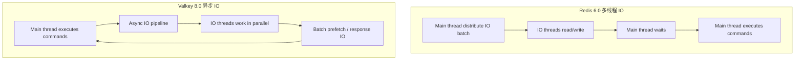

# Redis 是单线程模型？Redis 6 多线程 IO 与 Valkey 异步 IO 解析

> 来源整理：根据微信公众号文章《Redis 是单线程模型？｜得物技术》提取、总结并重写为技术博客版本。本文围绕 Redis “单线程模型”的真实含义、Redis 6.0 多线程 IO、源码执行流程、性能收益、Redis 6.0 的不足以及 Valkey 8.0 异步 IO 演进方向展开，并在文末补充面向 5 年经验开发/架构候选人的高质量面试追问。

## 1. 文章摘要

很多人说 Redis 是单线程模型，但这句话只说对了一半。更准确的说法是：Redis 的命令执行主路径长期保持单线程模型，也就是读写数据结构、执行命令、修改状态这些核心逻辑主要由主线程完成；但 Redis 并不是整个进程只有一个线程。

从 Redis 4.0 开始，Redis 已经引入后台线程处理异步删除、过期 key 清理、大 key lazy free 等任务。Redis 6.0 又引入多线程 IO，把网络读写和协议解析的一部分工作交给 IO 线程处理，但命令执行仍然是单线程。Valkey 8.0 则进一步引入异步 IO，让主线程与 IO 线程更充分并行，目标是进一步提高单节点吞吐。

这篇文章的核心结论：

- Redis “单线程”主要指命令执行单线程，不代表没有后台线程。
- Redis 6.0 多线程 IO 不改变 Redis 命令执行模型。
- 多线程 IO 主要优化网络读写和协议解析成本。
- 小 value、高连接数、网络 IO 压力明显的场景收益更大。
- 慢命令、Lua、大 key、CPU 密集命令无法靠多线程 IO 根治。
- Redis 6.0 IO 线程仍受主线程同步等待限制，CPU 利用不充分。
- Valkey 8.0 异步 IO 的方向是让 IO 线程与主线程更充分并行。

## 2. Redis “单线程模型”到底指什么

Redis 的高性能来自几个基础设计：

- 内存数据结构。
- 单线程命令执行，避免复杂锁竞争。
- IO 多路复用。
- 高效事件循环。
- 简洁协议和紧凑数据结构。

所谓 Redis 单线程，主要指命令执行模型：


命令执行单线程的好处是：

- 数据结构访问不需要加锁。
- 命令执行顺序天然可预期。
- 减少线程切换和锁竞争。
- 实现复杂度低，稳定性更好。

但单线程也意味着：只要某个命令耗时过长，主线程就会被阻塞，其他请求也会排队。这就是为什么 Redis 最怕慢命令、大 key、复杂 Lua、全量扫描和阻塞式操作。

## 3. Redis 线程模型演进

Redis 线程能力可以分成几个阶段：



### 3.1 Redis 4.0 后台线程

Redis 4.0 引入后台线程，不是为了并行执行命令，而是为了把一些重型后台任务从主线程挪出去，例如：

- 异步释放大对象。
- lazy free。
- 异步删除过期 key。

这类优化减少了主线程在释放内存上的阻塞时间。

### 3.2 Redis 6.0 多线程 IO

Redis 6.0 多线程 IO 的边界很清楚：

- IO 线程可以读 socket。
- IO 线程可以解析协议。
- IO 线程可以写响应。
- 主线程仍然负责执行命令。

因此它提升的是网络 IO 和协议解析能力，不是命令执行能力。

### 3.3 Valkey 8.0 异步 IO

Valkey 8.0 在 IO 线程系统上进一步演进，引入异步 IO，使主线程和 IO 线程能够更充分地并行工作，减少 Redis 6.0 中主线程同步等待 IO 线程的瓶颈。

## 4. Redis 6.0 多线程 IO 配置

Redis 6.0 多线程 IO 默认不开启，需要启动前配置。运行期间不能通过 `CONFIG SET` 动态修改。

典型配置：

```conf
# IO 线程数量。1 表示只使用主线程，不开启多线程 IO。
io-threads 4

# 是否让 IO 线程参与读数据和协议解析。
# 默认 no，表示多线程主要用于写响应。
io-threads-do-reads yes
```

配置要点：

- `io-threads` 必须大于 1 才会开启多线程 IO。
- Redis 代码中 IO 线程最大值为 128，但实际一般不会配置这么高。
- 线程 0 是主线程，所以 `io-threads 4` 表示 1 个主线程 + 3 个额外 IO 线程。
- 建议机器至少 4 核以上再考虑开启。
- 通常需要保留至少 1 个 CPU 核给系统和其他后台任务。
- 超过 8 个 IO 线程通常收益有限。
- 开启 TLS 时，Redis 6.0 多线程 IO 不支持。

## 5. Redis 6.0 多线程 IO 执行流程

Redis 6.0 的多线程 IO 可以理解为“主线程分发任务，IO 线程批量读写，主线程统一执行命令”。



流程简述：

1. 主线程负责接收连接和事件。
2. 如果开启多线程读，请求连接会进入待读队列。
3. 主线程通过 Round Robin 将连接分配给主线程和 IO 线程。
4. IO 线程读取 socket 数据并解析命令，但不执行命令。
5. 主线程等待所有 IO 线程完成读解析。
6. 主线程单线程执行命令。
7. 响应写入阶段，主线程再把待写客户端分配给 IO 线程。
8. IO 线程负责把响应写回 socket。
9. 主线程等待所有 IO 线程完成写操作。

关键特点：

- IO 线程同一时刻要么都在读，要么都在写。
- IO 线程不执行 Redis 命令。
- 主线程也参与读写，不是只做调度。
- 主线程会同步等待 IO 线程完成。

## 6. 源码流程精读

Redis 6.0 多线程 IO 的核心代码主要在 `networking.c`。

### 6.1 初始化

初始化入口大致是：

```text
main
  -> InitServerLast
  -> initThreadedIO
```

`initThreadedIO` 的关键行为：

- 如果 `server.io_threads_num == 1`，直接返回，不创建额外 IO 线程。
- 为每个线程创建对应的客户端待处理列表。
- 线程 0 是主线程。
- 为其他 IO 线程创建 `pthread`。
- IO 线程创建后先处于暂停状态，等待主线程启动。

简化伪代码：

```c
void initThreadedIO(void) {
    if (server.io_threads_num == 1) return;

    for (int i = 0; i < server.io_threads_num; i++) {
        io_threads_list[i] = listCreate();
        if (i == 0) continue;

        pthread_mutex_init(&io_threads_mutex[i], NULL);
        io_threads_pending[i] = 0;
        pthread_mutex_lock(&io_threads_mutex[i]);
        pthread_create(&tid, NULL, IOThreadMain, (void*)(long)i);
    }
}
```

### 6.2 读数据流程

当客户端连接有读事件，会触发 `readQueryFromClient`。如果启用了多线程读，Redis 不会立刻在主线程中读取数据，而是把客户端放入 `clients_pending_read` 队列。

简化逻辑：

```c
int postponeClientRead(client *c) {
    if (io_threads_active &&
        server.io_threads_do_reads &&
        !(c->flags & CLIENT_PENDING_READ)) {
        c->flags |= CLIENT_PENDING_READ;
        listAddNodeHead(server.clients_pending_read, c);
        return 1;
    }
    return 0;
}
```

随后主线程在事件循环的 `beforeSleep` 阶段调用 `handleClientsWithPendingReadsUsingThreads`：

- 将待读客户端分配到不同 IO 线程列表。
- 主线程处理自己分到的客户端。
- IO 线程处理各自分到的客户端。
- 主线程等待所有 IO 线程完成。
- 主线程继续处理已解析好的命令。



### 6.3 写数据流程

命令执行完成后，Redis 会通过 `addReply -> prepareClientToWrite -> clientInstallWriteHandler` 把待写响应的客户端加入 `clients_pending_write`。

简化逻辑：

```c
void clientInstallWriteHandler(client *c) {
    if (!(c->flags & CLIENT_PENDING_WRITE)) {
        c->flags |= CLIENT_PENDING_WRITE;
        listAddNodeHead(server.clients_pending_write, c);
    }
}
```

在 `beforeSleep` 阶段，Redis 调用 `handleClientsWithPendingWritesUsingThreads`：

- 如果待写客户端数量少，可能直接走同步写。
- 如果开启多线程 IO，则启动 IO 线程。
- 按 Round Robin 分配待写客户端。
- 主线程处理自己分到的写任务。
- IO 线程写回 socket。
- 主线程等待 IO 线程完成。

### 6.4 多线程 IO 动态暂停与开启

Redis 6.0 并不是让 IO 线程一直忙等处理任务。IO 线程在没有任务时会暂停，主线程在需要时启动。

这种设计减少了无效 CPU 消耗，但也带来一个限制：IO 线程是批处理式协作，主线程需要等待所有 IO 线程完成当前批次。

## 7. 性能对比与结论

原文基于 `redis-benchmark` 做了 Redis 6 单线程与多线程 IO 的简单 SET/GET 压测。

压测命令示例：

```bash
redis-benchmark \
  -h 172.xx.xx.xx \
  -t set,get \
  -n 1000000 \
  -r 100000000 \
  --threads 4 \
  -d 1024 \
  -c 256
```

参数说明：

- `-t set,get`：测试 SET/GET。
- `-n 1000000`：请求数量。
- `--threads 4`：benchmark 客户端线程数。
- `-d 1024`：value 大小。
- `-c 256`：客户端并发连接数。

原文结论可以整理为：

- 配置 4 个 IO 线程时，GET/SET QPS 相比单线程大部分情况下接近翻倍。
- 连接数越多，多线程 IO 优势越明显。
- value 越小，多线程 IO 优势越明显。
- 多线程读的收益比写更明显。
- value 越大，写命令优势越不明显。
- `io-threads-do-reads yes` 有轻微优势，但不是压倒性提升。

原因也比较直观：

- 小 value 场景，网络读写和协议解析占比更高，多线程 IO 更容易发挥作用。
- 大 value 场景，内存复制、网络带宽和写回成本更突出，收益被摊薄。
- 高连接数场景，单线程处理 socket 读写压力更明显，多线程分担更有效。

## 8. Redis 6.0 多线程 IO 的不足

Redis 6.0 多线程 IO 是一次重要优化，但它仍然不是“真正的全异步并行执行模型”。

主要不足：

### 8.1 主线程仍然承担核心瓶颈

主线程仍负责：

- 接收事件。
- 分发客户端。
- 等待 IO 线程。
- 执行所有命令。
- 协调写回。

因此，只要命令执行本身是瓶颈，多线程 IO 就无法解决。

### 8.2 主线程同步等待 IO 线程

Redis 6.0 中 IO 线程是批处理协作模型。主线程把任务分发给 IO 线程后，会等待所有线程完成。

这会导致两个问题：

- 最慢的 IO 线程决定当前批次完成时间。
- 主线程执行命令期间，IO 线程可能空闲。

### 8.3 IO 线程任务有限

IO 线程主要处理：

- 读 socket。
- 协议解析。
- 写 socket。

它们不负责命令执行，不负责复杂业务逻辑，也不能解决数据结构操作本身的 CPU 成本。

### 8.4 不支持 TLS 多线程 IO

原文提到 Redis 6.0 在开启 SSL/TLS 时不支持多线程 IO，这会影响对加密链路有要求的场景。

## 9. Valkey 8.0 异步 IO 的方向

Valkey 是 Redis 许可证变化后由社区推动的替代分支之一。Valkey 8.0 在 IO 线程系统上继续演进，重点是引入异步 IO，使主线程和 IO 线程能够更充分并行。

Redis 6.0 和 Valkey 8.0 的方向差异可以这样理解：



Valkey 8.0 的目标是：

- 减少主线程等待 IO 线程的时间。
- 把更多工作卸载给 IO 线程。
- 批量预读取内存数据，减少访问延迟。
- 提高 CPU 多核利用率。
- 提升单节点吞吐。

这并不意味着所有场景都应该立刻切换到 Valkey。对于生产系统，版本选择还要考虑兼容性、生态、客户端、运维体系、云服务支持和团队维护能力。

## 10. 工程落地建议

### 10.1 什么时候值得开启 Redis 6.0 多线程 IO

适合开启：

- 机器 CPU 核数充足，至少 4 核以上。
- Redis 单实例 QPS 高，网络 IO 压力明显。
- 请求 value 较小。
- 连接数较多。
- 慢命令、大 key 问题已经治理过。
- 业务主要瓶颈在网络读写和协议解析。

不适合指望它解决：

- 大 key 全量读取。
- 慢 Lua。
- `keys`、`hgetall`、`smembers` 等高风险命令。
- CPU 密集型命令。
- 内存碎片、swap、磁盘 AOF fsync 抖动。
- 主从复制延迟。

### 10.2 线程数如何设置

建议：

- 从 `io-threads 4` 开始压测。
- 观察 QPS、P99、CPU、网络、上下文切换。
- 不要盲目设置到 16、32、64。
- 至少保留 1 个 CPU 核给系统和后台任务。
- 开启 `io-threads-do-reads yes` 前先压测，不要默认打开。

### 10.3 压测要看什么

只看平均 QPS 不够，要同时看：

- QPS。
- P95/P99/P999。
- CPU 使用率和单核利用率。
- 网络入/出带宽。
- 慢命令。
- 大 key。
- 客户端连接数。
- 主从复制延迟。
- AOF/RDB 后台任务影响。

压测示例：

```bash
# 小 value，高并发连接
redis-benchmark -h 127.0.0.1 -p 6379 -t get,set -n 1000000 -c 1000 -d 128 --threads 4

# 中等 value
redis-benchmark -h 127.0.0.1 -p 6379 -t get,set -n 1000000 -c 512 -d 1024 --threads 4

# pipeline 场景
redis-benchmark -h 127.0.0.1 -p 6379 -t get,set -n 1000000 -c 256 -P 16 -d 256 --threads 4
```

## 11. 总结

Redis 是单线程模型这句话要精确理解：Redis 的命令执行主路径仍然是单线程，但 Redis 进程早已不只有一个线程。

Redis 6.0 多线程 IO 的价值在于把网络读写和协议解析从主线程中部分拆出去，提高高连接数、小 value、IO 压力明显场景下的吞吐。但它不会改变 Redis 命令执行单线程模型，也无法解决慢命令、大 key、复杂 Lua 等主线程执行瓶颈。

Valkey 8.0 异步 IO 代表了另一个演进方向：更充分地让主线程和 IO 线程并行，从而提高多核利用率和单节点吞吐。但生产落地仍需结合兼容性、生态和运维能力评估。

一句话落地建议：先治理慢命令、大 key 和不合理数据模型，再用压测决定是否开启多线程 IO；不要把多线程 IO 当作所有 Redis 性能问题的解药。

## 12. 面试追问：五年资深开发与架构设计视角

以下问题适合考察候选人是否真正理解 Redis 线程模型、性能瓶颈和业务治理，而不是只会回答“Redis 是单线程”。

### 12.1 Redis 单线程模型

1. Redis 是单线程模型，这句话准确吗？你会如何更严谨地描述？
2. Redis 为什么长期坚持命令执行单线程？它解决了哪些复杂性？
3. Redis 单线程为什么还能支撑很高 QPS？
4. Redis 4.0 以后有哪些后台线程？它们是否改变了命令执行模型？
5. 单线程命令执行模型最大的风险是什么？

### 12.2 Redis 6.0 多线程 IO

6. Redis 6.0 多线程 IO 处理的是哪些阶段？哪些阶段仍然是单线程？
7. `io-threads` 和 `io-threads-do-reads` 分别控制什么？
8. 为什么 Redis 6.0 默认只对写响应使用多线程 IO？
9. 为什么开启 `io-threads-do-reads yes` 的收益可能不明显？
10. 为什么开启 TLS 时 Redis 6.0 不支持多线程 IO？

### 12.3 性能收益与边界

11. 为什么小 value 场景下多线程 IO 收益更明显？
12. 为什么连接数越多，多线程 IO 越容易体现优势？
13. 为什么 value 越大，写命令的多线程收益越不明显？
14. Redis 多线程 IO 能解决 `hgetall` 大 key 慢的问题吗？为什么？
15. Redis 多线程 IO 能解决 Lua 脚本阻塞问题吗？为什么？

### 12.4 源码与执行流程

16. Redis 6.0 中主线程如何把待读客户端分发给 IO 线程？
17. IO 线程为什么同一时刻要么都读，要么都写？
18. 主线程为什么要等待所有 IO 线程完成？这会带来什么瓶颈？
19. `clients_pending_read` 和 `clients_pending_write` 分别解决什么问题？
20. Redis 6.0 多线程 IO 为什么说是批处理协作，而不是真正异步并行？

### 12.5 线上落地与架构判断

21. 线上 Redis QPS 到瓶颈时，你如何判断该开启多线程 IO、扩实例、加 proxy，还是治理 key？
22. 开启多线程 IO 前，你会做哪些压测和灰度验证？
23. 如果开启多线程 IO 后 QPS 提升但 P99 变差，你会怎么排查？
24. `io-threads` 设置过大为什么可能没有收益，甚至有副作用？
25. Redis 单核 CPU 打满时，为什么不一定应该先开多线程 IO？

### 12.6 Valkey 与演进思考

26. Valkey 8.0 异步 IO 相比 Redis 6.0 多线程 IO 的核心改进是什么？
27. 如果团队考虑从 Redis 切到 Valkey，你会评估哪些兼容性和运维风险？
28. 在什么场景下，Valkey 异步 IO 的收益可能比 Redis 6.0 更明显？
29. Redis/Valkey 单节点吞吐提升后，业务架构还需要关注哪些新瓶颈？
30. 请设计一个 Redis 性能问题排障流程：从告警、指标确认、慢命令、大 key、网络、CPU、线程配置到最终治理方案。

这些追问的重点是看候选人能否从“知道 Redis 是单线程”进一步上升到“理解性能瓶颈在哪里、优化手段边界在哪里、业务应该如何落地治理”。

## 参考来源

- 微信公众号文章：[Redis 是单线程模型？｜得物技术](https://mp.weixin.qq.com/s/Fqn-797GpsSKdVztzthSOg)
