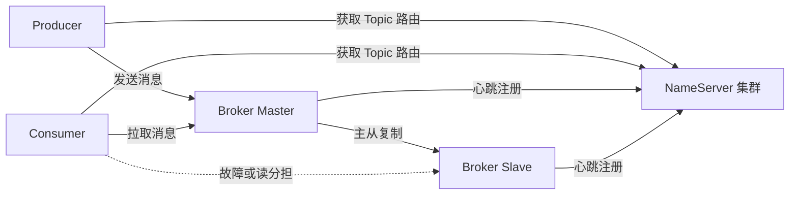
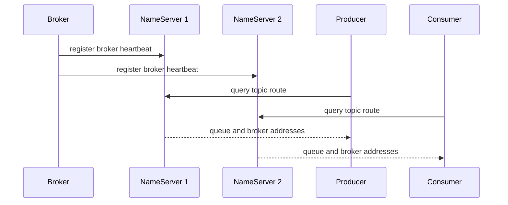
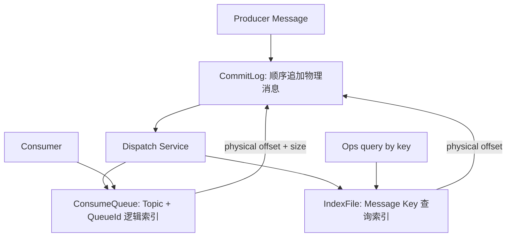
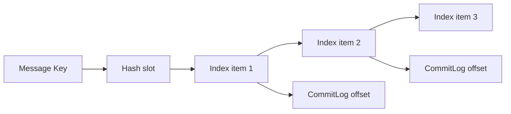
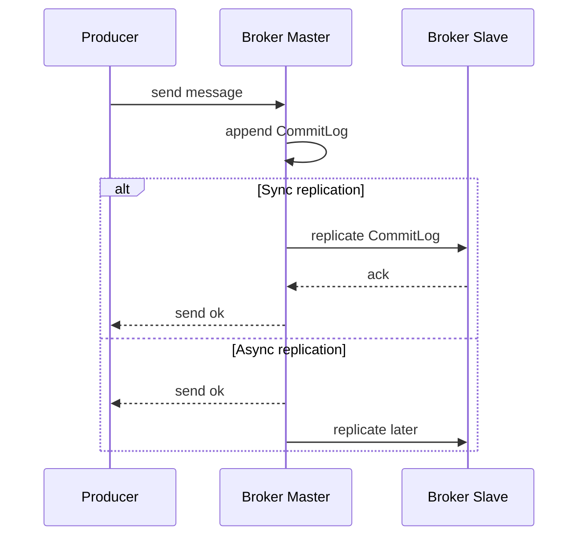
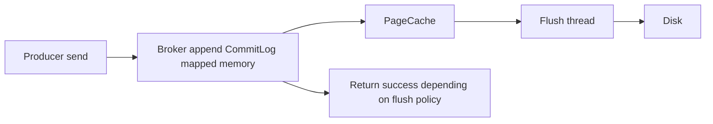
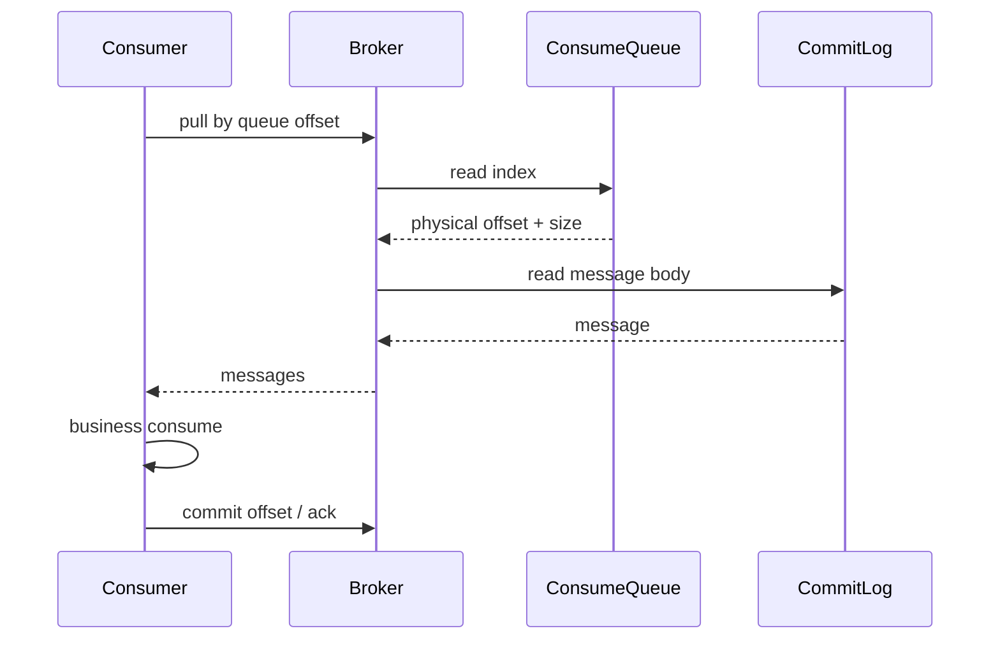
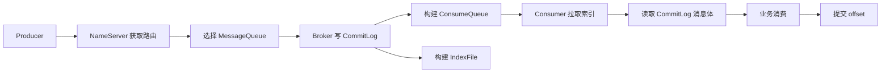

# RocketMQ 高性能揭秘：承载万亿级流量的架构奥秘

> 来源整理：根据微信公众号文章《RocketMQ高性能揭秘：承载万亿级流量的架构奥秘｜得物技术》提取、总结并重写为技术博客版本。本文保留原文的技术主线，重新组织为“架构总览 -> 核心组件 -> 存储设计 -> 高可用 -> 生产消费模型 -> 性能优化 -> 实战清单”的博客结构。

## 1. 文章摘要

RocketMQ 是一款面向高吞吐、高可靠、可堆积、可扩展场景的分布式消息中间件。原文重点解释了 RocketMQ 为什么能支撑大规模流量，核心答案不在单个参数，而在整套架构设计：

- 使用 `NameServer` 做轻量级、无状态、最终一致的路由发现。
- 使用 `Broker` 作为消息存储、转发、复制、查询的核心引擎。
- 使用 `CommitLog + ConsumeQueue + IndexFile` 分离物理存储、逻辑消费和消息查询。
- 通过顺序写、内存映射、PageCache、批量刷盘降低磁盘成本。
- 通过主从复制、Dledger、同步/异步刷盘等机制在性能和可靠性之间做工程取舍。
- 通过 Producer/Consumer 的负载均衡、重试、消费进度管理支撑大规模生产消费。

如果用一句话概括：RocketMQ 的高性能来自“写入链路极简顺序化，消费链路索引化，路由层轻量化，高可用策略可配置化”。

## 2. RocketMQ 架构总览

RocketMQ 主要由四类角色组成：

| 组件 | 职责 | 关键点 |
|---|---|---|
| Producer | 发送消息 | 获取 Topic 路由，选择队列，发送同步/异步/单向消息 |
| Consumer | 消费消息 | 支持集群消费、广播消费、Push/Pull、重试和消费进度 |
| NameServer | 路由中心 | 无状态、节点间不通信，Broker 定期注册，客户端定期拉取路由 |
| Broker | 消息代理 | 负责消息存储、转发、复制、查询、消费进度和运行时元数据 |

整体链路如下：



RocketMQ 的架构特点是：路由发现和消息存储解耦，NameServer 不参与消息收发，Broker 承担消息链路核心职责。

## 3. NameServer：轻量级服务发现枢纽

### 3.1 设计思想

NameServer 的设计哲学是“简单、无状态、最终一致”。

它不存储消息，只维护路由元数据，例如：

```java
Map<String, List<QueueData>> topicQueueTable;
Map<String, BrokerData> brokerAddrTable;
Map<String, Set<String>> clusterAddrTable;
Map<BrokerAddrInfo, BrokerLiveInfo> brokerLiveTable;
```

Broker 定期向所有 NameServer 上报心跳；Producer 和 Consumer 定期从 NameServer 拉取 Topic 路由。多个 NameServer 之间不做同步，也不选主。

### 3.2 为什么不做强一致注册中心

NameServer 牺牲了路由元数据的强一致性，换来了极低复杂度：

- 部署简单：启动多个 NameServer 即可。
- 水平扩展容易：节点之间没有复制协议。
- 故障影响小：某个 NameServer 挂掉，客户端可以访问其他节点。
- 路由变动不频繁：消息队列场景下 Topic/Broker 拓扑通常不会秒级剧烈变化。

路由更新过程可以这样理解：



### 3.3 与 Kafka 元数据管理的差异

| 维度 | RocketMQ NameServer | Kafka KRaft / Controller |
|---|---|---|
| 架构风格 | 去中心化、无状态 | 中心化元数据管理 |
| 一致性 | 最终一致 | 强一致 |
| 节点间通信 | NameServer 之间不通信 | Controller 通过共识协议维护元数据 |
| 运维复杂度 | 低 | 相对更高 |
| 元数据精确性 | 依赖客户端容错和周期刷新 | 全局一致视图更强 |

RocketMQ 的选择更偏“工程简单、可用优先”；Kafka 的选择更偏“元数据强一致和统一调度”。

## 4. Broker：消息存储与转发的核心引擎

Broker 是 RocketMQ 的核心。它负责消息写入、存储、索引构建、消息拉取、主从复制、消费进度管理和运行时配置。

Broker 存储目录通常位于 `${storePathRootDir}/store/`，核心文件包括：

| 目录/文件 | 作用 | 设计要点 |
|---|---|---|
| `commitlog/` | 消息物理实体 | 所有 Topic 消息混合顺序追加写，单文件默认 1GB |
| `consumequeue/` | 逻辑消费队列 | 按 Topic/QueueId 组织，定长 20 字节索引 |
| `index/` | Key 查询索引 | 哈希槽 + 链表结构，支持按 Key 查询消息 |
| `config/` | 运行时元数据 | Topic 配置、消费进度等 |
| `checkpoint` | 刷盘检查点 | 恢复时判断 CommitLog、ConsumeQueue、IndexFile 进度 |
| `abort` | 异常退出标记 | 存在时表示上次异常关闭，需要恢复 |
| `lock` | 文件锁 | 防止多个 Broker 进程同时写同一目录 |

## 5. CommitLog、ConsumeQueue、IndexFile 的分工

RocketMQ 没有为每个 Topic 单独写一份物理日志，而是把所有消息顺序追加到 CommitLog，再用 ConsumeQueue 给消费者提供逻辑视图。



### 5.1 CommitLog：顺序写入的性能根基

CommitLog 存储完整消息。文件名是 20 位数字，表示该文件的起始物理偏移量。例如：

```text
00000000000000000000
00000000001073741824
00000000002147483648
```

单个文件默认 1GB，写满后切换下一个文件。由于消息体长度不固定，CommitLog 中每条消息不是定长记录，但整体写入是追加写。

一条消息通常包含：

- 消息总长度。
- MagicCode。
- Body CRC。
- QueueId。
- QueueOffset。
- PhysicalOffset。
- BornTimestamp / StoreTimestamp。
- Topic。
- Properties。
- Body。

### 5.2 ConsumeQueue：消费视图索引

ConsumeQueue 是逻辑队列索引，按 `Topic/QueueId` 组织。每条记录固定 20 字节：

| 字段 | 字节数 | 说明 |
|---|---:|---|
| CommitLog Offset | 8 | 消息在 CommitLog 中的物理偏移量 |
| Size | 4 | 消息长度 |
| Tag HashCode | 8 | Tag 哈希，用于过滤优化 |

消费者按队列顺序拉取时，先读 ConsumeQueue，再根据物理偏移量回到 CommitLog 读取消息体。

### 5.3 IndexFile：消息查询能力

IndexFile 用于按 Message Key 查询消息，通常服务于运维排查、消息轨迹、问题定位。其结构可以理解为“哈希槽 + 链表”。



IndexFile 不是消费主路径，因此不会影响正常消费顺序，但能提升按 Key 查询的效率。

## 6. RocketMQ 如何优化随机读取

消息写入是顺序写，但消费并不总是完全顺序：不同 ConsumerGroup、不同 Queue、不同消费进度都会导致读取位置不一致。RocketMQ 通过以下设计缓解随机读成本：

- 使用 ConsumeQueue 的定长索引快速定位消息物理偏移。
- CommitLog 使用内存映射文件，利用操作系统 PageCache。
- 顺序追加提高写入吞吐，读取尽量由 PageCache 命中。
- 支持按照 Tag HashCode 做初步过滤，减少无效消息读取。
- 文件按固定大小滚动，偏移量到文件位置计算简单。

物理定位公式可以简化理解为：

```text
fileName = floor(physicalOffset / fileSize) * fileSize
position = physicalOffset % fileSize
```

## 7. 一体与分离：RocketMQ 与 Kafka 的架构取舍

原文提到 Kafka 和 RocketMQ 的核心架构博弈，本质是“Topic 分区日志一体化”与“物理日志 + 逻辑队列分离”的差异。

| 维度 | RocketMQ | Kafka |
|---|---|---|
| 物理存储 | 所有 Topic 混合写 CommitLog | 每个 Topic-Partition 独立日志 |
| 消费索引 | ConsumeQueue 逻辑索引 | Partition log 本身即消费序列 |
| 查询索引 | IndexFile 支持 Key 查询 | 主要按 offset 读取 |
| 随机消费优化 | ConsumeQueue -> CommitLog | 直接读分区日志 |
| 架构特点 | 写入集中顺序化，消费视图分离 | 分区天然独立，模型直接 |

RocketMQ 的分离设计让写入路径更容易顺序化，也方便支持多消费视图和消息查询；Kafka 的分区日志模型更直接，天然适合流式顺序处理和日志回放。

## 8. 高可用设计：复制、主从与 Dledger

RocketMQ 高可用主要围绕 Broker 展开。

常见模式包括：

- 异步复制：Master 写成功后返回，再异步复制到 Slave，性能好但极端故障可能丢少量数据。
- 同步复制：Master 等 Slave 确认后再返回，可靠性高但延迟更高。
- Dledger：基于 Raft 思想的多副本复制和自动主从切换能力。



选择建议：

- 金融交易、支付、订单主链路：倾向同步刷盘 + 同步复制，牺牲部分延迟换可靠性。
- 日志、埋点、监控数据：倾向异步刷盘 + 异步复制，优先吞吐。
- 对自动故障切换要求高：考虑 Dledger 或云厂商托管高可用版本。

## 9. 刷盘策略：性能与可靠性的工程平衡

RocketMQ 的消息写入先进入内存映射区域，再由刷盘线程将数据落到磁盘。核心策略：

| 策略 | 说明 | 优点 | 风险 |
|---|---|---|---|
| 同步刷盘 | 消息落盘后才返回成功 | 可靠性高 | 延迟更高，吞吐下降 |
| 异步刷盘 | 写入 PageCache 后返回，后台批量刷盘 | 吞吐高，延迟低 | 宕机可能丢失未刷盘数据 |

刷盘链路可以这样看：



工程上要关注：

- 磁盘类型：SSD/NVMe 对尾延迟影响很大。
- 刷盘间隔：越短越可靠，但成本越高。
- PageCache：内存不足会导致读写抖动。
- Broker 异常退出恢复：依赖 checkpoint、abort 等文件判断恢复位置。

## 10. Producer：高效生产模型

Producer 的关键动作是：获取路由、选择队列、发送消息、处理结果。

发送方式：

- 同步发送：等待 Broker 返回，适合关键业务消息。
- 异步发送：通过回调处理结果，适合高吞吐但仍关心发送结果。
- 单向发送：不等待结果，适合日志类非关键消息。

Java 发送示例：

```java
DefaultMQProducer producer = new DefaultMQProducer("order_producer_group");
producer.setNamesrvAddr("127.0.0.1:9876");
producer.start();

Message msg = new Message(
    "OrderTopic",
    "Created",
    "order_1001",
    "{\"orderId\":1001}".getBytes(StandardCharsets.UTF_8)
);

SendResult result = producer.send(msg);
System.out.println(result.getSendStatus());

producer.shutdown();
```

生产端实践建议：

- 关键消息使用同步发送，并处理失败重试。
- 设置业务 Key，便于后续问题排查。
- 控制消息大小，避免大消息拖垮 Broker 和网络。
- 同一业务有顺序要求时，使用顺序消息并固定队列选择策略。
- 发送重试要配合幂等，避免业务重复。

## 11. Consumer：消费模型与进度管理

Consumer 支持两种常见消费模式：

- 集群消费：同一 ConsumerGroup 内，每条消息只被一个实例消费。
- 广播消费：同一 ConsumerGroup 内，每个实例都会消费一份消息。

消费进度以 offset 形式维护。消费者拉取消息后，业务处理成功再提交进度。失败时 RocketMQ 会进入重试机制。



消费端实践建议：

- 消费逻辑必须幂等。
- 慢消费要监控堆积量和消费延迟。
- 消费失败要区分可重试和不可重试错误。
- 批量消费能提升吞吐，但要控制单批处理时间。
- 顺序消费要避免单条消息阻塞整个队列。

## 12. 核心流程：从发送到消费

一条消息的完整路径可以简化为：



这个流程体现了 RocketMQ 的几个关键设计：

- 发送端不直接依赖固定 Broker，而是通过路由动态寻址。
- Broker 写入主路径尽量顺序化。
- 消费路径通过 ConsumeQueue 缩小读取范围。
- 查询能力通过 IndexFile 补充，不污染消费主路径。

## 13. 其他性能优化关键点

### 13.1 顺序写和 PageCache

RocketMQ 借助顺序追加和内存映射减少磁盘随机写。大量读取也依赖 PageCache 命中，因此 Broker 机器要预留足够内存给操作系统缓存，不应把 JVM 堆设置得过大。

### 13.2 批量与异步

批量发送、批量拉取、异步刷盘、异步复制都体现了同一个原则：减少单条消息的固定成本。

### 13.3 文件预分配与固定大小

CommitLog 文件固定大小并按偏移命名，便于快速定位、滚动、清理和恢复。

### 13.4 过滤优化

Tag HashCode 能做轻量过滤，SQL92 过滤能力更灵活但成本更高。高吞吐场景下，不要把复杂过滤逻辑全部压给 Broker。

### 13.5 监控与堆积治理

高性能不是只看发送 TPS，还要看：

- 消息堆积量。
- 消费延迟。
- Broker 磁盘水位。
- 刷盘耗时。
- 主从复制延迟。
- PageCache 命中和磁盘 IO。
- 发送失败率和消费失败率。

## 14. 实战落地清单

### 14.1 Topic 与队列规划

- Topic 按业务语义划分，不要一个 Topic 承载所有业务。
- Queue 数量影响并发消费能力，但过多会增加 Broker 管理成本。
- 顺序消息要谨慎设置队列数量，因为同一顺序键必须落到同一队列。

### 14.2 生产端

- 关键消息设置 Key。
- 发送失败要记录日志和告警。
- 同步发送关注延迟，异步发送关注回调失败。
- 大消息拆分或外部存储，不要直接塞进 MQ。

### 14.3 消费端

- 消费幂等是第一原则。
- 区分业务失败、依赖失败和毒丸消息。
- 设置最大重试次数和死信队列处理流程。
- 监控每个 ConsumerGroup 的 lag。

### 14.4 Broker 运维

- 磁盘优先 SSD/NVMe。
- JVM 堆不要挤占 PageCache。
- 关注磁盘水位和文件清理策略。
- 主从复制延迟要告警。
- 定期演练 Broker 故障、NameServer 故障和消费堆积恢复。

## 15. 总结：RocketMQ 架构设计的启示

RocketMQ 的高性能不是单点技巧，而是一组相互配合的设计：

- NameServer 轻量无状态，让路由发现简单可靠。
- Broker 承担核心存储和转发，通过顺序写提升吞吐。
- CommitLog 和 ConsumeQueue 分离，让物理写入和逻辑消费各自优化。
- IndexFile 提供运维查询能力，不干扰消费主链路。
- 刷盘、复制、消费模式都提供可配置取舍，适配不同可靠性等级。

对工程系统设计的启示是：高性能架构往往不是“所有地方都追求强一致和强实时”，而是把主路径做短、做顺、做批量，把非主路径索引化、异步化、可恢复化。

## 参考来源

- 微信公众号文章：[RocketMQ高性能揭秘：承载万亿级流量的架构奥秘｜得物技术](https://mp.weixin.qq.com/s/Rg-mQv3kKsoLGgyJV9SBng)
