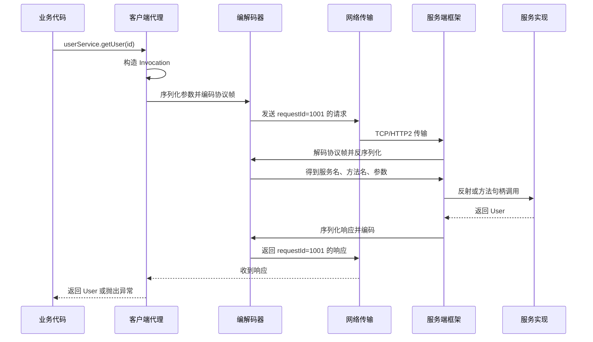
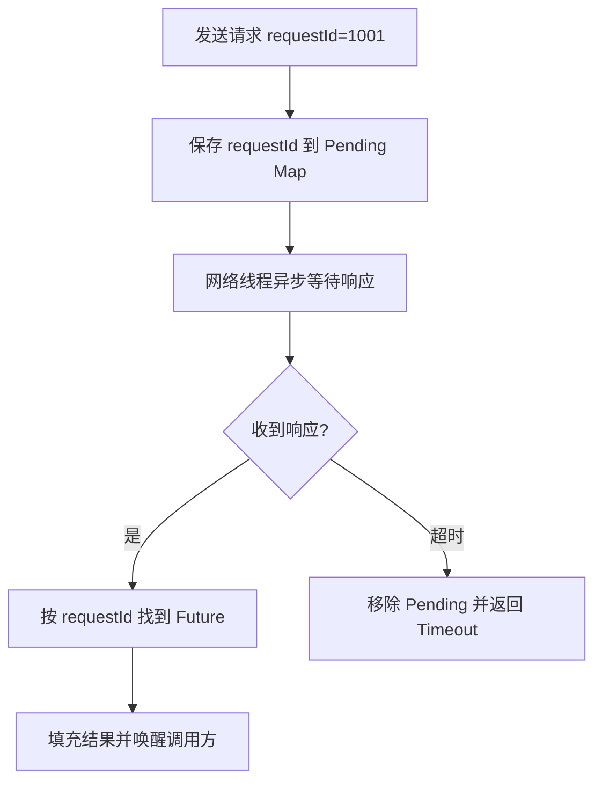

# 01 核心原理：能否画张图解释下 RPC 的通信流程

如果面试官让你解释 RPC，最好的回答不是先背 Dubbo 的配置，也不是先讲 gRPC 的四种调用模式，而是先画出一次调用从发起到返回的完整路径。只要这张图能画清楚，后面的协议、序列化、网络通信、动态代理、服务治理都有了落点。

## 本章要解决的问题

这一章聚焦一个问题：业务代码明明只是调用了一个接口方法，为什么请求最后能跑到另一台机器上的服务实现里？

我们要拆清楚：

- 客户端代理如何拦截本地方法调用。
- 请求如何被封装、序列化和协议编码。
- 网络层如何发送请求并接收响应。
- 服务端如何解码、分发并调用真实实现。
- 响应如何匹配到原来的请求。

## 核心观点

RPC 的本质是“代理 + 协议 + 序列化 + 网络 + 服务分发”的组合。调用方看到的是接口方法，框架内部处理的是请求消息。服务端看到的是字节流，框架内部会把它还原为方法调用。

一次 RPC 调用至少要回答四个问题：

- 调哪个服务、哪个方法？
- 参数和返回值怎么变成字节？
- 字节怎么跨网络传输？
- 响应回来后怎么找到原来的调用方？

## 原理拆解

### 一次 RPC 调用时序图



### 客户端发生了什么

业务代码调用 `userService.getUser(1001)` 时，拿到的往往不是一个真实实现类，而是框架生成的代理对象。代理对象会拦截方法调用，拿到接口名、方法名、参数类型、参数值、返回类型、注解元数据和调用上下文。

这些信息会被组装成一次 Invocation。它不是业务对象，而是一条“远程调用指令”。

常见字段包括：

- serviceName：服务名或接口全限定名。
- methodName：方法名。
- parameterTypes：参数类型列表。
- arguments：参数值。
- requestId：请求唯一编号。
- timeout：本次调用超时时间。
- attachments：traceId、用户、灰度标识、鉴权信息等扩展上下文。

### 协议和序列化发生了什么

Invocation 不能直接在网络上传输，需要先序列化成字节。序列化负责处理对象到字节的转换，协议负责告诉对方这段字节应该如何解释。

一个典型请求帧可能长这样：

```text
+---------+---------+----------+----------+----------+-------------+
| magic   | version | reqId    | codec    | bodyLen  | body bytes  |
+---------+---------+----------+----------+----------+-------------+
```

其中 `body bytes` 可能是 JSON、Protobuf、Hessian、Kryo 或 MessagePack 编码后的内容。协议头用于解决消息边界、版本识别、请求匹配、压缩方式和状态判断。

### 网络层发生了什么

高性能 RPC 框架通常会复用长连接。客户端发送请求后，不一定阻塞一个专门的 socket 等响应，而是把 `requestId` 和一个 Future 放到待完成请求表中。网络线程收到响应后，根据 `requestId` 找到对应 Future，再唤醒等待线程或触发回调。



这就是为什么 requestId 很重要。没有它，同一条连接上并发发送多个请求后，客户端就不知道哪个响应属于哪个调用。

### 服务端发生了什么

服务端收到字节后，先按协议解码，再按序列化方式还原 Invocation。然后根据服务名和方法名找到本地暴露的服务实现。

调用实现的方式可能是反射、方法句柄、动态生成的调用器，或者框架内部的 Invoker 抽象。Dubbo 中就大量使用 Invoker 来统一服务调用模型，gRPC 则通过生成代码和 MethodDescriptor 来组织调用。

服务执行完成后，框架把返回值或异常封装为响应，再经过序列化、协议编码和网络传输返回给客户端。

## 工程实践

设计一个最小 RPC 框架时，可以先保留这几个核心对象：

```java
class RpcRequest {
    String requestId;
    String serviceName;
    String methodName;
    String[] parameterTypes;
    Object[] arguments;
    Map<String, String> attachments;
}

class RpcResponse {
    String requestId;
    int status;
    Object result;
    String errorMessage;
}
```

客户端维护一个 `ConcurrentHashMap<String, CompletableFuture<RpcResponse>>`，发送请求前放入 map，响应回来后按 requestId 完成 future。

```java
CompletableFuture<RpcResponse> future = new CompletableFuture<>();
pending.put(request.getRequestId(), future);
channel.writeAndFlush(encode(request));
return future.get(timeout, TimeUnit.MILLISECONDS);
```

服务端维护一个服务注册表：

```java
Map<String, Object> serviceMap = new ConcurrentHashMap<>();
Object service = serviceMap.get(request.getServiceName());
Method method = findMethod(service, request.getMethodName(), request.getParameterTypes());
Object result = method.invoke(service, request.getArguments());
```

真实框架会比这复杂得多，但主线不会变。

## 常见坑

第一个坑，是只关心请求发出去，不关心 pending 请求清理。超时请求如果不移除，会造成内存泄漏。响应迟到后也要能识别并丢弃。

第二个坑，是没有统一上下文传播。traceId、租户、用户、灰度标签如果没有随请求传递，排查问题和流量治理都会很难。

第三个坑，是把服务端异常原样返回。异常类型在跨语言场景下可能不存在，堆栈也可能泄漏内部信息。更合理的做法是定义统一错误码和错误消息结构。

第四个坑，是忽视超时的端到端语义。客户端超时了，不代表服务端停止执行。如果是写操作，可能出现“客户端认为失败，服务端实际成功”的不一致。

## 面试追问

1. RPC 为什么需要 requestId？

因为连接通常会被多个请求复用，响应返回顺序不一定等于请求发送顺序。requestId 用来把响应匹配到原始调用，尤其是异步和多路复用场景。

2. 一次 RPC 调用可能在哪些环节失败？

服务发现失败、连接失败、编码失败、发送失败、服务端限流、业务异常、响应解码失败、客户端超时、连接被关闭、反序列化异常都可能导致失败。

3. 客户端超时后服务端还会执行吗？

可能会。除非协议和框架支持取消信号，并且服务端业务逻辑能够响应取消，否则服务端可能继续执行。写接口必须结合幂等和去重设计。

4. RPC 如何支持异步调用？

客户端发送请求后立即返回 Future、Promise、Callback 或协程挂起点，响应回来后由网络线程完成结果。核心仍然依赖 requestId 和 pending 请求表。

## 章节笔记

### 课程核心观点

RPC 调用不是魔法，本质上是框架把本地方法调用转换成网络消息，再在服务端还原成方法执行。理解通信流程，是理解后续所有设计的基础。

### 我的理解

RPC 的优雅之处在于把复杂链路藏在接口后面，但排障时必须把这条链路重新展开。你能画出的链路越细，定位问题越快。

### 关键概念

- Invocation：一次方法调用的结构化描述。
- requestId：请求和响应匹配的关键。
- Pending Map：客户端保存未完成请求的容器。
- 服务分发：服务端根据服务名和方法名找到实现并执行。
- 上下文传播：traceId、灰度、鉴权、租户等元数据透传。

### 实战落地

为任意一个线上 RPC 接口抓一条调用链路，记录服务名、方法名、超时时间、序列化方式、协议类型、traceId、调用结果和耗时分布。这个练习比只看源码更能建立真实感。

### 生产坑点

- 超时后没有清理 pending 请求。
- requestId 生成不唯一，导致响应串包。
- 服务端异常模型混乱，客户端无法判断是否可重试。
- 上下文透传缺失，链路追踪断裂。

## 小结

一张 RPC 通信流程图，应该覆盖代理、编码、传输、解码、分发、执行和响应匹配。后面的协议、序列化、网络 IO 和动态代理，本质上都是这条链路上的局部细化。
