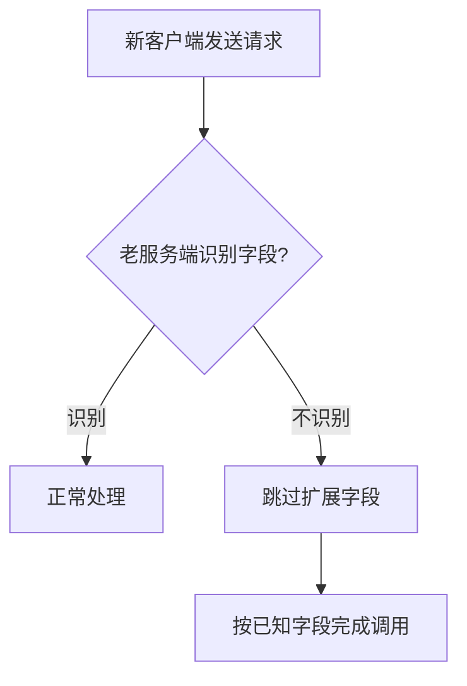

# 02 协议：怎么设计可扩展且向后兼容的协议

RPC 框架里的协议，决定了双方如何识别一段网络字节。没有协议，客户端发出去的只是一串二进制；有了协议，服务端才知道这是请求还是响应、用什么序列化方式、消息有多长、版本是多少、是否压缩、是否出错。

协议设计看起来底层，但它直接影响系统能否长期演进。一次不谨慎的字段变更，可能比一次业务 bug 更难处理，因为协议兼容问题通常发生在新老客户端、新老服务端混跑的过程中。

## 本章要解决的问题

这一章回答：

- RPC 协议通常包含哪些信息？
- 为什么协议要显式描述消息边界？
- 如何设计可扩展字段，避免未来升级困难？
- 向后兼容和向前兼容分别意味着什么？
- gRPC、Dubbo、Protobuf 的设计给我们什么启发？

## 核心观点

协议不是“把对象转成字节”这么简单。序列化解决对象表达，协议解决通信约定。

一个合格的 RPC 协议至少要解决：

- 消息边界：一条消息从哪里开始，到哪里结束。
- 消息类型：请求、响应、心跳、握手、取消、推送。
- 请求匹配：请求 ID 或流 ID。
- 编解码方式：JSON、Protobuf、Hessian 等。
- 版本兼容：协议版本、特性位、扩展字段。
- 状态表达：成功、业务异常、框架异常、限流、超时等。

## 原理拆解

### 一个简单二进制协议

可以把协议想成信封。信封上写收件人、寄件人、邮编和重量，信封里才是正文。RPC 协议头就是这个信封。

```text
0        2        3        4        5        13       17
+--------+--------+--------+--------+--------+--------+---------+
| magic  | version| type   | codec  | flags  | reqId  | bodyLen |
+--------+--------+--------+--------+--------+--------+---------+
| body bytes ...                                             |
+------------------------------------------------------------+
```

字段含义：

- magic：魔数，用来快速识别是否为本协议。
- version：协议版本。
- type：请求、响应、心跳、握手等消息类型。
- codec：序列化方式。
- flags：压缩、加密、是否双向、是否事件消息等特性位。
- reqId：请求唯一编号。
- bodyLen：消息体长度，解决粘包和半包。
- body：序列化后的请求或响应内容。

### 为什么必须有长度字段

TCP 是字节流协议，不保留应用层消息边界。你发送两次数据，对方可能一次读到；你发送一次大数据，对方也可能分多次读到。这就是常说的粘包和半包。


长度字段可以让接收端先读固定长度的协议头，再根据 `bodyLen` 读取完整消息体。Netty 中常见的 `LengthFieldBasedFrameDecoder` 就是这个思路。

### 可扩展协议怎么设计

可扩展协议的关键，是给未来留位置，同时允许老版本忽略不认识的信息。

常见做法包括：

- version：明确协议主版本，遇到不兼容变更时可拒绝或降级。
- flags：用 bit 表达可选特性，例如压缩、加密、心跳。
- header extension：支持 key-value 扩展头。
- TLV：Type-Length-Value 格式，接收方可以跳过未知 type。
- schema field number：像 Protobuf 一样用字段编号维持兼容。



兼容的本质不是“所有版本都理解所有字段”，而是“不理解也不会崩”。

## 工程实践

### 协议升级策略

| 场景 | 推荐策略 | 风险点 |
| --- | --- | --- |
| 新增可选字段 | 给默认值，老版本忽略 | 新版本不能假设字段一定存在 |
| 删除字段 | 先废弃，再观察，再删除 | 老版本仍可能依赖该字段 |
| 修改字段类型 | 尽量新增字段替代 | 类型变化通常不兼容 |
| 新增枚举值 | 老版本要有 unknown 处理 | 老客户端可能无法识别 |
| 修改语义 | 视为高风险变更 | 字段名没变但行为变了更隐蔽 |

### 设计扩展头

扩展头适合放调用元数据，例如 traceId、租户、灰度标签、鉴权 token、压缩算法、客户端版本。

```json
{
  "traceId": "9f3a1c",
  "tenant": "shop-a",
  "gray": "v2",
  "deadline": "120ms"
}
```

但扩展头不能无限膨胀。它会增加网络体积和解析成本，也可能带来安全风险。生产中要限制总大小、敏感字段脱敏，并明确哪些字段允许透传。

### 参考 gRPC 和 Dubbo

gRPC 运行在 HTTP/2 之上，借助 HTTP/2 的流、多路复用、header、状态码和流控能力，并默认使用 Protobuf 描述消息结构。它的优势是跨语言、标准化和生态完整。

Dubbo 协议更偏 Java 服务治理场景，强调高性能、长连接、请求响应匹配、服务元数据和治理扩展。Dubbo 的协议头中也包含魔数、标志位、状态、请求 ID 和数据长度等信息。

它们的共同点是：协议不只是传输 body，还要为框架治理留出元数据通道。

## 常见坑

第一个坑，是没有魔数和版本。没有魔数，收到错误流量时很难快速判断；没有版本，协议演进只能靠猜。

第二个坑，是字段只新增不治理。扩展字段越来越多，最后每次调用都带一堆历史包袱。协议扩展也需要生命周期管理。

第三个坑，是只考虑客户端升级，不考虑服务端升级。真实发布经常是多版本混跑，必须支持新客户端调老服务端、老客户端调新服务端。

第四个坑，是协议错误和业务错误混在一起。反序列化失败、方法不存在、服务限流、业务校验失败，应该有清晰的错误分类。

## 面试追问

1. RPC 协议和序列化协议有什么区别？

RPC 协议定义消息如何在网络上传输，包括头部、长度、类型、状态、请求 ID 等；序列化协议定义对象如何编码为字节，比如 JSON、Protobuf、Hessian。

2. 为什么 TCP 场景下要处理粘包和半包？

因为 TCP 是面向字节流的，不保留应用层消息边界。接收端一次 read 读到的数据，不一定对应发送端一次 write 的数据。

3. 怎么做到向后兼容？

新增字段要可选、有默认值；老版本要能忽略未知字段；不要随意修改字段类型和语义；必要时通过版本协商或双协议支持完成迁移。

4. 为什么 Protobuf 里不建议复用删除过的字段编号？

因为旧数据或旧客户端可能仍然使用这个编号。复用会让同一个编号在不同版本里表达不同含义，导致解析出错或语义混乱。

## 章节笔记

### 课程核心观点

RPC 协议设计要同时关注通信效率和长期兼容。协议头不是越简单越好，而是要包含框架运行和演进所需的最小元信息。

### 我的理解

协议像系统的地基。业务代码可以经常改，协议不能随意动。越靠近基础设施，越要为未来的多版本、多语言、多框架共存留余地。

### 关键概念

- 魔数：识别协议类型。
- 长度字段：划分消息边界。
- 特性位：表达压缩、加密、心跳等可选能力。
- TLV：便于跳过未知扩展字段。
- 版本协商：在客户端和服务端能力不一致时选择可用协议。

### 实战落地

设计协议时先写一份兼容性规则，明确哪些变更允许直接上线，哪些必须双写双读，哪些属于破坏性变更。协议文档要和代码同等重要。

### 生产坑点

- 字段类型变化导致老客户端反序列化失败。
- body 长度不校验，异常流量造成内存风险。
- 扩展头无限透传，导致请求体膨胀。
- 错误码没有分层，无法判断是否可重试。

## 小结

一个可用的 RPC 协议，要解决消息边界、请求匹配、元数据表达和版本演进。一个可长期运行的 RPC 协议，还要允许未知字段存在、允许多版本混跑，并把兼容性当成设计目标，而不是上线后的补丁。
