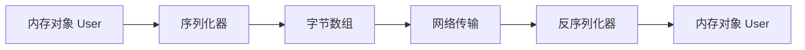
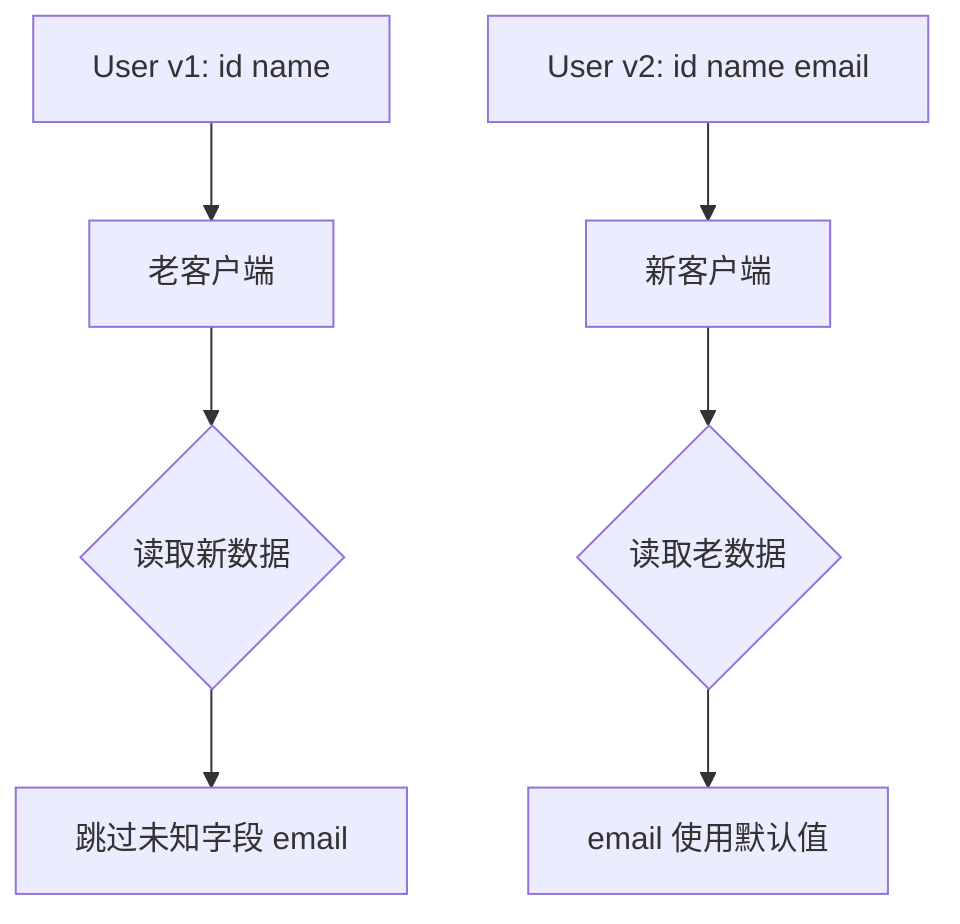

# 03 序列化：对象怎么在网络中传输

业务代码里传的是对象，网络上传的是字节。序列化就是把对象变成字节，再把字节还原成对象的过程。它看起来像工具层能力，但在 RPC 框架里，序列化会影响性能、兼容性、跨语言能力、安全性和排障体验。

很多 RPC 性能问题，最后都会落到序列化上：对象太大、字段太多、反射太慢、schema 不兼容、反序列化触发安全漏洞。理解序列化，不是为了记住哪个框架最快，而是为了知道不同方案适合什么场景。

## 本章要解决的问题

这一章回答：

- 为什么 RPC 必须序列化？
- JSON、Protobuf、Hessian、Kryo、MessagePack 等方案如何取舍？
- 什么是 schema-first 和 code-first？
- Protobuf 为什么适合跨语言 RPC？
- 反序列化有哪些安全风险？

## 核心观点

序列化选型没有绝对最优，只有场景最优。选择时至少看六个维度：

- 性能：编码和解码速度。
- 体积：网络传输字节数。
- 兼容性：字段新增、删除、默认值和未知字段处理。
- 跨语言：多语言服务能否共享数据结构。
- 可读性：排查问题时是否容易观察。
- 安全性：反序列化过程是否可能执行危险逻辑。

内部高性能、多语言 RPC 常用 Protobuf；Java 内部系统可能使用 Hessian 或 Kryo；调试接口、开放平台和简单管理面更适合 JSON。

## 原理拆解

### 对象到字节的转换



序列化器要处理的不只是字段值，还包括类型信息、字段顺序、空值、默认值、集合、嵌套对象、枚举、日期时间、二进制数据等细节。

### 常见方案对比

| 方案 | 优点 | 缺点 | 适合场景 |
| --- | --- | --- | --- |
| JSON | 可读性好，生态广 | 体积大，性能一般，类型表达弱 | 调试、开放接口、管理面 |
| Protobuf | 体积小，跨语言强，兼容性好 | 需要维护 proto schema，可读性差 | gRPC、多语言内部服务 |
| Hessian | Java 生态常见，使用方便 | 跨语言生态弱于 Protobuf | Java 内部 RPC |
| Kryo | 性能好，体积较小 | 兼容性和注册管理要求高 | Java 高性能内部场景 |
| MessagePack | 比 JSON 紧凑，多语言支持 | schema 约束弱 | 轻量跨语言传输 |
| Avro | schema 演进能力强 | 使用复杂度高 | 数据管道、日志、数据平台 |

### Protobuf 的兼容性思路

Protobuf 不靠字段名传输，而是靠字段编号。比如：

```proto
message User {
  int64 id = 1;
  string name = 2;
  string email = 3;
}
```

编码后的数据会带字段编号和 wire type。新增字段时，老客户端不认识编号 4，可以跳过；老数据里没有字段 4，新客户端读取时用默认值。



这也是 Protobuf 在 RPC 领域受欢迎的重要原因：它把兼容性规则写进了编码模型。

### Schema-first 与 code-first

Schema-first 是先定义 IDL 或 schema，再生成多语言代码。gRPC + Protobuf 就是典型代表。它适合跨团队、跨语言、接口契约明确的系统。

Code-first 是先写语言里的接口或类，再由框架推导协议和序列化结构。它上手快，适合单语言内部系统，但跨语言和长期兼容治理更容易变复杂。

在公司内部，如果服务边界稳定、语言多样、团队协作复杂，schema-first 往往更稳。如果只是单语言内部模块快速通信，code-first 的效率更高。

## 工程实践

### 序列化选型 checklist

1. 是否跨语言？如果是，优先考虑 Protobuf、Thrift、Avro、MessagePack。
2. 是否需要人直接读？如果是，JSON 或带调试工具的二进制协议更合适。
3. 是否对延迟和带宽敏感？如果是，优先考虑 Protobuf、Kryo、Hessian 等紧凑编码。
4. 是否需要长期兼容？如果是，必须有 schema 演进规则。
5. 是否暴露给不可信输入？如果是，避免危险的通用反序列化机制。
6. 是否需要对象多态？如果是，要明确类型信息如何表达，避免隐式魔法。

### Protobuf 实践建议

- 字段编号一旦发布，不要复用。
- 删除字段时使用 reserved 保留编号和名称。
- 新增字段尽量给出业务默认语义。
- 避免在协议里表达语言特有类型，例如 Java 的 BigDecimal 可以用 string 或结构化 message 表达。
- 枚举保留 UNKNOWN 值，防止老版本无法识别新枚举。

示例：

```proto
message Order {
  reserved 4, 8;
  reserved "old_status";

  int64 id = 1;
  string order_no = 2;
  OrderStatus status = 3;
}

enum OrderStatus {
  ORDER_STATUS_UNKNOWN = 0;
  ORDER_STATUS_CREATED = 1;
  ORDER_STATUS_PAID = 2;
}
```

### 性能测试不要只看单点

比较 JSON 和 Protobuf 时，不要只测一次对象编码耗时。更有意义的指标包括：

- P95/P99 编码和解码耗时。
- 序列化后字节大小。
- GC 压力和对象分配量。
- 大对象、嵌套对象、空字段、集合字段下的表现。
- schema 演进后的兼容情况。

## 常见坑

第一个坑，是把序列化后的体积当唯一指标。体积小很重要，但解码成本、对象分配和调试成本同样重要。

第二个坑，是忽略默认值语义。Protobuf 里字段不存在和字段为默认值，在某些版本中并不总是容易区分。业务上如果需要区分“未传”和“传了空值”，要显式建模。

第三个坑，是反序列化不可信数据。某些 Java 反序列化机制曾多次出现安全漏洞，本质原因是反序列化过程可能触发类加载、构造逻辑或特殊方法调用。

第四个坑，是序列化对象和领域对象完全混用。RPC DTO 应该服务于接口契约，领域对象服务于业务模型。二者强耦合会让接口演进变困难。

## 面试追问

1. 为什么 Protobuf 比 JSON 更适合高性能 RPC？

Protobuf 使用二进制编码，字段用编号表示，通常体积更小；同时 schema 明确，跨语言生成代码，减少运行时解析成本。但它可读性不如 JSON，需要配套 IDL 和工具链。

2. 什么情况下仍然选择 JSON？

开放接口、调试接口、配置管理、后台管理、对可读性要求高或性能压力不大的场景。JSON 的优势是通用、直观、工具生态强。

3. 反序列化为什么有安全风险？

如果反序列化机制允许根据输入创建任意类型，并触发特殊方法、类加载或对象图构造，就可能被恶意 payload 利用。对不可信输入要限制类型、校验数据并使用安全序列化方案。

4. Schema-first 的代价是什么？

需要维护 IDL、生成代码、管理版本和发布流程。它牺牲一点开发自由度，换来跨语言和长期契约治理能力。

## 章节笔记

### 课程核心观点

序列化是 RPC 的基础能力，它决定对象能否跨进程、跨机器、跨语言传输。选型时不能只看性能，要同时看兼容、体积、安全和生态。

### 我的理解

序列化是接口契约的一部分。只要数据跨过进程边界，就不能再把它当内部对象随便改。稳定的 DTO、清晰的 schema 和兼容规则，是服务长期演进的保险。

### 关键概念

- 序列化：对象到字节。
- 反序列化：字节到对象。
- Schema：数据结构契约。
- 字段编号：Protobuf 兼容性的核心。
- DTO：面向传输的数据对象。

### 实战落地

给一个现有 RPC 接口做序列化体检：统计请求和响应大小、P99 编解码耗时、字段数量、空字段比例、是否存在历史废弃字段。很多性能优化点会从这里浮出来。

### 生产坑点

- 字段编号复用导致数据错读。
- DTO 直接复用数据库实体，暴露不该暴露的字段。
- 大对象一次性序列化造成内存尖峰。
- 反序列化异常没有区分协议问题和业务问题。

## 小结

序列化不是“选个最快的库”这么简单。RPC 中的序列化方案，必须同时服务于性能、兼容、跨语言、安全和可维护性。越是核心服务，越要把序列化契约当成长期资产来管理。
