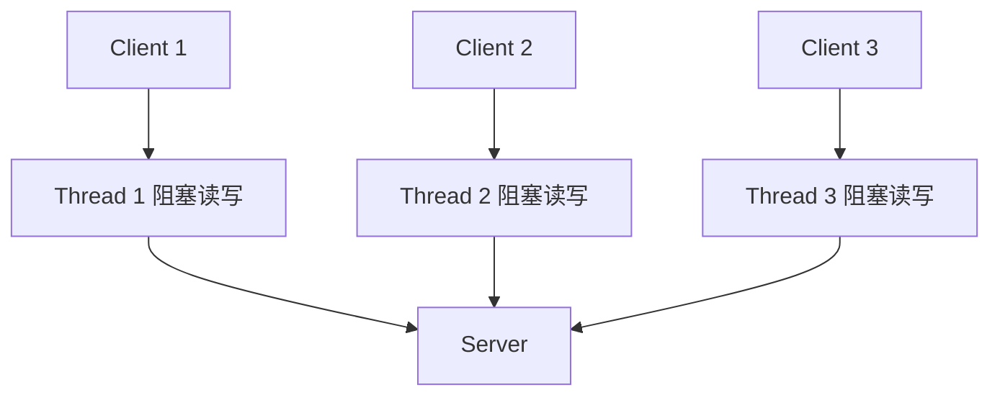
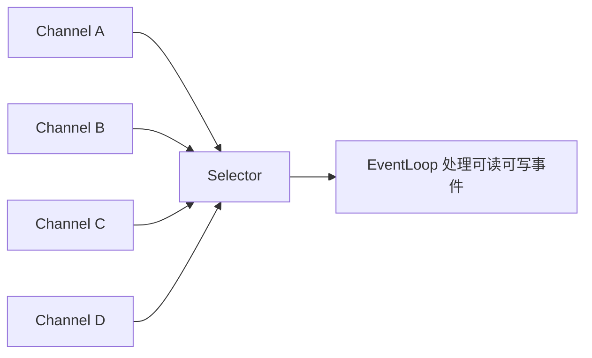
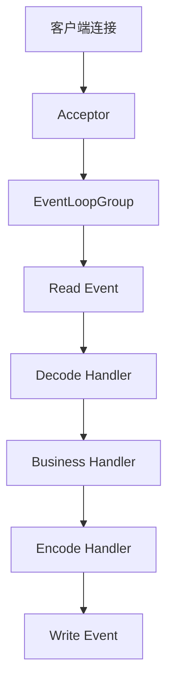

# 04 网络通信：RPC 框架在网络通信上更倾向于哪种网络 IO 模型

RPC 最终要通过网络发送字节。协议和序列化解决了“发什么”，网络通信解决的是“怎么高效地发”。在低并发场景，一个连接一个线程也能跑；到了高并发、长连接、多服务调用的场景，IO 模型就会直接影响吞吐、延迟和资源成本。

现代 RPC 框架大多倾向于 NIO、多路复用和 Reactor 模型。Java 生态里，Netty 是最常见的网络基础设施；gRPC Java 底层也可以运行在 Netty 之上。

## 本章要解决的问题

这一章回答：

- BIO、NIO、多路复用和 Reactor 的区别是什么？
- 为什么 RPC 不适合大量使用阻塞短连接？
- Netty 的 EventLoop、ChannelPipeline、ByteBuf 分别解决什么问题？
- 连接池、心跳、背压在 RPC 网络层中有什么价值？

## 核心观点

RPC 网络层更倾向于使用非阻塞 IO 和事件驱动模型，因为 RPC 的典型场景是大量并发请求、长连接复用、请求响应异步匹配和低延迟传输。

阻塞 IO 的模型简单，但连接数和线程数一旦上来，线程切换、内存占用和调度成本会迅速变高。NIO + Reactor 把“等待 IO 就绪”和“处理 IO 事件”集中到少量事件循环线程中，更适合高并发连接。

## 原理拆解

### BIO 模型

BIO 是阻塞 IO。服务端通常为每个连接分配一个线程，线程阻塞在 read 上，读到数据后处理请求。

它的优点是简单，缺点是连接多时线程也多。RPC 框架如果为每个连接、每个请求都占用线程，很快会遇到线程池耗尽和上下文切换成本。

### NIO 与多路复用

NIO 允许 socket 设置为非阻塞。线程不再傻等某个连接，而是通过 selector 监听多个连接上的事件。

Linux 上常见的多路复用机制包括 select、poll、epoll。epoll 在大量连接场景下更高效，因为它不需要每次线性扫描所有文件描述符，更适合高并发网络服务。

### Reactor 模型

Reactor 的核心思想是：事件来了再处理。网络线程监听 IO 事件，把读、写、连接、关闭等事件分发给对应 handler。

在 Netty 中，这套模型被封装为 EventLoopGroup、Channel、ChannelPipeline 和 ChannelHandler。你写业务 handler，Netty 负责事件循环、连接管理和底层 IO。

## 工程实践

### RPC 为什么喜欢长连接

短连接每次调用都要经历连接建立和释放。TCP 三次握手、TLS 握手、慢启动都会增加延迟。RPC 内部服务之间调用频繁，更适合维持长连接并复用。

长连接带来三个好处：

- 减少连接建立成本。
- 支持多请求并发复用。
- 便于做心跳、连接状态检测和流控。

但长连接也要管理连接池、空闲连接、连接重建、服务端下线和网络分区。

### Netty 中几个关键概念

EventLoop 是事件循环线程，一个 EventLoop 可以管理多个 Channel。RPC 框架要避免在 EventLoop 里执行耗时业务逻辑，否则会阻塞同一线程上的其他连接。

ChannelPipeline 是处理器链，适合组织编解码、心跳、日志、鉴权、限流等逻辑。

ByteBuf 是 Netty 的字节缓冲区，相比 Java NIO ByteBuffer 更灵活，但引用计数模式也带来内存泄漏风险。使用直接内存时，监控和释放更重要。

### 业务线程池与 IO 线程隔离

服务端收到请求后，不应该在 IO 线程里直接执行业务逻辑。常见做法是：

这样可以避免慢业务拖垮网络事件循环。但业务线程池也要有队列长度、拒绝策略和隔离策略，否则只是把阻塞从 IO 线程转移到业务线程池。

### 背压和流控

当发送速度大于对端处理速度时，数据会在缓冲区堆积。RPC 框架需要根据连接可写状态、队列长度、请求数、响应延迟来限制继续发送。

gRPC 基于 HTTP/2，可以利用 HTTP/2 flow control 管理流量窗口。自定义 TCP 协议则需要框架自己做连接级和请求级背压。

## 常见坑

第一个坑，是在 Netty EventLoop 中执行阻塞业务，例如访问数据库、调用第三方接口、做大对象序列化。这会让同一个 EventLoop 上的所有连接都受影响。

第二个坑，是连接池无限增长。连接不是越多越好，连接太多会增加服务端压力、内存占用和心跳成本。

第三个坑，是没有心跳和空闲检测。网络设备、NAT、负载均衡可能静默断开连接。没有心跳，客户端可能长时间持有不可用连接。

第四个坑，是 ByteBuf 泄漏。引用计数缓冲区如果没有正确释放，直接内存泄漏会比堆内存问题更隐蔽。

## 面试追问

1. BIO 和 NIO 最大区别是什么？

BIO 中线程通常阻塞等待某个连接的数据；NIO 允许一个线程监听多个连接的就绪事件，通过非阻塞方式处理 IO。

2. 为什么 Reactor 适合 RPC？

RPC 有大量连接和并发请求，Reactor 可以用少量线程处理大量 IO 事件，再把业务执行交给业务线程池，资源利用率更高。

3. Netty 的 EventLoop 为什么不能阻塞？

一个 EventLoop 管理多个 Channel。如果它被某个耗时任务阻塞，其他连接的读写事件也无法及时处理，导致整体延迟抖动。

4. 长连接有什么问题？

需要处理连接保活、心跳、重连、负载均衡、服务端下线、连接泄漏和连接池水位。长连接提升性能，也增加状态管理复杂度。

## 章节笔记

### 课程核心观点

RPC 网络通信更倾向于 NIO 和 Reactor 模型。高并发长连接场景下，阻塞 IO 的线程成本太高，事件驱动模型更适合框架化封装。

### 我的理解

网络层是 RPC 性能的底盘。很多“服务慢”的问题，本质不是业务逻辑慢，而是连接池耗尽、IO 线程被阻塞、缓冲区堆积或心跳失效。

### 关键概念

- BIO：阻塞 IO，模型简单但线程成本高。
- NIO：非阻塞 IO，可用 selector 监听多个连接。
- Reactor：事件驱动分发模型。
- EventLoop：Netty 事件循环线程。
- 背压：下游处理不过来时限制上游发送。

### 实战落地

给 RPC 客户端和服务端补充网络层指标：连接数、活跃连接数、连接创建失败数、心跳失败数、pending 请求数、可写状态、业务线程池队列长度、IO 线程耗时任务数量。

### 生产坑点

- IO 线程被业务逻辑阻塞。
- 连接池过小导致排队，过大导致服务端压力过高。
- 心跳只检查 TCP，不检查业务可用性。
- 大响应一次性写出，造成内存和缓冲区尖峰。

## 小结

RPC 框架选择 NIO、Reactor 和 Netty，不是为了炫技，而是为了在大量长连接和并发请求下稳定地处理 IO。理解网络模型后，再看协议编解码、连接池、心跳、背压和线程隔离，就会更顺。
