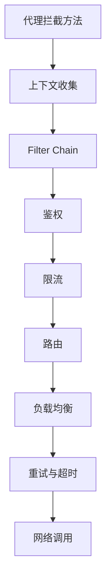

# 05 动态代理：面向接口编程，屏蔽 RPC 处理流程

RPC 最迷人的地方，是让调用方像调用本地接口一样调用远程服务。你写的是 `userService.getUser(id)`，框架内部却完成了服务发现、负载均衡、序列化、协议编码、网络发送、响应匹配和异常处理。

这层“像本地调用一样”的体验，主要靠动态代理实现。动态代理把接口方法调用拦截下来，转换成一次 RPC 请求，再把远程响应转换成方法返回值。

## 本章要解决的问题

这一章回答：

- RPC 为什么常常面向接口编程？
- 动态代理如何拦截方法调用？
- JDK 动态代理、CGLIB、ByteBuddy 有什么区别？
- 代理层应该屏蔽什么，又不应该屏蔽什么？
- 为什么说“远程调用不是本地调用”？

## 核心观点

动态代理是 RPC 客户端的入口，它负责把接口调用转换成远程调用描述。它屏蔽的是框架处理流程，不应该屏蔽远程调用的本质成本。

换句话说，代理让代码更好写，但工程师仍然要意识到这里发生的是网络调用。超时、重试、幂等、异常、上下文传播，都不能因为调用形式像本地方法就被忽略。

## 原理拆解

### 代理对象在调用链中的位置


业务代码依赖接口，而不是依赖具体远程实现。框架在运行时生成接口的代理对象，注入到业务代码中。调用接口方法时，实际进入的是代理逻辑。

### JDK 动态代理示例

下面是一个最小化的代理示意：

```java
public class RpcProxy implements InvocationHandler {
    private final Class<?> serviceInterface;
    private final RpcClient rpcClient;

    public RpcProxy(Class<?> serviceInterface, RpcClient rpcClient) {
        this.serviceInterface = serviceInterface;
        this.rpcClient = rpcClient;
    }

    @Override
    public Object invoke(Object proxy, Method method, Object[] args) throws Throwable {
        if (method.getDeclaringClass() == Object.class) {
            return method.invoke(this, args);
        }

        RpcRequest request = new RpcRequest();
        request.setServiceName(serviceInterface.getName());
        request.setMethodName(method.getName());
        request.setParameterTypes(method.getParameterTypes());
        request.setArguments(args);
        request.setRequestId(UUID.randomUUID().toString());

        return rpcClient.invoke(request, method.getReturnType());
    }

    @SuppressWarnings("unchecked")
    public static <T> T create(Class<T> interfaceClass, RpcClient rpcClient) {
        return (T) Proxy.newProxyInstance(
            interfaceClass.getClassLoader(),
            new Class<?>[] { interfaceClass },
            new RpcProxy(interfaceClass, rpcClient)
        );
    }
}
```

业务使用方式：

```java
UserService userService = RpcProxy.create(UserService.class, rpcClient);
User user = userService.getUser(1001L);
```

这段代码的关键不在语法，而在思想：代理层把 Java 方法调用转成了结构化请求。

### 三类代理技术

| 技术 | 原理 | 优点 | 限制 |
| --- | --- | --- | --- |
| JDK 动态代理 | 基于接口生成代理类 | JDK 原生，简单稳定 | 只能代理接口 |
| CGLIB | 生成目标类子类 | 可代理普通类 | final 类和 final 方法受限 |
| ByteBuddy | 运行时生成字节码 | 灵活强大，生态现代 | 理解和调试成本更高 |

RPC 框架常用接口代理，因为接口天然适合表达服务契约。Dubbo 的服务引用就是典型的面向接口代理；gRPC 则通过 proto 生成 Stub，本质上也是把远程调用封装成客户端调用对象。

### 代理层和调用链治理

代理层不仅构造请求，也常常是过滤器链的入口。



所以代理层是一个很关键的扩展点。日志、指标、链路追踪、灰度标签、租户信息，往往都从这里进入调用链。

## 工程实践

### 代理层应该做什么

代理层适合做这些事：

- 提取接口名、方法名、参数和返回类型。
- 构造 RpcRequest。
- 读取注解或配置，例如超时、重试、分组、版本。
- 注入 traceId、租户、用户、灰度标识等上下文。
- 调用过滤器链和远程调用客户端。
- 将响应转换成返回值或异常。

### 代理层不应该做什么

代理层不适合承载复杂业务逻辑。它是基础设施入口，不应该判断订单状态、处理支付规则、拼接业务 SQL。否则服务契约和业务逻辑会纠缠在一起，后续测试和演进都很痛苦。

代理层也不应该完全吞掉远程错误。比如超时、限流、熔断、服务不存在，应该以可观测、可分类的方式暴露给调用方，方便调用方做降级或告警。

### 注解驱动的服务引用

很多框架会通过注解注入代理对象：

```java
public class OrderApplicationService {
    @RpcReference(timeout = 200, retries = 1, version = "v2")
    private UserService userService;
}
```

框架启动时扫描注解，为 `UserService` 生成代理对象，并根据注解配置构造调用策略。这里的注解不是魔法，只是代理创建时的元数据来源。

## 常见坑

第一个坑，是代理了 `toString`、`equals`、`hashCode` 却没特殊处理。JDK 动态代理会把这些 Object 方法也转到 InvocationHandler，处理不好会触发奇怪行为。

第二个坑，是把重试藏得太深。调用方看起来只调用了一次，实际可能请求了三次。对写操作来说，这会造成重复扣款、重复下单等严重问题。

第三个坑，是接口粒度太细。一次业务操作如果拆成十几个 RPC 小方法，网络开销和故障面会被放大。接口设计要考虑远程调用成本。

第四个坑，是异常抽象混乱。远程服务抛出的业务异常、框架超时异常、序列化异常、限流异常，应该区分清楚，而不是统一包成 RuntimeException。

## 面试追问

1. JDK 动态代理为什么要求接口？

JDK 动态代理是在运行时生成一个实现指定接口的代理类，因此必须有接口。它不能直接代理普通类。

2. RPC 为什么偏向面向接口编程？

接口天然表达服务契约，调用方只依赖契约，不依赖实现。框架可以在运行时为接口生成代理，把调用转为远程请求。

3. 动态代理和 Stub 是什么关系？

Stub 可以理解为客户端调用桩。动态代理是一种生成 Stub 的方式。gRPC 通过代码生成 Stub，Dubbo 等框架可以通过动态代理生成接口代理，本质都是隐藏远程调用细节。

4. 为什么远程调用不能完全透明？

因为远程调用有延迟、失败、超时、重试和副作用。本地调用透明是编码体验，工程语义不能透明。调用方必须知道哪些接口可能慢、可能失败、是否幂等。

## 章节笔记

### 课程核心观点

动态代理让 RPC 调用看起来像本地接口调用。它负责拦截方法，提取调用信息，并交给 RPC 框架完成后续流程。

### 我的理解

代理层是 RPC 的“入口门面”。它让业务代码优雅，但它背后连接着一整条远程调用链。好的代理设计应该降低使用成本，同时保留必要的远程调用语义。

### 关键概念

- InvocationHandler：JDK 动态代理的调用拦截器。
- Stub：客户端调用桩。
- 服务契约：接口、方法、参数、返回值和语义约定。
- Filter Chain：调用过程中的可扩展治理链。
- 远程调用语义：超时、失败、重试、幂等和降级。

### 实战落地

可以自己实现一个最小代理：定义接口，使用 JDK 动态代理拦截方法，把方法名和参数打印出来，再替换成真实网络调用。这个练习能快速打通“接口调用如何变成 RPC 请求”的认知。

### 生产坑点

- Object 方法未特殊处理。
- 代理层吞异常导致调用方无法区分错误类型。
- 注解配置优先级混乱，线上行为不可预测。
- 接口设计过细，导致一次业务操作产生大量 RPC。

## 小结

动态代理负责把面向接口的本地调用体验，转换成面向网络的远程调用过程。它是 RPC 易用性的关键，但不应该让工程师忘记远程调用的真实成本。写 RPC 接口时，要同时考虑代码体验和分布式语义。
