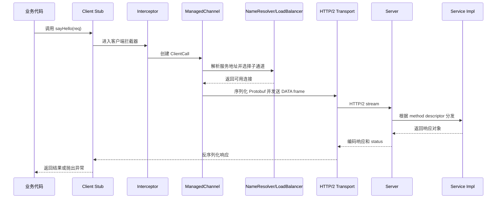

# 06 RPC实战：剖析 gRPC 源码，动手实现一个完整的 RPC

## 1. 本章要解决的问题

学 RPC 最容易停在两个极端：要么只会使用框架暴露出的注解和配置，要么一头扎进源码细节，最后忘了 RPC 的主链路到底是什么。本章要解决的问题是：如何用 gRPC 这样的成熟框架做参照，抽象出一个完整 RPC 框架的最小闭环，并把它拆成可以亲手实现的模块。

我们不追求复刻 gRPC。gRPC 的价值在于给我们一张“工业级 RPC 的设计剖面图”：IDL、代码生成、Channel、Stub、拦截器、NameResolver、LoadBalancer、HTTP/2 传输、流式调用、状态码、Deadline、Metadata 都是长期生产实践沉淀出来的边界。

## 2. 核心观点

- 一个完整 RPC 至少要闭合四件事：调用表达、消息编解码、网络传输、服务分发。
- gRPC 的核心抽象不是“发 HTTP/2 请求”，而是围绕 Channel 和 Stub 建立了一套可扩展调用管线。
- 手写 RPC 时不要一开始就堆治理能力，先让一次 unary 调用稳定跑通，再逐步加入注册发现、负载均衡、拦截器、超时和重试。
- RPC 框架的工程难点不在反射调用，而在“失败时如何收敛影响”：超时、取消、连接管理、状态传播、流控和可观测性。

## 3. 原理拆解

### 3.1 从 gRPC 请求生命周期看主链路



这条链路里最值得学习的是抽象边界：

- Stub 负责把本地方法调用转成通用调用描述，不关心连接怎么建。
- Channel 负责维护调用上下文、连接、子通道和负载均衡。
- Transport 只处理字节传输和协议细节，不理解业务接口。
- Server 侧用 MethodDescriptor 找到服务实现，屏蔽底层协议差异。
- Interceptor 以链式方式扩展鉴权、日志、埋点、限流等横切能力。

### 3.2 手写 RPC 的最小组件

一个教学版 RPC 可以拆成如下模块：


最小闭环可以定义这些对象：

```java
record RpcRequest(
    long requestId,
    String serviceName,
    String methodName,
    String[] parameterTypes,
    Object[] arguments,
    Map<String, String> attachments
) {}

record RpcResponse(
    long requestId,
    int code,
    Object data,
    String errorMessage
) {}
```

客户端代理把接口调用转成 `RpcRequest`，服务端根据 `serviceName + methodName + parameterTypes` 找到实现并反射执行，再把结果包装成 `RpcResponse` 返回。

### 3.3 为什么 gRPC 选择 HTTP/2 + Protobuf

HTTP/2 给 gRPC 带来了多路复用、头部压缩、流控、双向流和单连接多请求能力。Protobuf 则提供强 schema、跨语言、紧凑编码和向后兼容能力。二者组合后，gRPC 可以天然支持四种调用模式：

| 调用模式 | 说明 | 适用场景 |
| --- | --- | --- |
| Unary | 一问一答 | 查询、命令、常规服务调用 |
| Server Streaming | 一个请求多个响应 | 日志拉取、列表分页推送 |
| Client Streaming | 多个请求一个响应 | 批量上传、指标聚合 |
| Bidirectional Streaming | 双向流 | 实时协作、长连接网关 |

教学版 RPC 可以先实现 Unary。只要接口设计保留 requestId、metadata、status、timeout 等字段，后续就有扩展空间。

## 4. 工程实践

### 4.1 mini-rpc 实现路线

建议按以下顺序实现，而不是一次性做成“大而全框架”：

1. 定义服务接口与实现类，例如 `UserService#getById`。
2. 服务端维护本地服务映射表：`Map<String, Object>`。
3. 客户端使用 JDK 动态代理生成接口代理。
4. 代理层生成 `RpcRequest`，用 JSON 或 Protobuf 序列化。
5. 传输层先用简单 TCP 或 HTTP 实现请求响应。
6. 服务端解码后反射调用真实实现。
7. 客户端按 `requestId` 匹配响应，并处理超时。
8. 加入 Filter 链：日志、trace、鉴权、指标。
9. 加入 Registry：本地静态列表 -> ZooKeeper/Nacos。
10. 加入 Cluster：路由、负载均衡、失败处理。

### 4.2 简化版客户端调用伪代码

```java
public Object invoke(Object proxy, Method method, Object[] args) {
    RpcRequest request = new RpcRequest(
        idGenerator.nextId(),
        method.getDeclaringClass().getName(),
        method.getName(),
        Arrays.stream(method.getParameterTypes()).map(Class::getName).toArray(String[]::new),
        args,
        TraceContext.current()
    );

    byte[] body = codec.encode(request);
    byte[] frame = protocol.encode(body);
    byte[] responseFrame = transport.send(frame, timeoutMillis);
    RpcResponse response = codec.decode(protocol.decode(responseFrame), RpcResponse.class);

    if (response.code() != 0) {
        throw new RpcException(response.errorMessage());
    }
    return response.data();
}
```

这段代码看起来简单，但生产实现要补齐很多细节：连接复用、异步响应映射、粘包半包、线程模型、异常分类、上下文透传、请求取消、可观测指标。

### 4.3 源码阅读建议

读 gRPC 源码不要从每个类逐行读起，可以沿着主链路切入：

- 客户端入口：Stub 如何创建 `ClientCall`。
- 调用管线：Interceptor 如何包裹调用。
- 地址解析：NameResolver 如何得到服务地址。
- 负载均衡：LoadBalancer 如何选择 Subchannel。
- 传输层：HTTP/2 stream 如何承载请求和响应。
- 服务端分发：MethodDescriptor 和 ServerCallHandler 如何定位实现。

每读一个扩展点，都问两个问题：它屏蔽了什么变化？它把什么能力留给了业务或框架使用者？

## 5. 常见坑

- 把远程调用伪装成本地调用后，忘了远程调用会超时、失败、重复执行。
- 只实现同步阻塞调用，压测时线程全部卡在等待响应上。
- 没有 requestId，连接复用后响应无法正确匹配请求。
- 没有统一错误码，业务异常、框架异常、网络异常混在一起。
- 服务端反射调用没有做方法签名校验，重载方法容易调用错。
- 连接断开后没有清理 pending request，客户端内存持续增长。
- 拦截器顺序混乱，鉴权、限流、反序列化异常的责任边界不清。

## 6. 面试追问

**1. gRPC 和普通 HTTP JSON 调用相比，优势在哪里？**  
gRPC 使用 HTTP/2 和 Protobuf，天然支持多路复用、流式调用、强 schema、跨语言代码生成和统一状态模型。HTTP JSON 更通用、调试友好，但在内部高频服务调用里，类型约束、性能和演进能力通常弱一些。

**2. 为什么 RPC 需要 Stub？**  
Stub 把本地方法调用转换成远程调用描述，让业务代码以接口方式编程，同时隐藏序列化、协议、网络、超时等流程。它是“本地语义”和“远程传输”之间的适配层。

**3. 手写 RPC 最小可用版本需要哪些模块？**  
动态代理、请求响应模型、序列化、协议编解码、网络传输、服务注册表、服务端分发、异常处理和超时控制。

**4. 为什么说 requestId 很关键？**  
长连接复用时，同一连接上可能同时飞行多个请求。requestId 用于把异步返回的响应匹配回对应调用，否则客户端无法知道哪个响应属于哪个请求。

## 7. 小结

剖析 gRPC 的目标不是复制一个 gRPC，而是理解工业级 RPC 的骨架：Stub 表达调用，Channel 管理通道，Transport 负责传输，ServerCall 分发执行，Interceptor 承载扩展能力。自己动手实现 mini-rpc 时，先闭合一次完整调用，再沿着失败处理、服务发现、路由负载、可观测性逐步增强，这样才能真正理解框架设计背后的取舍。

## 8. 章节笔记

### 课程核心观点

RPC 框架不是一个网络工具类，而是一套把接口调用、协议传输和服务治理串起来的系统。gRPC 展示了成熟 RPC 如何通过清晰抽象支撑跨语言、流式调用和扩展能力。

### 我的理解

手写 RPC 的关键是先建立“主链路优先”的意识。只要一次调用能从代理层稳定走到服务实现，再稳定返回，后面的注册中心、负载均衡、熔断限流都可以作为管线能力叠加。

### 关键概念

- Stub：客户端代理，负责把本地调用转换成远程调用。
- Channel：调用通道，管理连接、负载均衡和调用上下文。
- Codec：序列化和反序列化。
- Protocol：协议头、消息边界、状态码和扩展字段。
- Dispatcher：服务端分发器。
- Interceptor：横切能力扩展点。

### 实战落地

先实现 Unary RPC，再加入异步调用。序列化可以先用 JSON 便于调试，协议头要保留版本号、序列化类型、压缩类型、消息长度、requestId。等链路跑通后再替换为 Protobuf 或 Hessian。

### 生产坑点

最容易被低估的是超时和取消。调用方超时后，如果服务端还在执行，可能造成无意义压力；如果调用方重试，可能造成重复写入。RPC 框架必须和业务幂等设计一起考虑。

### 本章小结

gRPC 是一套值得拆解的工程范本。mini-rpc 是理解范本的训练场。能把它们对照起来，就能从“会用 RPC”走向“能设计 RPC”。
