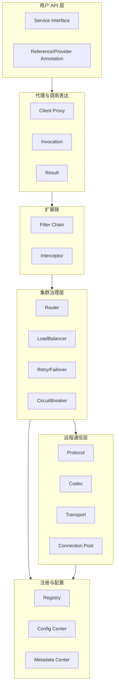
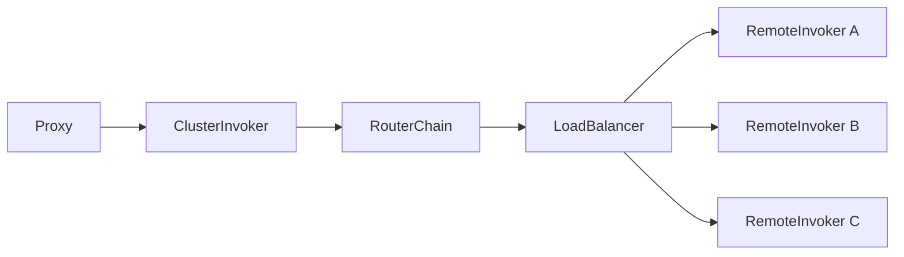
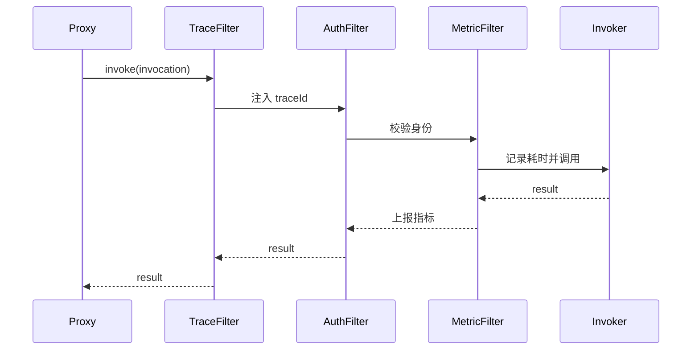

# 07 架构设计：设计一个灵活的 RPC 框架

## 1. 本章要解决的问题

当一个 RPC Demo 能跑通之后，真正的问题才开始出现：序列化要不要可替换？注册中心从 ZooKeeper 换到 Nacos 怎么办？同一个服务是否支持多协议暴露？调用链路里的鉴权、限流、日志、灰度规则放在哪里？如果没有架构分层，这些能力会很快缠在一起，框架变成难以维护的一团逻辑。

本章要解决的问题是：如何设计一个既有清晰主链路，又能支持扩展的 RPC 框架。

## 2. 核心观点

- RPC 框架的稳定性来自清晰分层，灵活性来自受控扩展点。
- 扩展点不是越多越好，只有变化频繁、策略多样、实现可替换的地方才值得抽象。
- 框架要区分“调用主流程”和“治理附加能力”，避免把所有逻辑塞进 Invoker。
- 配置体系必须有优先级和来源说明，否则线上行为不可解释。

## 3. 原理拆解

### 3.1 推荐的模块分层



这套分层有两个好处。第一，业务代码只面对接口和注解，治理策略不会侵入业务。第二，协议、序列化、注册中心、负载均衡等能力可以独立替换。

### 3.2 Invoker 是核心抽象

很多 RPC 框架都会收敛出类似 Invoker 的抽象：

```java
public interface Invoker<T> {
    Class<T> interfaceType();
    URL url();
    Result invoke(Invocation invocation);
}
```

它表达的是“对某个服务的一次可调用能力”。本地服务实现可以包装成 Invoker，远程服务节点也可以包装成 Invoker，Filter、Router、LoadBalancer 都围绕 Invoker 工作。



有了这个抽象，集群调用就变成：从 Directory 获取 Invoker 列表，经过 Router 过滤，再由 LoadBalancer 选择一个，最后发起远程调用。

### 3.3 SPI 与插件化

RPC 框架天然有许多可替换策略：

| 扩展点 | 常见实现 |
| --- | --- |
| Serialization | JSON、Protobuf、Hessian、Kryo |
| Protocol | 自定义 TCP、HTTP/2、Dubbo、Thrift |
| Registry | ZooKeeper、Nacos、Consul、Kubernetes API |
| LoadBalancer | Random、RoundRobin、LeastActive、P2C |
| Router | Tag、Condition、Gray、Region |
| Filter | Trace、Auth、Metric、RateLimit |

Dubbo SPI 的价值在于比 Java SPI 更适合框架场景：支持按名称加载、依赖注入、包装类、Adaptive 扩展。自己设计时不一定要实现完整 SPI，但至少要避免把策略写死在 if-else 里。

## 4. 工程实践

### 4.1 一套可落地的目录结构

```text
mini-rpc
  rpc-api              # 对业务暴露的注解、接口和配置模型
  rpc-core             # Invocation、Invoker、Filter、扩展加载
  rpc-protocol         # 协议定义、编解码、状态码
  rpc-transport-netty  # 网络通信实现
  rpc-registry         # 注册发现抽象
  rpc-registry-nacos   # Nacos 实现
  rpc-cluster          # 路由、负载均衡、容错
  rpc-spring-boot      # Spring Boot 自动装配
```

这种拆法的原则是：抽象和实现分开，核心模型和外部依赖分开，方便后续替换和测试。

### 4.2 Filter Chain 的设计



Filter 的设计要注意三点：

- 顺序可控：鉴权通常要早于业务调用，指标要覆盖完整耗时。
- 异常透明：Filter 可以记录和转换异常，但不能吞掉框架语义。
- 上下文一致：trace、租户、灰度标签要在同步和异步链路中都能传递。

### 4.3 配置优先级

生产环境里，同一个参数可能来自代码默认值、配置文件、注解、注册中心、动态配置中心。建议明确优先级：

```text
动态配置中心 > 注册中心服务配置 > 启动参数 > 应用配置文件 > 注解默认值 > 框架默认值
```

配置还要能解释来源。排查“为什么这个服务突然变成 3 次重试”时，系统应该能告诉你规则来自哪个配置项、哪个版本、何时生效。

## 5. 常见坑

- 抽象过早，Demo 阶段就设计十几个扩展点，核心链路反而不稳定。
- 抽象过晚，序列化、协议、注册中心写死，后续迁移成本极高。
- Filter 无顺序，线上出现鉴权未执行、指标重复上报等问题。
- 动态配置无版本号，规则下发后无法回滚和审计。
- 多协议共用一套错误码时没有映射关系，客户端收到异常不可理解。
- 框架日志缺少 requestId、service、method、remote address，故障时无法定位。

## 6. 面试追问

**1. RPC 框架为什么需要分层？**  
分层可以降低复杂度，让接口代理、协议编解码、网络传输、服务治理各自演进。没有分层时，一个能力变化会牵动整条链路，框架难以维护。

**2. 什么地方适合做 SPI？**  
适合做 SPI 的地方通常有多个实现、使用方需要按场景替换、且核心框架只依赖抽象。例如序列化、注册中心、路由、负载均衡、过滤器。

**3. Filter 和 Interceptor 有什么区别？**  
语义上都属于拦截扩展。实践中 Filter 常用于框架内部统一调用链，Interceptor 常暴露给用户扩展。关键不是名字，而是执行位置、顺序和异常语义要清晰。

**4. RPC 配置为什么需要优先级？**  
因为线上行为往往由多处配置共同决定。如果没有优先级，调用超时、重试次数、路由规则等行为会不可预测，也无法排查来源。

## 7. 小结

一个灵活的 RPC 框架不是把所有能力都做成插件，而是先稳定主链路，再识别真正会变化的策略点。Proxy、Invocation、Invoker、Filter、Protocol、Registry、Cluster 是常见核心抽象。只要边界清楚，RPC 框架就能从单机 Demo 演进到支持多协议、多注册中心、多治理策略的生产系统。

## 8. 章节笔记

### 课程核心观点

RPC 框架需要面向扩展设计。代理、协议、序列化、注册发现、路由、负载均衡、过滤器应该各司其职，避免把治理能力和网络细节耦合在一起。

### 我的理解

灵活性来自“受控变化”。扩展点要围绕稳定主流程展开，而不是让每个模块都可以任意改写。一个好框架应该既能加能力，也能解释能力是如何生效的。

### 关键概念

- Invocation：一次调用的抽象描述。
- Invoker：可执行调用单元。
- Directory：服务节点目录。
- Router：按规则过滤节点。
- LoadBalancer：在候选节点中做选择。
- Filter Chain：横切逻辑扩展链。
- SPI：扩展实现加载机制。

### 实战落地

设计 mini-rpc 时可以先定义稳定接口：`Codec`、`Protocol`、`TransportClient`、`RegistryClient`、`LoadBalancer`、`Router`、`Filter`。每个接口先提供一个默认实现，再通过配置选择。

### 生产坑点

扩展点必须有默认实现、错误降级和观测日志。否则插件加载失败、配置拼错、规则下发异常时，框架会表现得像随机故障。

### 本章小结

架构设计的目标不是显得复杂，而是让复杂能力有地方安放。RPC 框架越往生产走，越需要清晰的模块边界、配置优先级和扩展机制。
