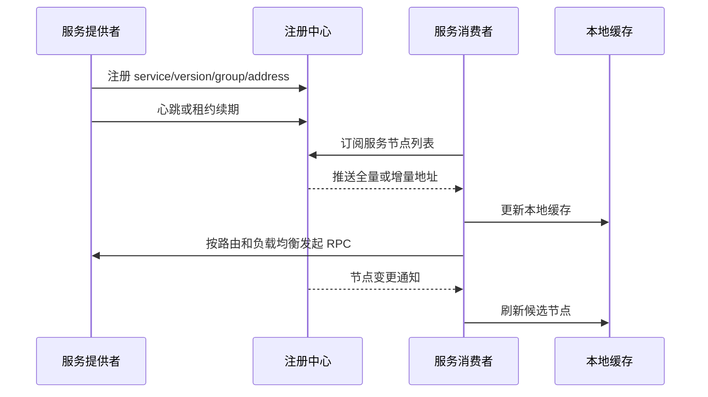
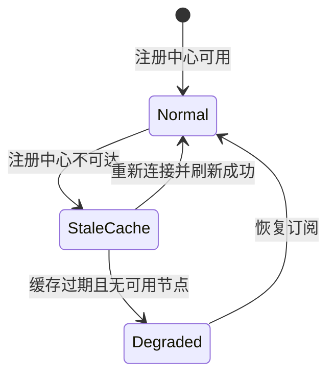
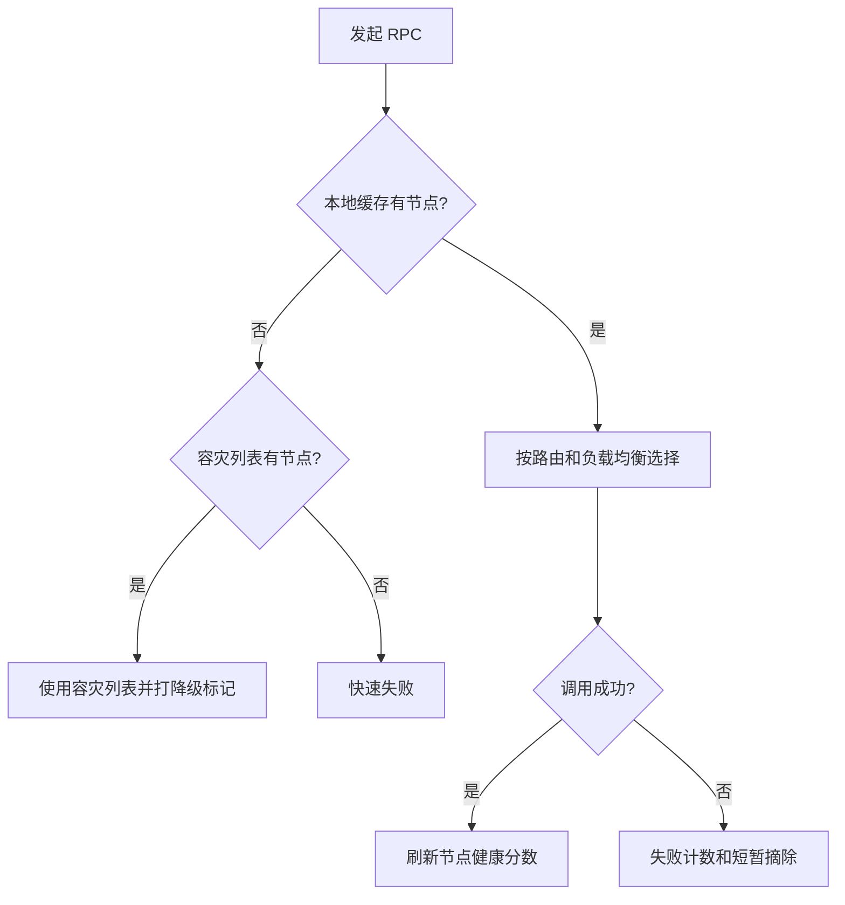

# 08 服务发现：到底是要 CP 还是 AP

## 1. 本章要解决的问题

RPC 调用不能依赖写死的 IP 列表。服务会扩容、缩容、发布、迁移、故障恢复，调用方必须知道“当前哪些节点可用”。这就是服务发现要解决的问题。

但注册中心经常被问到一个经典问题：到底选择 CP 还是 AP？ZooKeeper、Nacos、Consul、Eureka 的差异背后，本质是对一致性和可用性的取舍。本章要把这个问题放回 RPC 生产场景里讨论。

## 2. 核心观点

- 服务发现的目标不是维护一份绝对正确的节点表，而是在变化中提供足够可靠的可用节点视图。
- RPC 服务发现通常更偏 AP，因为调用链路不能因为注册中心短暂不可用就整体停摆。
- CP 或 AP 不是产品标签，而是故障场景下的行为选择。
- 客户端本地缓存、失效摘除、订阅通知和容灾列表，决定了注册中心故障时系统能否继续运行。

## 3. 原理拆解

### 3.1 服务发现的基本流程



服务发现至少包含五个动作：注册、续约、订阅、通知、摘除。任何一个动作延迟或失败，调用方看到的节点列表都可能和真实世界不完全一致。

### 3.2 CP 和 AP 在服务发现中的含义

| 维度 | CP 倾向 | AP 倾向 |
| --- | --- | --- |
| 优先目标 | 数据一致 | 服务可用 |
| 故障行为 | 无法确认一致时拒绝部分操作 | 尽量接受读写，允许短暂不一致 |
| 典型代表 | ZooKeeper、etcd | Eureka、Nacos AP 模式 |
| 适用场景 | 配置、选主、分布式锁 | 服务发现、临时节点列表 |

服务发现里的“节点列表不一致”通常可以通过客户端重试、健康检测、负载均衡来消化。但“注册中心不可用导致所有服务无法发现”会直接扩大故障面。所以多数大规模 RPC 系统会让服务发现链路偏 AP，并用本地缓存兜底。

### 3.3 客户端缓存是生命线



调用方不应该每次 RPC 都访问注册中心，而应该订阅节点变化并维护本地缓存。注册中心故障时，客户端继续使用上一次成功的地址列表，同时结合失败摘除和探活降低错误请求。

## 4. 工程实践

### 4.1 注册数据模型

一个服务实例至少需要这些元数据：

```yaml
service: com.example.UserService
version: 1.0.0
group: prod
address: 10.0.1.23:20880
protocol: tri
weight: 100
region: cn-shanghai
zone: az1
metadata:
  build: 2026.05.25.1
  warmup: true
  gray: false
```

这些字段不是装饰品。version、group 决定调用隔离，weight 影响负载均衡，region/zone 支持就近调用，metadata 支持灰度和治理规则。

### 4.2 ZooKeeper、Nacos、Kubernetes 怎么选

| 方案 | 优势 | 注意点 |
| --- | --- | --- |
| ZooKeeper | 强一致、临时节点、watch 机制成熟 | 大规模 watch 和频繁变更要谨慎 |
| Nacos | 服务发现和配置中心一体，支持 AP/CP | 要理解临时实例与持久实例差异 |
| Consul | 健康检查和多数据中心能力较好 | Java 生态使用广度不如 Nacos/Dubbo 组合 |
| Kubernetes Service/EndpointSlice | 云原生环境天然集成 | 跨集群、多协议元数据能力需要补充 |

如果系统运行在 Kubernetes 内，基础发现可以借助 Service 和 EndpointSlice；如果还需要 RPC 级别的版本、分组、权重、灰度元数据，通常仍需要 Nacos、Dubbo 注册中心或服务网格控制面补齐。

### 4.3 注册中心故障时的客户端策略



建议实现这些策略：

- 本地缓存持久化：进程重启后也能加载最近一次成功列表。
- 缓存过期不立即清空：标记 stale，但允许继续调用。
- 失败摘除有时间窗口：不要一次失败就永久删除节点。
- 注册中心恢复后做全量校准：避免增量事件丢失造成脏数据。
- 关键服务配置容灾地址：在极端场景下支持手动兜底。

## 5. 常见坑

- 每次调用都查注册中心，把注册中心变成高频依赖。
- 注册中心不可用时清空本地列表，导致全站调用失败。
- 只相信注册中心心跳，不做客户端失败反馈，故障摘除滞后。
- 节点元数据设计太弱，后续灰度、分组、地域路由都无法落地。
- Watch 或订阅事件丢失后没有全量校验机制。
- 服务下线时先停进程再注销，调用方还在向已停节点发请求。

## 6. 面试追问

**1. 服务发现为什么通常偏 AP？**  
因为 RPC 调用更怕发现系统不可用导致整体停摆。节点列表短暂不一致可以通过重试、摘除、探活缓解，但注册中心不可用如果没有缓存，会直接让调用链路中断。

**2. ZooKeeper 和 Nacos 在服务发现上有什么差异？**  
ZooKeeper 更偏强一致，临时节点和 watch 适合维护节点状态。Nacos 同时提供服务发现和配置能力，支持 AP/CP 模式，在微服务生态中更强调可用性和治理元数据。

**3. 客户端发现和服务端发现有什么区别？**  
客户端发现由调用方获取节点列表并做负载均衡；服务端发现由网关、代理或服务网格负责选择目标节点。前者性能好、灵活，后者语言无关、治理集中。

**4. 注册中心挂了，RPC 还能调用吗？**  
如果客户端有本地缓存，已有服务通常还能继续调用；新服务发现、节点变更、扩容缩容会受影响。没有缓存的系统则可能直接大面积失败。

## 7. 小结

服务发现不是简单的“服务名查 IP”，而是一套围绕节点生命周期、元数据、订阅通知、本地缓存和故障兜底的系统。CP 和 AP 的选择要回到业务故障模型：RPC 服务发现通常更重视可用性，同时用健康检测和客户端治理弥补短暂不一致。

## 8. 章节笔记

### 课程核心观点

服务发现要在一致性和可用性之间取舍。对于 RPC 调用，注册中心短暂不可用不应该阻断已有调用，本地缓存和容灾能力非常重要。

### 我的理解

注册中心是控制面，RPC 调用是数据面。控制面故障时，数据面最好能维持一段时间。把这两者解耦，是服务发现设计的关键。

### 关键概念

- 服务注册：Provider 上报实例信息。
- 服务订阅：Consumer 监听节点变化。
- 本地缓存：Consumer 保存可用节点列表。
- 临时实例：依赖心跳或连接存活的实例。
- 元数据：版本、分组、权重、地域、标签等治理信息。

### 实战落地

使用 Nacos 或 ZooKeeper 时，客户端要维护内存缓存和磁盘快照。订阅事件到达后更新内存；注册中心不可用时继续使用旧缓存，并在日志和指标中标记缓存状态。

### 生产坑点

不要把注册中心当数据库查询。调用链路应该只依赖本地视图，注册中心负责异步推送变化。

### 本章小结

服务发现的答案不是简单选择 CP 或 AP，而是设计故障场景下的行为。对 RPC 来说，能继续稳定调用，比节点列表瞬时绝对一致更重要。
