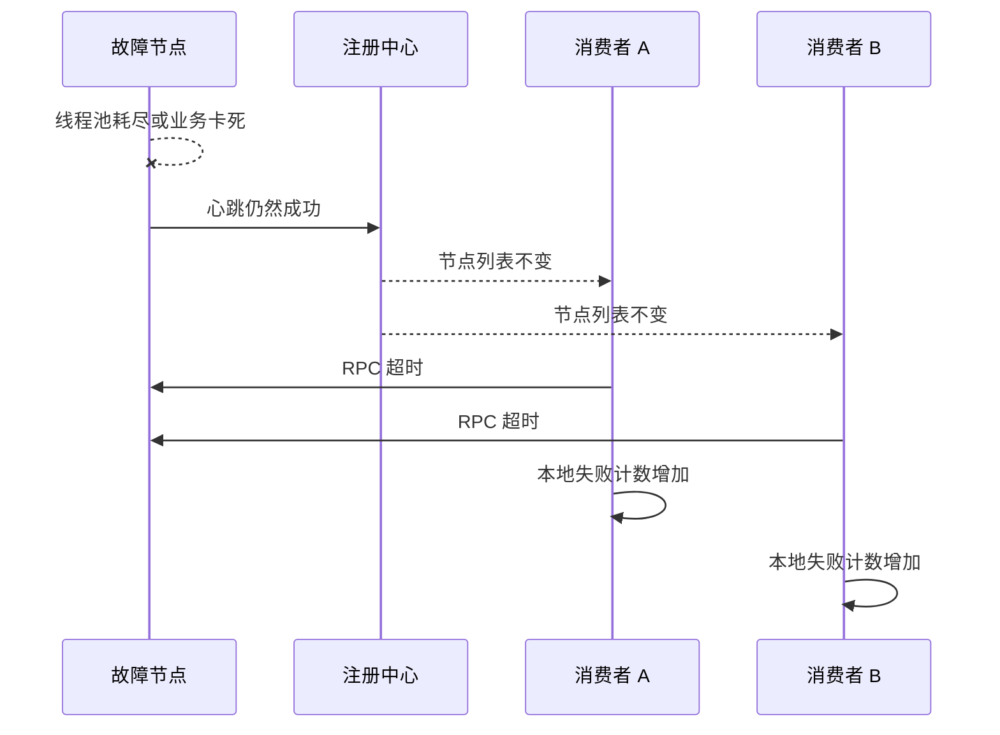
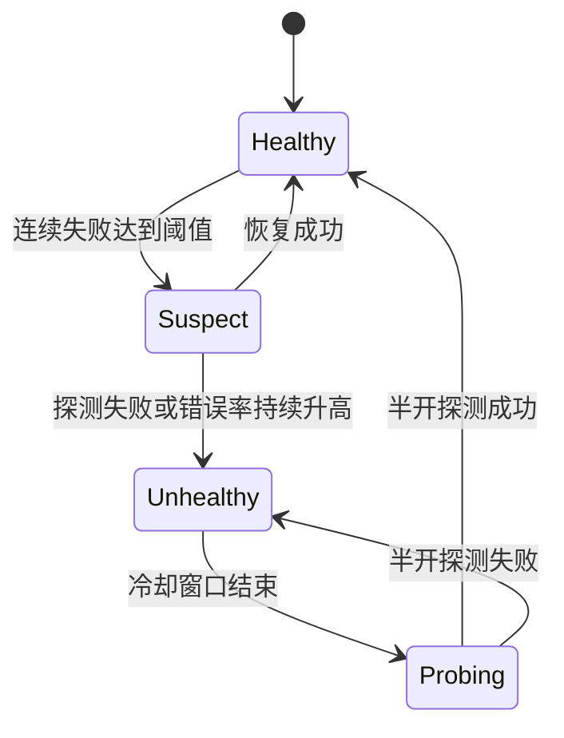
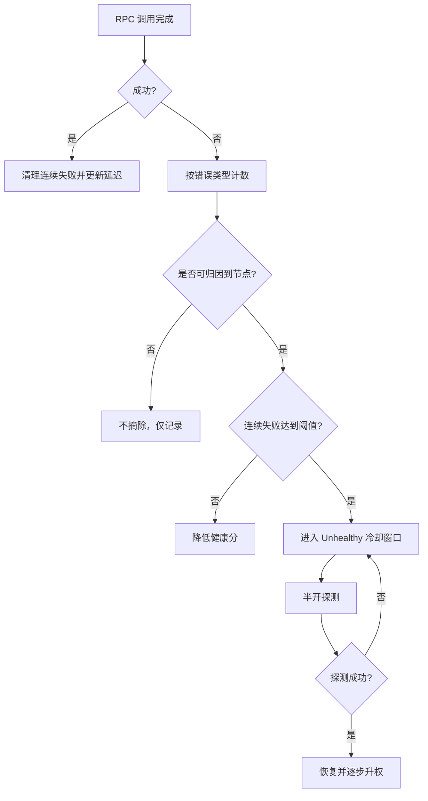

# 09 健康检测：这个节点都挂了，为啥还要疯狂发请求

## 1. 本章要解决的问题

线上经常出现一种看起来很反直觉的现象：某个服务节点已经不可用了，但调用方仍然持续把请求打过去，日志里刷满连接失败、超时和重试。原因通常不是“框架不知道健康检测”，而是健康状态从真实故障传播到调用方需要时间，并且故障类型远比“进程挂了”复杂。

本章要解决的问题是：RPC 框架如何判断节点健康，如何摘除故障节点，又如何避免摘除过快造成抖动。

## 2. 核心观点

- 健康状态不是一个布尔值，而是带时间窗口、置信度和恢复过程的状态机。
- 注册中心心跳只能说明节点和注册中心之间仍有联系，不能证明业务接口可用。
- 客户端被动失败反馈比单纯依赖注册中心通知更及时。
- 摘除节点要防止过慢导致错误放大，也要防止过快导致可用容量震荡。

## 3. 原理拆解

### 3.1 为什么故障节点还会被调用



进程存活、端口可连、注册中心心跳正常，都不能代表业务可用。一个节点可能处于这些“半死不活”的状态：

- TCP 连接正常，但业务线程池耗尽。
- 进程存活，但依赖数据库超时。
- 健康检查接口正常，但核心接口内部锁竞争严重。
- 节点刚启动，缓存没热好，响应极慢。
- 节点 GC 频繁，偶发长尾延迟。

### 3.2 健康检测状态机



一个实用状态机通常包含：

- Healthy：正常参与负载均衡。
- Suspect：降低权重或限制并发，观察是否恢复。
- Unhealthy：从候选节点中短暂摘除。
- Probing：允许少量探测请求进入，验证恢复。

这比“失败一次就摘除、成功一次就恢复”更稳定。

### 3.3 主动探活与被动熔断

| 机制 | 优点 | 局限 |
| --- | --- | --- |
| 注册中心心跳 | 成本低，统一维护实例生命周期 | 不能代表业务接口健康 |
| 客户端主动探活 | 可以针对真实服务端口或健康接口 | 探测流量和频率需要控制 |
| 被动失败统计 | 最贴近真实调用体验 | 低流量服务样本不足 |
| 熔断半开探测 | 避免持续打故障节点 | 阈值设计不当会误伤 |

生产里通常组合使用：注册中心负责实例级生命周期，客户端负责调用级健康反馈，熔断器负责短时间隔离异常节点。

## 4. 工程实践

### 4.1 节点健康评分

可以为每个节点维护一个轻量健康分：

```text
healthScore = f(successRate, timeoutRate, errorRate, ewmaLatency, consecutiveFailures)
```

负载均衡时不要只看节点是否存在，还要看健康分。健康分低的节点可以降低权重，连续失败超过阈值再摘除。

### 4.2 推荐的摘除策略



错误分类非常重要。业务参数错误、权限错误不应该导致节点摘除；连接失败、请求超时、服务端过载、协议错误更可能说明节点或链路异常。

### 4.3 Kubernetes 环境下的健康检测

Kubernetes 里常见两类探针：

- Liveness Probe：判断容器是否需要重启。
- Readiness Probe：判断实例是否可以接收流量。

RPC 框架更关心 Readiness。服务启动后不要立刻注册或变为 ready，应该等依赖连接、缓存预热、线程池初始化完成。服务关闭前也要先变为 not ready，再等待调用方停止分配新流量。

## 5. 常见坑

- 健康检查只检查端口，业务线程池耗尽时仍显示健康。
- 所有异常都计入节点失败，导致业务错误误伤节点。
- 失败一次就摘除，网络抖动时节点频繁上下线。
- 恢复后立即满权重接流量，冷节点被瞬间打垮。
- 只依赖注册中心摘除，没有客户端本地失败反馈。
- 熔断器没有半开状态，故障恢复后无法自动回到正常流量。

## 6. 面试追问

**1. TCP 连接正常是否代表 RPC 服务健康？**  
不代表。TCP 只能说明网络和端口可达，业务线程池、依赖资源、接口逻辑都可能不可用。

**2. 主动健康检查和被动健康检查有什么区别？**  
主动检查由框架定期探测节点；被动检查基于真实 RPC 调用结果统计。主动检查更可控，被动检查更接近用户体验，生产中通常组合使用。

**3. 为什么不能失败一次就摘除节点？**  
单次失败可能来自瞬时网络抖动、调用方超时设置过短或个别请求异常。立即摘除会造成节点抖动和容量震荡。

**4. 节点恢复后为什么要预热？**  
刚恢复的节点可能连接池、缓存、JIT、线程池都未达到稳定状态。立即满流量可能再次触发超时，应该逐步升权。

## 7. 小结

健康检测的本质是“用不完美的信号判断节点是否适合继续接流量”。注册中心、探针、客户端失败统计和熔断状态机各自只能覆盖一部分场景。真正可靠的方案，是把健康状态设计成有窗口、有冷却、有半开探测、有逐步恢复的闭环。

## 8. 章节笔记

### 课程核心观点

故障节点继续被请求，通常是因为健康状态传播有延迟，或健康检查维度太浅。RPC 框架需要在注册中心通知之外，加入客户端侧的失败统计和节点隔离。

### 我的理解

健康检测不是判断“活着吗”，而是判断“现在适合接业务流量吗”。这两个问题差异很大，生产故障大多发生在中间态。

### 关键概念

- 主动探活：定期发起健康检查。
- 被动检测：根据真实调用结果统计健康度。
- 连续失败阈值：避免单次失败误判。
- 冷却窗口：节点摘除后的观察时间。
- 半开探测：用小流量验证节点是否恢复。
- 预热升权：恢复后逐步增加流量。

### 实战落地

为每个节点维护健康状态、失败次数、最近错误类型、EWMA 延迟和冷却截止时间。负载均衡前先过滤 Unhealthy 节点，Suspect 节点降低权重。

### 生产坑点

健康检测必须区分错误类型。业务异常不应该影响节点健康，网络异常和资源耗尽类错误才应影响摘除策略。

### 本章小结

节点健康是动态状态，不是注册中心里的一行地址。RPC 框架要把真实调用反馈纳入调度决策，才能减少“明知节点不行还继续打”的问题。
