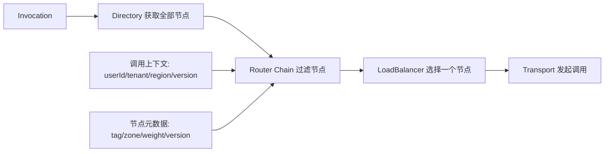
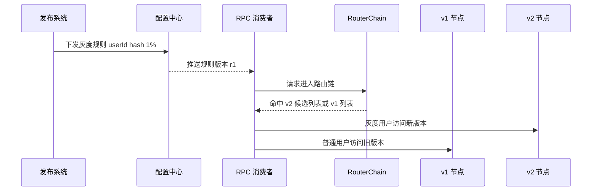

# 10 路由策略：怎么让请求按照设定的规则发到不同的节点上

## 1. 本章要解决的问题

当服务节点越来越多时，“从所有节点里随机选一个”已经不够了。灰度发布要让一部分用户访问新版本，跨地域部署要优先访问同城节点，大客户流量要进入专属集群，压测流量不能打到生产核心实例。这些都属于 RPC 路由要解决的问题。

本章要回答：路由策略应该放在调用链路的哪里？规则如何表达？如何动态下发和回滚？如何避免规则冲突把流量导错？

## 2. 核心观点

- 路由发生在负载均衡之前，它先筛选候选节点，再由负载均衡做选择。
- 路由规则的输入来自调用上下文、服务元数据和环境标签。
- 路由系统必须支持动态生效、灰度发布、审计和快速回滚。
- 规则越强大越要限制复杂度，否则排障成本会超过治理收益。

## 3. 原理拆解

### 3.1 路由在 RPC 调用链路中的位置



路由的职责是“过滤”。例如从 100 个节点中过滤出 version=2.0 且 region=shanghai 的 8 个节点。负载均衡的职责是“选择”。例如在这 8 个节点里按 P2C 选一个。

### 3.2 常见路由类型

| 路由类型 | 匹配条件 | 典型用途 |
| --- | --- | --- |
| 版本路由 | service.version | 多版本兼容、接口升级 |
| 标签路由 | node.tag、request.tag | 灰度、金丝雀发布 |
| 地域路由 | region、zone、机房 | 就近访问、容灾 |
| 租户路由 | tenantId、customerLevel | 多租户隔离 |
| 条件路由 | 方法名、参数、header | 精细化流量控制 |
| 比例路由 | hash(userId) % 100 | 按比例灰度 |

条件路由能力很诱人，但要谨慎。RPC 框架不应该深度解析复杂业务对象，否则路由系统会和业务模型强耦合。更好的方式是由业务显式把路由标签写入上下文。

### 3.3 路由规则 DSL 示例

```yaml
id: gray-user-service-v2
service: com.example.UserService
enabled: true
priority: 100
match:
  method: getUserProfile
  attachments:
    gray: "true"
    region: "cn-shanghai"
route:
  include:
    version: "2.0.0"
    region: "cn-shanghai"
fallback:
  strategy: use-original-list
```

规则要至少包含：作用服务、启停状态、优先级、匹配条件、目标节点条件、兜底策略。兜底策略很关键，目标节点为空时是快速失败、退回原列表，还是走默认版本，要提前定义。

## 4. 工程实践

### 4.1 灰度发布流程



灰度发布建议从最稳定的 key 开始，例如 userId、tenantId，而不是随机请求级灰度。用户级灰度能保证同一用户在一段时间内稳定访问同一版本，便于排查。

### 4.2 路由规则优先级

一个实际系统里可能同时存在地域路由、灰度路由、隔离路由和禁用路由。可以采用如下顺序：

```text
强制禁用路由 > 安全隔离路由 > 灰度路由 > 地域就近路由 > 默认路由
```

强制禁用通常用于故障摘除或紧急封锁，优先级最高。地域就近属于优化策略，不能覆盖安全和灰度语义。

### 4.3 规则为空的处理

路由后候选节点为空是高频问题。建议按场景设计兜底：

| 场景 | 推荐兜底 |
| --- | --- |
| 灰度目标为空 | 回退旧版本并告警 |
| 安全隔离目标为空 | 快速失败 |
| 地域就近目标为空 | 跨地域访问 |
| 压测隔离目标为空 | 快速失败，避免污染生产 |

兜底不是技术细节，而是业务风险选择。尤其在支付、交易、风控等场景，导错流量可能比失败更严重。

## 5. 常见坑

- 把路由和负载均衡混在一起，导致规则难以组合。
- 路由规则没有版本号，无法判断当前生效的是哪一版。
- 目标节点为空时默认走全量节点，灰度或隔离失效。
- 使用请求级随机灰度，用户体验不稳定，排障困难。
- 规则支持任意表达式，性能和安全性不可控。
- 缺少命中日志，只知道请求失败，不知道它被哪条规则导走。

## 6. 面试追问

**1. 路由和负载均衡有什么区别？**  
路由负责根据规则筛选候选节点，负载均衡负责在候选节点中选择一个。路由回答“哪些节点可以用”，负载均衡回答“这次用哪个”。

**2. 灰度发布为什么常用用户 ID 做 hash？**  
因为用户 ID 稳定，可以保证同一用户持续命中同一版本。请求级随机灰度会让同一用户在新旧版本间跳动，容易造成状态不一致和排障困难。

**3. 路由规则下发后如何保证可回滚？**  
规则要有版本、审计、灰度生效和快速禁用能力。客户端保留上一版可用规则，新规则解析失败或命中异常时可以回退。

**4. 路由后节点为空怎么办？**  
取决于业务语义。灰度可回退旧版本，地域路由可跨地域，安全隔离和压测隔离通常应快速失败。

## 7. 小结

路由策略是 RPC 服务治理里最贴近业务语义的一层。它让调用不再只是“找一个可用节点”，而是“按版本、标签、地域、租户和风险边界选择合适节点”。设计路由系统时，规则表达、优先级、兜底策略、命中日志和回滚能力同等重要。

## 8. 章节笔记

### 课程核心观点

路由用于让请求按照设定规则进入不同节点集合，通常发生在负载均衡之前。它是灰度发布、流量隔离、地域就近和多版本治理的基础。

### 我的理解

路由规则本质是生产流量的方向盘。方向盘必须灵活，但更要可靠、可解释、可回滚。否则一次配置错误就可能把核心流量导向错误集群。

### 关键概念

- RouterChain：多个路由器按顺序执行。
- 标签路由：按节点和请求标签匹配。
- 条件路由：按方法、参数、上下文条件匹配。
- 灰度路由：让部分流量命中新版本。
- 兜底策略：路由结果为空时的行为。

### 实战落地

在 RPC 上下文里统一放入 `tenantId`、`userId`、`region`、`grayTag`、`env` 等标签。节点注册时上报 `version`、`zone`、`tag`、`weight`。路由系统只基于这些显式标签判断，避免解析业务对象。

### 生产坑点

每条路由规则都要有命中指标：命中次数、过滤前节点数、过滤后节点数、空结果次数、回退次数。没有观测的路由规则很危险。

### 本章小结

路由不是负载均衡的附属品，而是独立的治理层。设计好它，RPC 才能支持灰度、隔离、容灾和多环境协同。
