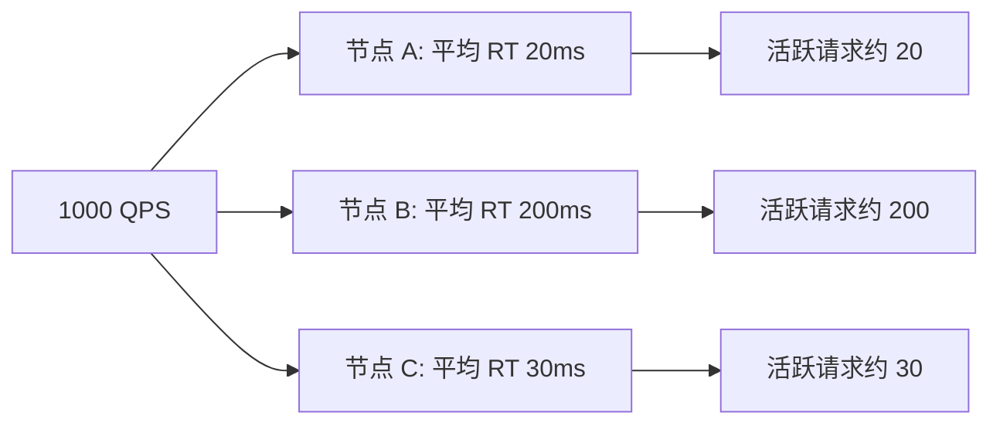
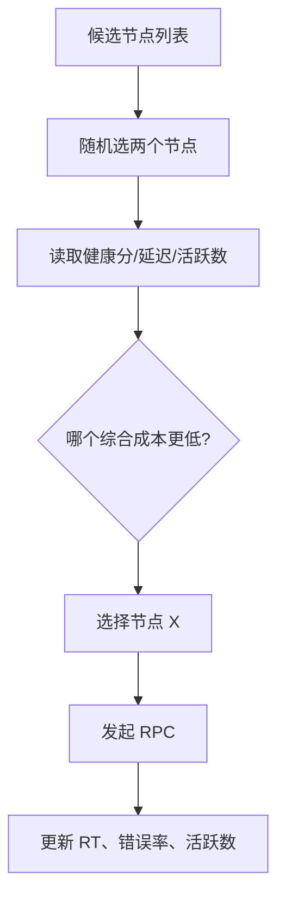

# 11 负载均衡：节点负载差距这么大，为什么收到的流量还一样

## 1. 本章要解决的问题

很多系统默认使用轮询或随机负载均衡。它们在节点能力相同、请求成本相近时表现不错，但真实生产里节点配置不同、机器冷热不同、接口耗时不同、GC 状态不同、网络抖动不同。于是会出现一个问题：明明节点 A 已经很慢，节点 B 很空闲，为什么它们收到的流量还差不多？

本章要解决的问题是：RPC 框架如何选择合适的负载均衡策略，如何让流量分配更贴近真实负载。

## 2. 核心观点

- 负载均衡不是平均分配请求，而是让整体调用成本和失败风险最低。
- 静态权重只能表达容量预估，不能实时反映 CPU、队列、RT 和错误率。
- 自适应负载均衡需要指标反馈，但反馈信号要平滑，避免频繁震荡。
- 路由先决定候选集合，负载均衡再在集合内选择节点。

## 3. 原理拆解

### 3.1 常见算法对比

| 算法 | 思路 | 优点 | 局限 |
| --- | --- | --- | --- |
| Random | 随机选择节点 | 简单，长期均匀 | 不感知负载 |
| Round Robin | 轮询节点 | 分布直观 | 慢节点仍会被持续分配 |
| Weighted Round Robin | 按权重轮询 | 支持异构容量 | 权重通常是静态的 |
| Least Active | 选择活跃请求最少的节点 | 对慢节点有一定保护 | 需要维护并发计数 |
| Consistent Hash | 相同 key 路由到相同节点 | 缓存命中友好 | 热点 key 会打爆节点 |
| P2C | 随机选两个，再选更优者 | 成本低，效果好 | 需要健康指标 |

没有万能算法。缓存类服务可能偏向一致性哈希，普通无状态服务适合 P2C + 延迟指标，异构机器需要权重，长连接服务还要考虑连接数。

### 3.2 为什么平均流量不等于均衡负载



如果三个节点收到同样 QPS，但节点 B 的响应时间是其他节点的 10 倍，那么它的并发堆积也可能是 10 倍。请求数均匀，并不代表资源压力均匀。

### 3.3 P2C + EWMA 延迟

P2C（Power of Two Choices）是生产中常用且性价比很高的策略：随机挑两个节点，然后选择指标更好的那个。相比全量扫描，它成本低；相比纯随机，它能明显减少流量打到慢节点的概率。

EWMA 用于平滑延迟指标：

```text
ewma = oldEwma * alpha + latestRt * (1 - alpha)
```

这样可以避免单次慢请求把节点彻底打入冷宫，也可以让持续变慢的节点逐渐降低被选中概率。



## 4. 工程实践

### 4.1 综合成本函数

可以给节点计算一个简单成本分：

```text
cost = ewmaLatency * latencyWeight
     + activeRequests * activeWeight
     + errorRate * errorWeight
     - staticWeightBonus
```

实际实现不一定用复杂公式，但要明确每个指标的含义：

- `ewmaLatency`：近期响应时间趋势。
- `activeRequests`：当前堆积程度。
- `errorRate`：短窗口错误率。
- `staticWeight`：机器规格、预热状态或人工容量配置。

### 4.2 预热权重

新节点刚上线时，不要立刻按满权重接流量。可以使用 warm-up 策略：

```text
effectiveWeight = configuredWeight * min(1, uptime / warmupDuration)
```

如果预热时间是 10 分钟，节点启动 1 分钟时只获得约 10% 权重。这对 Java 服务尤其重要，因为 JIT、缓存、连接池、线程池都需要进入稳定状态。

### 4.3 一致性哈希的热点问题

一致性哈希适合有状态或缓存敏感场景，例如用户会话、缓存分片。但它会带来热点风险。如果某个 key 流量极大，它会持续打到同一节点。

缓解方式包括：

- 热点 key 拆分，增加虚拟 key。
- 对超热点请求走副本读。
- 哈希环使用虚拟节点改善分布。
- 结合节点健康，在目标节点异常时允许临时漂移。

### 4.4 与服务发现和路由协作

负载均衡不应该处理所有问题：


服务发现提供节点，路由缩小范围，健康检测剔除异常，负载均衡做最终选择。职责清楚，系统才容易排障。

## 5. 常见坑

- 认为轮询就是负载均衡，忽略节点真实处理能力。
- 静态权重长期不调整，扩容和机器异构后流量分布失真。
- 使用最少连接但没有处理长尾请求，慢节点仍可能堆积。
- 自适应算法直接使用瞬时指标，导致节点权重剧烈震荡。
- 一致性哈希没有考虑热点 key，把单节点打爆。
- 负载均衡没有记录选择原因，排查流量倾斜时无从下手。

## 6. 面试追问

**1. 轮询和随机哪个更好？**  
在节点均质、请求成本接近时二者都可以。随机实现简单，长期分布均匀；轮询短期更均匀。但它们都不感知真实负载。

**2. 什么是 P2C？**  
P2C 是随机选择两个节点，再从中选择负载更低或健康分更好的节点。它以很低成本获得接近全局最优选择的效果，适合大规模服务调用。

**3. 静态权重有什么问题？**  
静态权重只能表达预估容量，无法实时反映节点当前 CPU、队列、RT、错误率、GC 等状态。生产里通常需要结合动态指标修正。

**4. 一致性哈希适合什么场景？**  
适合需要 key 亲和性的场景，例如缓存、会话、分片服务。它不适合所有无状态 RPC，因为热点 key 会造成负载倾斜。

## 7. 小结

负载均衡的目标不是把请求数分得一样，而是让系统整体更稳、更快、更少失败。简单算法适合简单场景，生产环境更推荐把静态权重、健康检测、EWMA 延迟、活跃请求数结合起来。路由、健康检测和负载均衡各司其职，才能让 RPC 调用真正贴近节点实时状态。

## 8. 章节笔记

### 课程核心观点

节点收到相同流量，不代表负载相同。负载均衡需要考虑节点能力、响应时间、活跃请求、错误率和预热状态，不能只看请求数量。

### 我的理解

负载均衡是“选择成本最低的下一跳”。如果算法只知道节点列表，不知道节点状态，它最多做到流量平均，做不到压力均衡。

### 关键概念

- Round Robin：轮询。
- Weighted Round Robin：加权轮询。
- Least Active：最少活跃调用。
- Consistent Hash：一致性哈希。
- P2C：二选一负载均衡。
- EWMA：指数加权移动平均，用于平滑延迟。
- Warm-up：节点预热升权。

### 实战落地

默认策略可以选 P2C。每个节点维护活跃请求数、EWMA 延迟、短窗口错误率和有效权重。新节点先低权重接入，异常节点由健康检测降权或短暂摘除。

### 生产坑点

不要让负载均衡算法过度依赖单一瞬时指标。CPU、RT、错误率都可能短期抖动，必须用时间窗口和平滑算法处理。

### 本章小结

负载均衡是 RPC 框架从“能调用”走向“调用得稳”的关键能力。真正好的负载均衡，不追求数学上的平均，而追求生产系统里的低延迟、低错误和低震荡。
