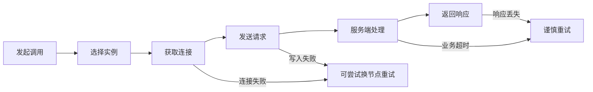
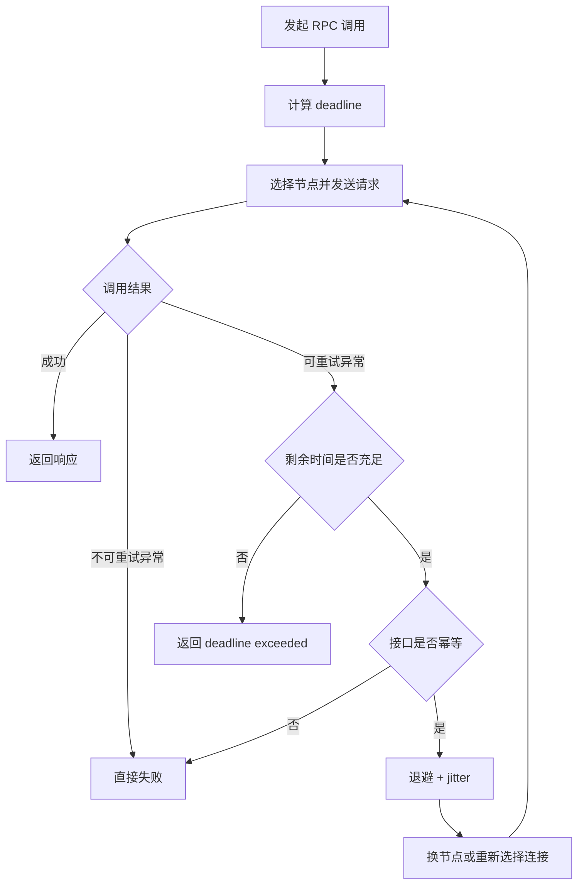

# 12 异常重试：在约定时间内安全可靠地重试

异常重试是 RPC 框架里最容易被低估的治理能力。它看起来只是“失败了再试一次”，但在生产环境里，重试可能是救命绳，也可能是把一次抖动放大成全站雪崩的扩音器。

一个成熟的 RPC 重试策略，必须同时回答三个问题：什么时候能重试，最多还能花多少时间重试，以及这次重试会不会把业务语义弄坏。

## 本章要解决的问题

我们希望解决的是：当调用链路出现短暂网络抖动、连接复用失效、下游实例刚好重启、负载均衡命中慢节点时，客户端如何在用户可接受的总耗时内自动恢复。

但重试不能变成“无脑补刀”。如果一个支付扣款接口超时后被重复调用，第一次请求可能已经在服务端执行成功，只是响应丢了。此时客户端再发一次请求，业务损失就不是技术指标上的错误率，而是真实的钱。

所以异常重试的目标不是“尽量成功”，而是“在时间预算、幂等边界和系统容量允许的前提下，提高成功率”。

## 核心观点

- 重试必须受总超时约束，不能每次重试都重新获得完整超时时间。
- 只有可判定安全的错误才适合重试，例如连接失败、连接池取连接失败、部分读超时、临时限流后的可恢复失败。
- 写操作重试必须依赖幂等设计，不能只靠 RPC 框架兜底。
- 重试要配合退避、抖动和重试预算，避免在故障时制造流量尖刺。
- 重试策略应该区分接口、错误码、调用方、流量等级，而不是全局一刀切。

## 原理拆解

一次 RPC 调用通常包含寻址、建连或取连接、编码、发送、服务端排队、业务执行、响应解码等步骤。异常可能发生在任何环节，不同环节的重试风险完全不同。



判断能否重试时，核心是判断“服务端是否可能已经执行了业务逻辑”。如果请求还没发出去，重试通常安全；如果请求已经到达服务端，只是客户端没拿到响应，就必须回到业务幂等来判断。

一个合理的重试模型需要维护总时间预算：

```text
deadline = now + client_timeout
for attempt in 1..max_attempts:
    remaining = deadline - now
    if remaining <= 0:
        fail("deadline exceeded")
    try call(timeout = min(per_attempt_timeout, remaining))
    if success:
        return result
    if !retryable(error) or !idempotent(method):
        fail(error)
    sleep(backoff(attempt, remaining))
```

这里的关键是 `deadline`。很多事故都来自“每次重试都有 3 秒超时，最多重试 3 次”，于是一个原本 3 秒超时的接口被拉长成 9 秒，线程池、连接池、上游等待队列全部被拖住。

## 工程实践

推荐把重试策略拆成四层配置：接口级、错误级、预算级和幂等级。

```yaml
rpc:
  retry:
    default:
      maxAttempts: 2
      totalTimeoutMs: 800
      perAttemptTimeoutMs: 300
      backoff:
        type: exponential
        baseMs: 30
        maxMs: 120
        jitter: true
    methods:
      OrderQueryService.query:
        idempotent: true
        maxAttempts: 3
      PaymentService.charge:
        idempotent: false
        maxAttempts: 1
```

对于写操作，业务侧要提供幂等键。常见做法是由调用方生成 `requestId` 或 `idempotencyKey`，服务端以“业务单号 + 操作类型 + 幂等键”建立唯一约束。

```sql
CREATE TABLE rpc_idempotent_record (
  id BIGINT PRIMARY KEY,
  biz_key VARCHAR(128) NOT NULL,
  operation VARCHAR(64) NOT NULL,
  request_id VARCHAR(128) NOT NULL,
  status VARCHAR(32) NOT NULL,
  response_snapshot TEXT,
  created_at TIMESTAMP NOT NULL,
  UNIQUE KEY uk_biz_request (biz_key, operation, request_id)
);
```

在微服务体系中，还要给重试设置“预算”。例如一个调用方在 1 分钟内最多只能因为重试额外放大 20% 的请求量，超过预算就快速失败或降级，避免下游已经不稳时继续加压。

```java
boolean canRetry(RpcError error, RpcMethod method, RetryContext ctx) {
    return method.isIdempotent()
        && error.isTransient()
        && ctx.remainingTimeMs() > 0
        && retryBudget.tryAcquire(method.name());
}
```

如果使用 resilience4j，可以把 `Retry` 和 `TimeLimiter` 组合起来，但要注意总超时应该在最外层控制；如果使用 Sentinel，则可以把重试失败率、异常比例和 QPS 限流联动起来，避免失败时重试放大。

### 补充图示：带总预算的重试决策



这张图可以作为实现重试拦截器时的检查清单：先看错误是否可重试，再看时间预算和幂等边界，最后才决定是否换节点重试。

## 常见坑

- 只配置最大重试次数，不配置总超时，导致调用链耗时被隐性放大。
- 对所有异常都重试，把参数错误、权限错误、业务失败也当作临时故障。
- 对非幂等写接口开启默认重试，造成重复扣款、重复发券、重复发货。
- 多层服务都重试，A 重试 B、B 重试 C，最终形成指数级流量放大。
- 没有退避和抖动，所有客户端在同一时间重新请求，故障恢复窗口被再次打爆。
- 没有观测重试指标，只看最终成功率，看不到底层已经靠大量重试勉强维持。

## 面试追问

1. RPC 框架如何判断一个异常是否适合重试？
2. 为什么重试必须和总超时一起设计？
3. 读接口一定可以重试吗？写接口一定不能重试吗？
4. 如何避免多层服务之间的重试风暴？
5. 幂等键应该由调用方生成还是服务方生成？为什么？
6. 如果服务端已经执行成功但响应丢失，客户端该怎么处理？

## 小结

异常重试的价值在于消化短暂抖动，而不是掩盖系统性故障。真正可靠的重试策略，应该同时具备时间预算、错误分类、幂等保护、退避抖动、重试预算和可观测性。

一句话总结：重试不是再来一次，而是在“还来得及、还安全、还扛得住”的条件下，再试一次。
