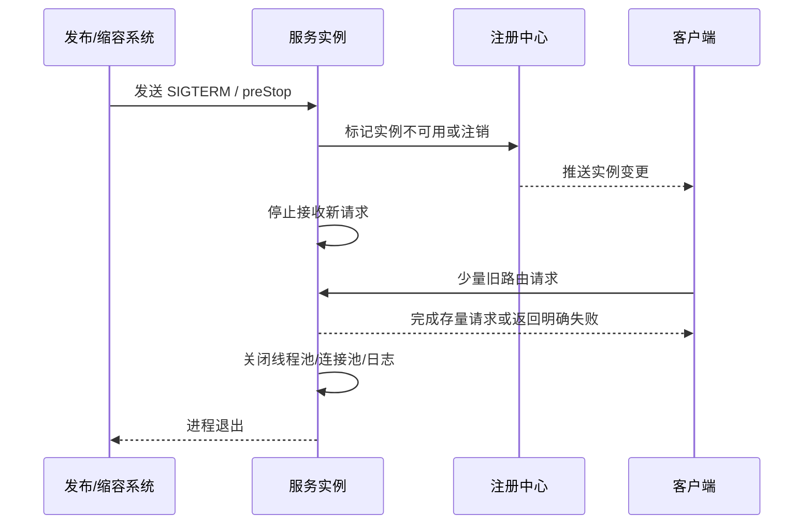
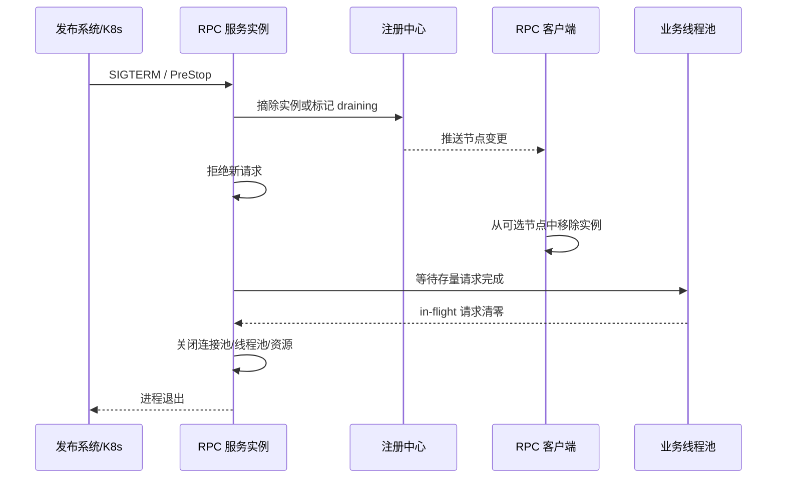

# 13 优雅关闭：如何避免服务停机带来的业务损失

服务关闭是一次有组织的撤退。进程被杀掉很简单，难的是让它退出流量、处理完存量请求、释放资源，并且不给调用方制造一串随机失败。

在 RPC 系统里，优雅关闭的关键不是“最后执行一个 shutdown hook”，而是让注册中心、负载均衡、连接管理、请求处理和容器生命周期协同起来。

## 本章要解决的问题

服务发布、机器维护、弹性缩容、节点故障转移都会触发服务关闭。没有优雅关闭时，常见现象包括：

- 客户端仍然把新请求打到即将退出的节点。
- 服务端进程停止后，正在处理的请求被中断。
- 长连接被直接断开，客户端出现大量 `connection reset`。
- Kubernetes 删除 Pod 后，Endpoint 摘除和进程退出之间存在时间差。
- 发布期间错误率尖刺，业务误以为依赖服务不稳定。

优雅关闭要解决的就是：先停止接收新流量，再尽量处理完已接收请求，最后释放资源并退出。

## 核心观点

- 优雅关闭是一个状态机，不是一个单点动作。
- 下线注册中心和停止接收请求之间要有传播时间。
- 已进入服务端的请求要么完成，要么在明确的截止时间内失败。
- 关闭流程必须有最大等待时间，不能无限等待。
- 连接关闭要区分“拒绝新请求”和“断开已有连接”。

## 原理拆解

典型的优雅关闭流程如下：



注意这里有一个灰色窗口：服务端已经开始下线，但客户端可能还没有收到注册中心变更，或者本地负载均衡缓存还没有刷新。因此服务端不能一注销就立刻退出，必须留出 `drain` 时间。

服务端通常会维护三个状态：

```text
RUNNING     接收新请求并处理
DRAINING    不再接收新请求，继续处理存量请求
STOPPED     资源释放，进程退出
```

当实例进入 `DRAINING` 后，可以对新请求返回明确的 `UNAVAILABLE` 或 `SERVER_SHUTTING_DOWN`，让客户端换节点重试；对已经进入业务线程池的请求，则等待其完成。

## 工程实践

在 Kubernetes 中，优雅关闭需要配合 `readinessProbe`、`preStop` 和 `terminationGracePeriodSeconds`。

```yaml
apiVersion: apps/v1
kind: Deployment
metadata:
  name: order-rpc
spec:
  template:
    spec:
      terminationGracePeriodSeconds: 45
      containers:
        - name: order-rpc
          image: example/order-rpc:1.0.0
          lifecycle:
            preStop:
              httpGet:
                path: /internal/drain
                port: 8080
          readinessProbe:
            httpGet:
              path: /ready
              port: 8080
            periodSeconds: 3
```

`/internal/drain` 的职责不是睡眠，而是切换服务状态：把 readiness 置为失败、从 RPC 注册中心摘除实例、拒绝新请求并开始等待存量请求。

```java
class GracefulShutdown {
    private final AtomicReference<State> state = new AtomicReference<>(RUNNING);
    private final AtomicInteger inFlight = new AtomicInteger();

    RpcResponse handle(RpcRequest request) {
        if (state.get() != RUNNING) {
            return RpcResponse.unavailable("server is draining");
        }
        inFlight.incrementAndGet();
        try {
            return invoke(request);
        } finally {
            inFlight.decrementAndGet();
        }
    }

    void drain(Duration maxWait) {
        state.set(DRAINING);
        registry.unregister();
        waitUntil(() -> inFlight.get() == 0, maxWait);
        closeResources();
        state.set(STOPPED);
    }
}
```

对于 gRPC，可以优先调用 `server.shutdown()`，等待一段时间后再 `shutdownNow()`；对于 Netty，需要停止接收新连接，关闭 boss group，再等待 worker group 中已提交任务完成。

生产 checklist：

- 发布系统是否给实例足够的摘流时间？
- readiness 是否能准确反映“可接业务流量”，而不是只表示进程活着？
- RPC 注册中心摘除和 Kubernetes Endpoint 摘除是否同时处理？
- 客户端遇到 `SERVER_SHUTTING_DOWN` 是否会换节点重试？
- 长连接是否支持 GOAWAY、连接排水或类似机制？
- 关闭等待是否有上限，避免发布卡死？

### 补充图示：优雅关闭的时序协作



真正的优雅关闭不是单点动作，而是发布系统、注册中心、客户端和服务端共同完成的一段协议。

## 常见坑

- 在 `preStop` 里只写 `sleep 10`，但服务本身没有进入拒绝新请求状态。
- readiness 探针一直成功，Pod 已经收到终止信号仍然被继续打流量。
- 只从注册中心注销，没有考虑客户端本地缓存和连接复用。
- 强制关闭业务线程池，导致订单创建、库存扣减等半路中断。
- 等待存量请求没有上限，长轮询或慢 SQL 让发布流程卡住。
- 服务端返回普通业务错误，客户端无法判断应该换节点重试。

## 面试追问

1. 优雅关闭为什么要先摘流再退出？
2. Kubernetes 的 readinessProbe 和 livenessProbe 在优雅关闭中分别起什么作用？
3. 注册中心摘除实例后，为什么还可能有请求打进来？
4. 如何处理关闭过程中的长连接？
5. 优雅关闭等待时间应该如何设置？
6. 服务关闭时正在执行的事务应该中断还是等待？

## 小结

优雅关闭的本质是把“进程死亡”改造成“流量撤离”。它要求服务实例在退出前主动告诉系统：我不再接新活，但会尽量把手上的活做完。

稳定的发布体验往往不是来自更快的启动脚本，而是来自每个实例都懂得如何体面地离场。
